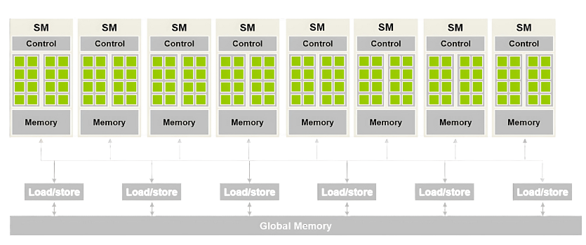

## Summary of Day 05:

### Chapter_04: Compute Architecture and Scheduling 

#### Architecture of a modern GPU:

    
    
Fig: <b>5_01</b>: Modern GPU architecture

Okay so the diagram presented above illustrates the architecture of modern GPU, specifically focusing on orgranization of Streaming Multiprocessors (SMs) and their interation with memory.

##### Decoding the architecture:

1. **Streaming Multiprocessors (SMs)** : Each SM contains control logic, multiple cores (green blocks) for parallel processing, and local memory for fast data access.
2. **Load/Store Units** :  These manage data transfer between SMs and the global memory.
3. **Global Memory** : A shared memory pool accessible by all SMs, used for storing large datasets.

Also, the differences between old and newer GPUS:

| Older GPUs | Modern GPUs |
|------------|-------------|
|  Used DRAMs as Global Memory | Uses High-Bandwidth Memory (HBM) | 
|  Was implemeted before NVIDIAs Pascal Architecture | Pascal Onwards... |
|| Higher Bandwidth |
|| Reduced Latency |
|| Energy Efficiency |
|| *Compact Design: Memories stacked vertically  using 3D packaging technology |

---

> **Goin' through...**
  

