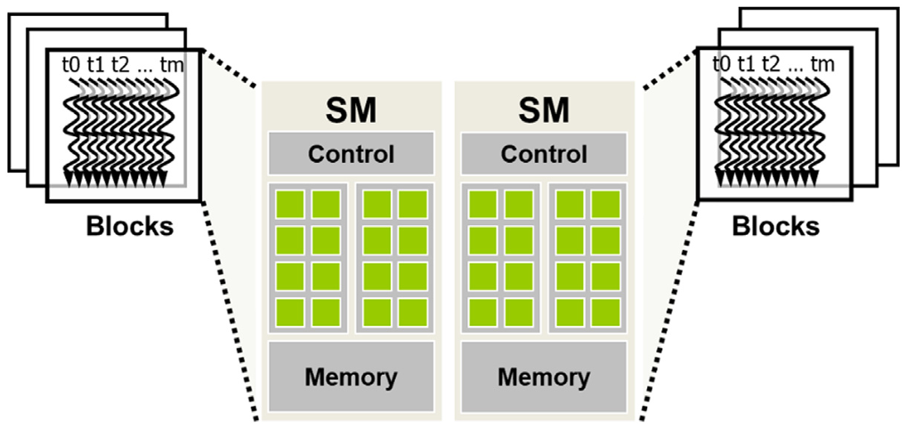

## Summary of Day 05:

### Chapter_04: Compute Architecture and Scheduling 

#### Architecture of a modern GPU:

    
    
Fig: <b>5_01</b>: Modern GPU architecture

Okay so the diagram presented above illustrates the architecture of modern GPU, specifically focusing on orgranization of Streaming Multiprocessors (SMs) and their interation with memory.

##### Decoding the architecture:

1. **Streaming Multiprocessors (SMs)** : Each SM contains control logic, multiple cores (green blocks) for parallel processing, and local memory for fast data access.
2. **Load/Store Units** :  These manage data transfer between SMs and the global memory.
3. **Global Memory** : A shared memory pool accessible by all SMs, used for storing large datasets.

Also, the differences between old and newer GPUS:

| Older GPUs | Modern GPUs |
|------------|-------------|
|  Used DRAMs as Global Memory | Uses High-Bandwidth Memory (HBM) | 
|  Was implemeted before NVIDIAs Pascal Architecture | Pascal Onwards... |
|| Higher Bandwidth |
|| Reduced Latency |
|| Energy Efficiency |
|| *Compact Design: Memories stacked vertically  using 3D packaging technology |

---
##### Block Scheduling:

    
    
Fig: <b>5_02</b>: Thread block assignment to streaming multiprocessors (SMs)

- **Block Assignmets**: 
    - Each thread block is assigned to a SM, and multiple blocks can be assigned to the same SM if resources allow. 
    - Blocks are assigned to SMs on a block-by-block basis, meaning all threads within a block execute on the same SM.
    - This guarantees that threads in the same block can interact closely, unlike threads from different blocks.

    > ⚠️ _*Jargon Alert:_ **Barrier Synchronization**  
    This ensures all the threads in a block reach a certain threshold before proceeding and helping the coordinate executions.

    - Threads in the same block can access low-latency shared memory within the SM, unlike global memory, which is slower.
- **Resource Constraints:** Each block reserves hardware resources like registers, shared memory, and execution units. The number of blocks an SM can handle depends on how much of these resources each block consumes.

- **Goal:** The goal is to maximize SM occupancy—if too many resources are taken by a single block, fewer blocks can run on that SM, reducing efficiency.

---
##### Barrier Synchronization:

As explained earlier, barrier synchronization makes sure that all threads in a block reach a certain point in the code before any thread can continue. In CUDA, this is done using the function `__syncthreads()`.

- **How does `__syncthreads()` work?**
    - When a thread in a block calls __syncthreads(), it stops at that point and waits.
    - It can only continue executing once every other thread in the same block has also reached that point.
    - This guarantees that all threads have finished the current phase of execution before moving on.

- Threads in different blocks cannot use `__syncthreads()` to synchronize with each other. There's a workaround, but has so many catch.

Example Code to show `__syncthreads()` in action. — [Click Here](./barrier_sync.cu)to redirect.
 
Okay so in the code, I've implemented the kernel functions for both correct and incorrect implementation in the code mentioned above. The correct kernel uses `__syncthreads()` properly by ensuring that all threads in the block reach the barrier, resulting in the expected output. In contrast, the incorrect kernel conditionally calls `__syncthreads()` only for threads with an index less than 5. This violates the rule that every thread in a block must participate in the barrier, leading to undefined behavior.

In our specific run, the incorrect kernel did not deadlock as expected—which is a manifestation of the unpredictable nature of undefined behavior. _The GPU's thread scheduling happened to keep all threads sufficiently in synchronization, masking the issue_. However, this is not reliable and can cause deadlocks or other errors in different situations. The correct implementation ensures that all threads reach the synchronization point, avoiding these issues and producing consistent results.

---

    <b>
        End of Day_05🫡
    </b>

