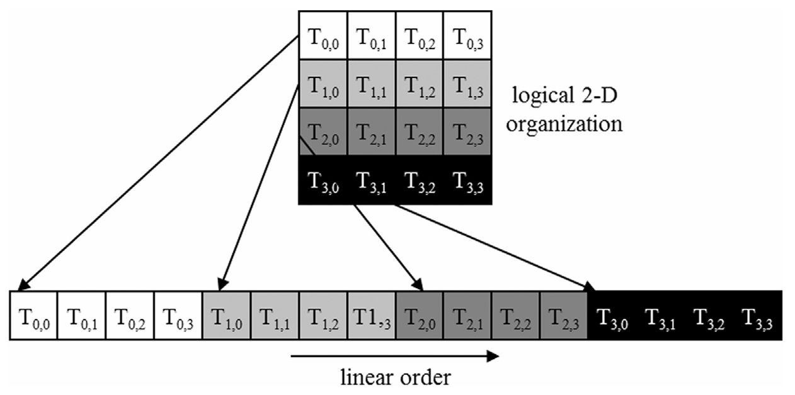
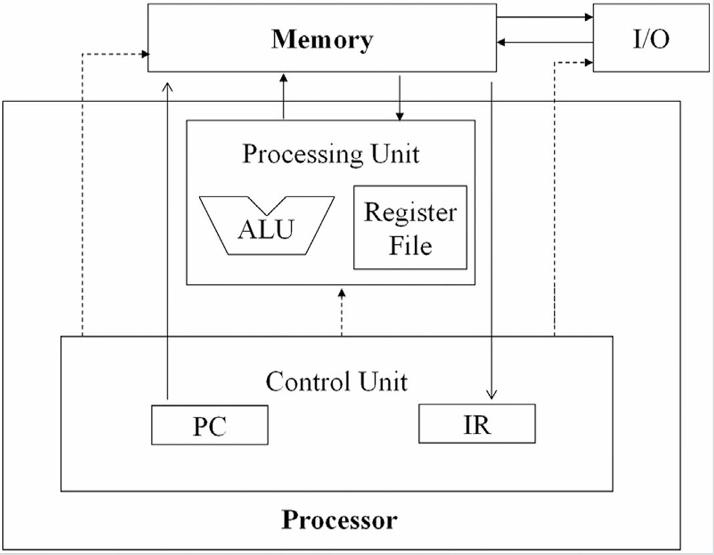
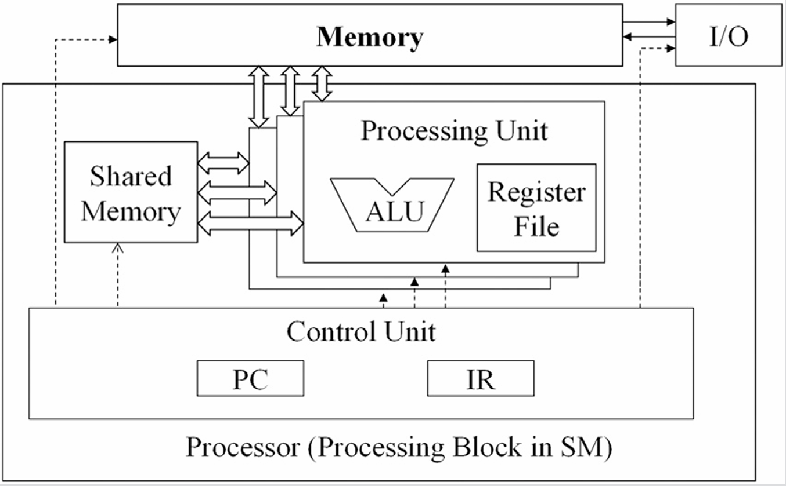

## Summary of Day 06:

> *Continuation of chapter 4: 

#### Warps and SIMD Hardware:

- **About Warps** : In CUDA, when a block of threads is assigned to a SM, its further divided into smaller units called as _warps_. 
    - A warp typically consists of 32 threads that are scheduled and executed together.
    - Let's think of it as a team of **32** workers  who receive the **same instruction** but work on **different pieces of data**. And the concept of same instruction but different data points is the concept of SIMD Hardware.

- **About SIMD** : One Instruction is executed simultaneously across multiple data points. 
    - **S**ingle **I**nstruction, **M**ultiple **D**ata
    - This model helps GPUs achieve high efficiency because it *reduces the overhead of managing different instructions for different threads*.

##### **Further in depth summary:**

1. In the start of the subsection, authors have talked about the **Blocks and Threads Execution**:
    - Blocks execute in *any order* relative to each other for scalability.
    - Inside a block, threads can also execute in any order unless we use the barrier synchronization to ensure certain phases are completed. 

2. **Warps Formation:**
    - When a block is assigned to a SM, it is split into the warps of 32 threads 
    > ⚠️ _As said earlier it's standard to have 32 threads_

    - Example: For a block of 256 threads; 
```math
\text{Number of warps} = \frac{256}{32} = 8 \space \text{wraps}
```
and, if there are like 3 blocks in the SM;
```math
\text{Total warps} = 8 \times 3 = 24 \space \text{warps in total}
``` 

3. **Warp Partitioning Based on Thread Indices:**
    - For **1-D block**, threads are partitioned straightforward way:
        - **Warp 0** = Threads (0 to 31), 
        - **Warp 1** = Threads (32 to 63) and so on...
    > What I'm trying to say here is that:
     okay let's say  we have like block of 48 threads. Then, the very first warp would have threads from 0 to 31 (32 in total) and remaining $48 - 32 = 16$ on warp 1. 

4. **For Multi_dimensions:**
    - For **2-D and 3-D blocks,** threads are "linearized" in **row-major order** (like 2D arrays).

    - _In 2-D block_, all threads with the same `threadIdx.y` are grouped together; sorted by `threadIdx.x`.

    - _In 3-D_, all threads with `threadIdx.z = 0` are placed first, followed by those with `threadIdx.z = 1` and so on...
<div align= "center">
    
    <p>Fig: <b>6_01</b>: Placing the 2D blocks to linear layout</p>
</div>

5. **SIMD:** — Explained Above (☝️)

> **The advantage** of SIMD is that the cost of the control hardware, such as the instruction fetch/dispatch unit, is shared across many execution units. This design choice allows for a smaller percentage of the hardware to be dedicated to control
___
##### _Warps and SIMD Hardware:_
Okay, so the "**Von Newmann Model**"; which we studied on Microprocessors Subject _(only relatable to CS studs)_, is the core model that fuels up the Warps and SIMD hardware design. 

For those outside this circle, **Von Newmann Model** is the foundation of how traditional computers work. Its based on stored program computers where the program data and instruction data are stored in the same memory. 

In this model, 
- **Programs and data** are both stored *in memory.
- **The Control Unit (CU)** fetches an instruction from memory, decodes it, and then executes it.
- There’s a **Program Counter (PC)** that keeps track of which instruction comes next.
- The process is simple: 

Below is the diagram for Von-Newmann Architecture:

<div align= "center">
    
    <p>Fig: <b>6_02</b>: The <b>Von-NewMann</b> Architecture</p>
</div>

---
##### _How Is GPU Architecture Different?_
GPUs follow a modified version of the Von Neumann Model, but with one big change—**_"parallelism"_**. 

Instead of processing one instruction at a time like CPUs, GPUs are designed to handle thousands of operations simultaneously. Here’s how:

1. **Single Control Unit, Many Cores:**

    - A single Control Unit fetches an instruction just like in Von Neumann, but instead of sending it to one processor, it sends the same instruction to many processing cores at once.
    - Think of it like a teacher (Control Unit) giving the same assignment (instruction) to an entire class (cores) instead of just one student.

2. **Warps and SIMD Execution:**

    - These cores are grouped into units called warps (usually 32 threads per warp).
    - All threads in a warp execute the same instruction but on different data—this is called SIMD (Single Instruction, Multiple Data).
    - Example: If the instruction is to add two numbers, all threads will perform an addition, but each thread will add different pairs of numbers.
3. **Why This Design Is Efficient:**

- **Less Hardware Overhead**: Since all cores share the same Control Unit, we save on hardware costs and reduce power consumption.
- **Massive Parallelism**: GPUs can handle thousands of threads at once, making them perfect for tasks like image processing, scientific simulations, and machine learning.

<div align= "center">
    
    <p>Fig: <b>6_02</b>: The <b>Modified Von-NewMann</b> Architecture</p>
</div>

---
#### Control Divergence


---
> **Goin' through...**
<div align= "center">

</div>

