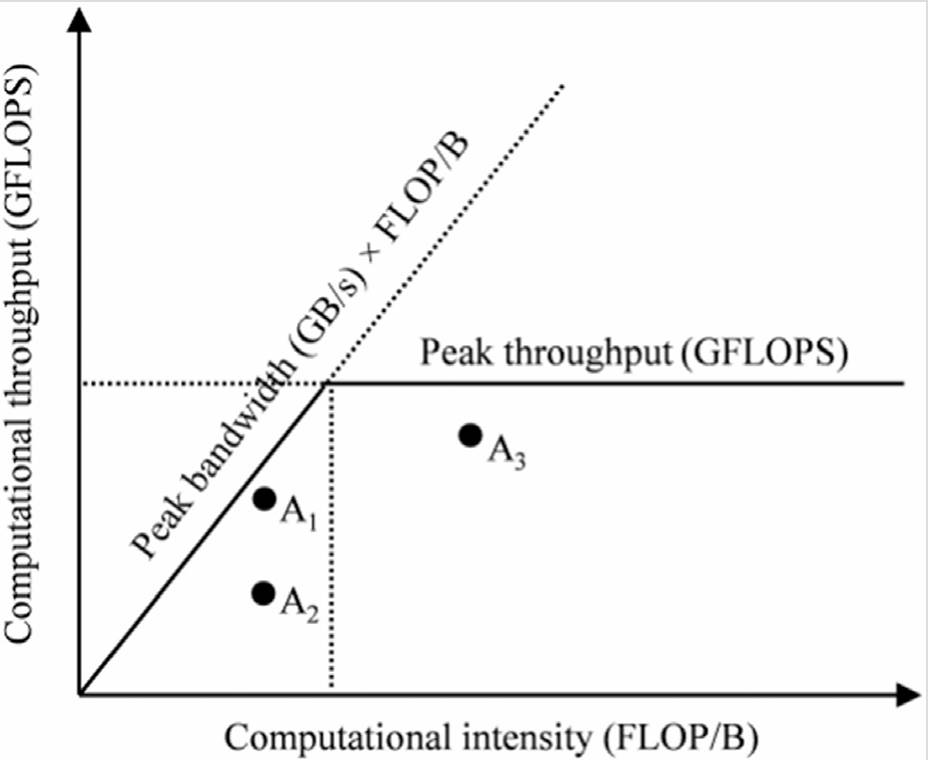

## Summary of Day 09:

> * Starting of Chapter 5

**Important points from Introduction:**
- Global memory, which is off-chip DRAM, has high latency and limited bandwidth, making execution inefficient.

- Even though many threads can help tolerate latency, memory congestion can still cause some cores to remain idle.

- To overcome this, GPUs provide on-chip memory resources that reduce traffic to global memory and improve performance.

- This chapter focuses on using different memory types to optimize data access and enhance execution speed.

---
#### Understanding Memory Access Effeciency in CUDA

1. **Memory Bottlenecks in Matrix Multiplication:**

- In matrix multiplication, the most executed part of the kernel is the **for-loop** that computes the dot product of a row from matrix $\text{M}$ and a column from matrix $\text{N}$.
```cpp
// The most executed part of the matrix multiplication kernel (line number 13-15 in the original code)
for (int k = 0; k < Width; ++k){
    Pvalue += M[row*Width+k] * N[k*Width+col]
}
```
To view complete Matrix Multiplication code, [Click Here](./matrix_multiplication.cu)

Each loop iteration involves:

- Two global memory accesses _(fetching elements from $\text{M}$ and $\text{N}$)_.
- One floating-point multiplication _(multiplying the fetched values)_.
- One floating-point addition _(accumulating the result into `Pvalue`)_.
- The compute to global memory access ratio is $0.25\space \text{FLOP/B}$ _(floating-point operations per byte fetched)_. This means that for every byte read from global memory, only $0.25$ floating-point operations are performed.

> _**Why does this matter?**_
> - The **Ampere A100 GPU** has a global memory bandwidth of $1555\space \text{GB/s}$.
> - The matrix multiplication kernel’s compute intensity ($0.25\space \text{FLOP/B}$) results in a throughput of $\text{389 GFLOPS}$ (Giga FLOPs per second).
> - However, the **A100 GPU’s peak single-precision performance** is $19,500\space \text{GFLOPS}$, meaning the kernel is achieving only $2\%$ of its potential performance.
> - If we consider the tensor cores (which specialize in matrix operations), their peak is $156,000 \space \text{GFLOPS}$, meaning the kernel is using only $0.25\%$ of the tensor core capacity.
>
> This happens because the **speed of execution is limited by memory bandwidth**, not by compute power. Such programs are called **memory-bound programs**.
---
#### Roofline Model: _Understanding Performance Limits_

The Roofline Model is a visual tool to analyze application performance relative to hardware capabilities.

<div align="center">
    
    <p><b>Fig 9.01:</b> Basic Example of Roofline Model</p>
</div>

**How it Works:**
- **X-axis:** Arithmetic intensity (FLOP/B) – The amount of computation per byte of data loaded.
- **Y-axis:** Computational throughput (GFLOPS) – The number of floating-point operations per second.
- Two lines represent hardware limits:
    - **Horizontal line**: Peak computational throughput (GFLOPS).
    - **Sloped line** _(starting from origin)_ : Peak memory bandwidth.

Each application is represented as a point on the graph:

- **Memory-bound applications** (low FLOP/B) are limited by memory bandwidth.
- **Compute-bound applications** (high FLOP/B) are limited by computational power.
- The intersection of the two lines marks the transition point between memory-bound and compute-bound programs.

**Taking above figure as in Example;**
- **A1 and A2**: Both are memory-bound programs.
    - **A1** is _efficient_, operating close to peak memory bandwidth.
    - **A2** is _inefficient_, meaning optimizations could improve memory usage.
- A3: A **compute-bound** program, utilizing GPU resources effectively.

---
#### Optimizing Matrix Multiplication for Better Performance

To fully utilize the $19,500 \space \text{GFLOPS}$ peak performance of the **A100 GPU**, the compute to global memory access ratio **must be at least** $12.5 \space \text{FLOP/B}$.

So, this means:
- Instead of $0.25 \space \text{FLOP/B}$, we need $50$ floating-point operations per $4$-byte data fetch.
- Achieving this depends on data reuse _(performing more operations per memory access)_.

---
#### CUDA Memory Types

