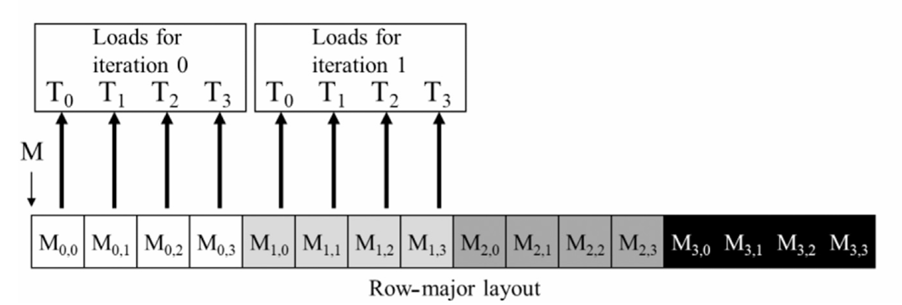

## Summary of Day 13:

> *Start of Chapter 6: "Performance Considerations"

#### 1. _Introduction:_

- High-performance parallel programming requires managing hardware constraints.
- Previous chapters covered _GPU compute architecture_, _scheduling_, and _memory hierarchy_.
- This chapter focuses on **off-chip memory (DRAM)**, **memory coalescing**, and **latency hiding**.
- Introduces _**thread granularity coarsening**_ for optimization.
- Ends with a checklist of performance optimizations for parallel patterns.

---
#### 2. **Memory Coalescing:**

> **What is it?**: It is the process of combining multiple memory accesses into a single memory transaction.

**Importance of Memory Coalescing:**
- Global memory access is a major bottleneck in CUDA performance due to limited bandwidth.
- Memory coalescing **optimizes data movement between global memory, shared memory, and registers** _to maximize efficiency_.
- Works _alongside tiling techniques_ to improve memory access patterns.

**Understanding DRAM and Burst Access:**

> ***What is DRAM?***: Stands for Dynamic Random Access Memory. It is the main memory in a computer system.

- DRAM **stores data in capacitors**, requiring time-consuming access *(~tens of nanoseconds)*.
- To speed up access, DRAM bursts transfer consecutive memory locations in parallel.
- **Coalesced memory access** allows CUDA to *efficiently utilize DRAM bursts*, increasing throughput.
> **DRAMs are Slow**. Here's why:
>
> <div align="center">
> 
> <p><b>Fig 13.01:</b><i> Figure showing DRAM Cell and path for accessing its content</i></p>
> </div>
>
> In figure 13.01, we see a schematic of a DRAM cell and the path for accessing its content. Several factors contribute to the inherent slowness of DRAMs:
>
> 1. **Decoder and Bit Line Loading**:
>    - The decoder circuit uses a transistor to drive a single line that is connected to the outlet gates of thousands of DRAM cells.
>    - This line has a very large capacitance (due to the sheer number of cells attached), taking a long time to charge or discharge to the required voltage level.
>
> 2. **Charge Sharing Mechanism**:
>    - When a DRAM cell is accessed, its capacitor releases a tiny amount of electrical charge onto a much larger bit line.
>    - If the cell stores a “1,” the small charge must elevate the voltage on the bit line enough for the sense amplifier to detect a high level.
>    - This process, known as charge sharing, is inherently slow because the bit line’s large capacitance dilutes the effect of the charge from the cell.
>
> 3. ***The Coffee Cup Analogy***:
>    - Imagine someone holding a small cup of coffee at one end of a long hallway, while a person at the other end tries to detect the coffee’s aroma to guess its flavor.
>    - The weak signal (aroma) must travel a long distance (the hallway) and overcome a large volume of air (analogous to the bit line’s capacitance) before it can be sensed reliably.
>    - This is similar to how the small charge in a DRAM cell must influence the large bit line.
>
> 4. **Trade-off Between Speed and Density**:
>    - One might think that using a larger, stronger capacitor in each cell would speed up this process.
>    - However, DRAM design has prioritized higher storage densities over speed.
>    - Over time, the capacitors have been reduced in size so that more bits can fit on a chip.
>    - This scaling down, while beneficial for capacity, reduces the strength of the signal each cell can deliver, leaving the access latency largely unchanged over the years.
>
> In summary, the slow access times of DRAMs stem from the time required to charge/discharge heavily loaded bit lines and the limitations imposed by the small charge of each miniaturized cell capacitor.

**Coalesced Memory Access in CUDA:**
- **Warp-level Memory Access:**
    - CUDA warps execute the same instruction together.
    - If all threads in a warp access consecutive global memory addresses, the accesses are coalesced into a single DRAM request.

_**Example**_: If Thread $0$ accesses $X$, Thread $1$ accesses $X+1$, Thread $2$ accesses $X+2$, etc., the accesses are combined into one efficient request.

- **Alignment constraints:**
    - Some CUDA devices require memory addresses to be aligned to 64-byte boundaries for coalescing.
    - Recent CUDA devices have on-chip caches, reducing but not eliminating the need for manual coalescing.

**Row-Major vs. Column-Major Storage:**
1. **Row-Major Order**:
    - In row-major order, elements of a **2D array are stored in consecutive memory locations**.
    - Favorable for **coalesced access** when iterating row-wise.
    - CUDA stores multi-dimensional arrays in row-major order.
    <div align="center">
    
    <p><b>Fig 13.02:</b><i> Logical View</i></p>
    
    <p><b>Fig 13.03:</b><i> Physical View: Row Major Layout</i></p>
    </div>

2. **Column-Major Order**:
    - Elements in the same column are stored far apart in memory.
    - Leads to **non-coalesced access** when iterating column-wise _(e.g., multiplying a matrix by its transpose)_.

    <div align="center">
    
    <p><b>Fig 13.02:</b><i> Logical View _(Same as before)_</i></p>
    
    <p><b>Fig 13.04:</b><i> Physical View: Column Major Layout</i></p>
    </div>

> ***Summary Difference Between:***
> | ***Row-Major*** | ***Column-Major*** |
> |:---------:|:------------:|
> | Consecutive memory locations | Elements stored far apart |
> | Coalesced access | Non-coalesced access |
> | Favorable for row-wise iteration | Favorable for column-wise iteration |

I've implemented a simple example code to show the difference in execution times between row-major and column-major storage. [Click Here](./row_vs_column_major.cu) to redirect. 

> ***Output_Example***
>```shell
>Enter the matrix size (N x N): 2046
>Row Major Execution Time: 0.52096 ms
>Column Major Execution Time: 0.265216 ms
>```

> GPTs Answer for: **Why is the column-major layout faster than the row-major layout?**
>
> _**Response:**_ It is not that one layout is universally faster than the other; it’s that the performance depends on how your kernel accesses the data. When your access pattern is column-wise, a column-major layout allows threads to read or write contiguous blocks of memory (ensuring coalesced accesses), which in turn leads to better performance. Conversely, if your access pattern were row-wise, a row-major layout would be optimal.
>
>So, when you see that a column-major layout is faster in your CUDA application, it’s because the layout matches the access pattern of your threads, resulting in efficient, coalesced memory transactions.
---
#### Strategies for Optimizing Memory Coalescing
1. **Rearrange thread-to-data mapping**
    - Ensure consecutive threads access consecutive memory addresses.
2. **Rearrange data layout**
    - Convert data storage format to align with memory access patterns.
3. **Use shared memory for unfavorable access patterns**
    - Load data into shared memory in a coalesced manner, then process it in a non-coalesced way.
4. **Corner turning technique**
    - Used for matrix multiplication when one matrix is stored in column-major order.
    - Loads data from global memory into shared memory in a coalesced pattern, then transposes it for efficient computation.
    <br><br>
    <div align="center">
    
    <p><b>Fig 13.05:</b><i> Corner Turning Technique</i></p>
    </div>

---
<div align="center">
    <b>
        End of Day_13🫡
    </b>
</div>


