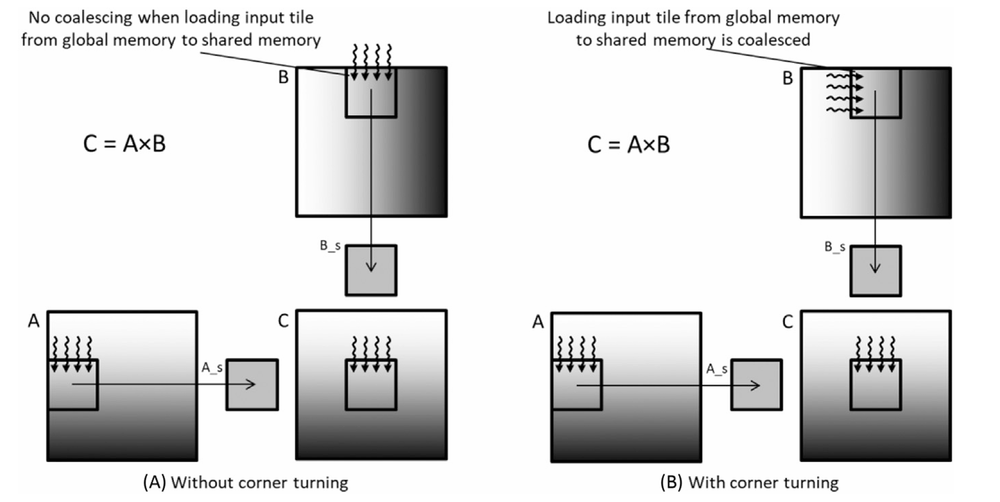
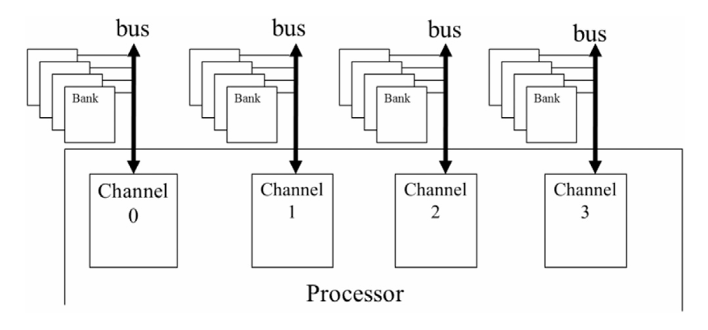
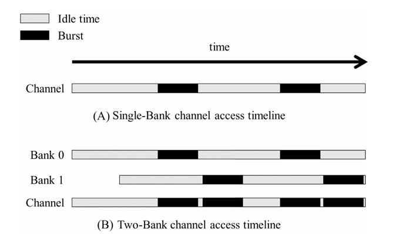

## Summary of Day 14:

> *Explaining the Corner Turning in Matrix Multiplication the one I studied yesterday in detail.

    
    
<b>Fig 14.01: </b><i>Corner Turning in Matrix Multiplication.</i>

_Here,_
- **Input Matrices:**
    - **Matrix A:** Stored in row-major layout in global memory.
    - **Matrix B:** Stored in column-major layout in global memory.
    - **Output Matrix C:** Stored in row-major layout in global memory.
- The goal is to ensure coalesced memory access while loading tiles from global memory into shared memory for efficient computation.

- **Memory Access Pattern for Matrix A:**
    - The access pattern follows the same strategy as in Chapter 5 _(Memory Architecture and Data Locality)_.
    - Four threads responsible for the four consecutive elements at the top edge of the output tile load the corresponding elements from matrix A.
- Each thread loads an element from matrix A such that:
    - The local row and column indices within the input tile match the indices of the output element in matrix C.
    - Since matrix A is row-major, consecutive threads access consecutive elements in the same row, leading to coalesced memory accesses.

- **Memory Access Pattern for Matrix B _(Problem with Naïve Approach)_:**
    - If we use the same access pattern as matrix A, the threads would load elements that are far apart in global memory.
    - This happens because matrix B is stored in column-major format, meaning that:
        - Consecutive threads would load nonconsecutive elements in memory.
        - This results in uncoalesced memory accesses, increasing memory latency and reducing efficiency.
- **Fig. 14.01**_(A)_ shows this problem:
    - Even though the threads are logically loading consecutive elements in matrix B, the actual memory locations are far apart, leading to poor performance.
- **Optimized Access Pattern for Matrix B _(Corner Turning Solution)_:**
- To solve this issue, the threads should load elements differently:
    - Instead of loading elements in the same row, they load elements in the same column (left edge of the input tile).
    - This ensures that consecutive threads load consecutive elements in memory, making the accesses coalesced.
- _**How it works:**_
    - The role of `threadIdx.x` and `threadIdx.y` is swapped when calculating the linearized index for loading elements from matrix B.
    - Since B is column-major, elements in the same column are adjacent in memory.
    - This allows consecutive threads to access adjacent memory locations, ensuring coalesced memory access.
- **Fig. 14.01**_(B)_ shows the optimized access pattern:
    - Each thread loads an element from the same column instead of the same row.
    - This transformation improves memory access efficiency by reducing global memory traffic.

> I've implemented a code comparing the Naive way with the Corner Turning and shared memory optimized approach: [Click Here](./corner_turning.cu) to view the code.
---
#### Memory Coalascing conditions and _a bit of analogy explained in the book_: 

> **_Revision from yesterday_**:  Mem Coalescing is a process of combining multiple memory access into single access to reduce global memory traffic.
>
> ***Conditions for Coalescing:***
> - Accesses can be **combined** if they occur **at the same time** and **target adjacent memory locations**.
> - This reduces the number of separate memory transactions and **improves memory bandwidth utilization**.

**Memory Coalescing and Traffic Congestion** _(Analogy):_

  
  
  
<b>Fig 14.02: </b><i>Reducing traffic congestion in highway systems.</i>

- Traffic congestion happens when too many cars try to travel on a road designed for fewer vehicles.
- This increases travel time drastically (e.g., commute time doubles or triples during peak hours).
- Solutions for traffic congestion involve reducing the number of cars on the road:
- ***Carpooling:*** Commuters share rides, reducing the number of vehicles.
- **Government policies encouraging carpooling**:
    - Restricting odd/even license plates on certain days _(forcing people to share rides)_.
    - Incentives like carpool lanes _(restricted for cars with multiple passengers)_.
    - High fuel prices to encourage ride-sharing.

 So that now you get the concept, let's link this to Memory Coalescing. 🤷

> ***Carpooling vs. Memory Coalescing***
>- **Memory coalescing works similarly to carpooling**:
>   - Data (passengers) need to be grouped into fewer DRAM access requests (cars).
>   - If multiple threads request the same DRAM location, they can "carpool" into a single memory request.
>   - This prevents DRAM bandwidth congestion and ensures efficient memory access.
> 
> ***Threads as Carpoolers: Importance of Warp Execution:***
>- Threads in the same warp are ideal for coalescing:
>   - Warps execute in SIMD (Single Instruction, Multiple Data) fashion, meaning all threads issue the same memory instruction simultaneously.
>   - If these memory accesses are to adjacent locations, they can be combined into a single DRAM request.
>   - This maximizes memory throughput and reduces memory latency
---
#### Into Hiding memory latency:

1. **DRAM Parallel Organization**
    - **Bursting**: Accesses multiple locations in the DRAM core array in parallel. 
    - **Banks & Channels:**
            

            
            
<b>Fig 14.03: </b><i>DRAM bank and channel organization.</i>

        - Each channel is a memory controller that connects multiple DRAM banks to the processor.
        - Processors typically have **$1-8$ channels**, and each channel connects to **multiple banks**.
        - ***Example:*** A modern CPU might require $32 \space\text{GB/s}$ memory bandwidth $(→ 2 \space \text{channels})$, while a modern GPU might require $256 \space \text{GB/s} (→ 16 \space \text{channels})$.

2. **Data Transfer Bandwidth & DRAM Latency**
    - **DDR Bus Example:**
        - $64-$ bit DDR bus @ $1 \space\text{GHz}$ = $16 \text{GB/s bandwidth}$.
        - But modern CPUs/GPUs require much higher bandwidth!
    - **Latency Bottleneck:**
        - DRAM access involves a long delay (e.g., decoder enabling cells, charge sharing with sense amplifiers).
        - If a single bank is connected to a channel, the access latency dominates, leading to underutilization.
        - ***Example:***
            - Latency-to-transfer time ratio = $20:1$
            - Max utilization = $4.8\%$ $(→ 16\space \text{GB/s}$ channel would deliver only $0.76 \space\text{GB/s}$!)
    - ***Solution:*** Connect multiple banks per channel to overlap memory accesses.

3. **Hiding Memory Latency with Multiple Banks** — _(Finally to the topic)_

    - **Interleaved Bank Access**:
        - Instead of waiting for one bank to finish, start accessing another bank in parallel.
        - ***Example:***
            - **Single bank**: `Access → Latency (idle) → Transfer → (repeat)`
            - **Two banks**: `Bank 1 (access) → Bank 2 (access) → Bank 1 (transfer) → Bank 2 (transfer)`
            

            
            
<b>Fig 14.04: </b><i>Improving data transfer bandwidth utilization with banking.</i>

        - **General formula:**
            - If $\text{latency}:\text{transfer time ratio} = R$, at least $R+1$ banks are needed for full utilization.
            - ***Example:*** If $R$ = 20, then 21+ banks are needed.
        - More banks reduce bank conflicts *(multiple accesses to the same bank)*.
---
Okay, so that's all I read today! No coding stuffs just went through the theory part.

    <b>
        End of Day_14🫡
    </b>

