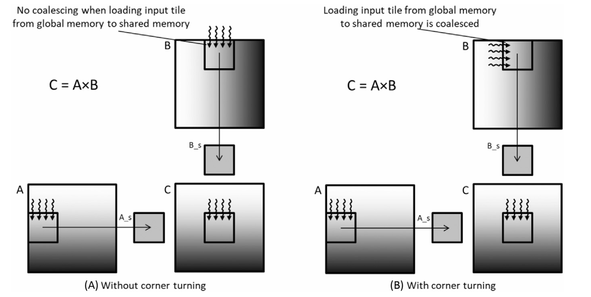

## Summary of Day 15:

> *Chapter 6: Endings...

#### Thread Coarsening:

1. ***Brief Overview***:

    - In prev. CUDA kernels, work was parallelized to the finest granularity, meaning:
        - Each thread handled the smallest possible unit of work.
        - **Vector addition:** One thread per output element.
        - **Image processing** *(RGB-to-grayscale, blur)*: One thread per pixel.
        - **Matrix multiplication:** One thread per output element.
    - **Advantages of fine-grained parallelization**:
        - Enhances scalability _(as discussed in Compute Architecture and Scheduling)_.
        - If the hardware has enough resources, it fully utilizes the available parallelism.
        - If resources are insufficient, hardware can serialize execution seamlessly.
    - Disadvantages of fine-grained parallelization:
        - There is often a “price” for parallelism, including:
            - **Redundant memory loads** across thread blocks.
            - **Redundant computation**.
            - **Synchronization overhead**: meaning, the cost of ensuring that threads are synchronized.
        - If the work is **automatically serialized due to resource limits**, this cost becomes **wasted overhead**. Or, in simpler terms, the cost of synchronization is wasted if the hardware is not able to fully utilize the parallelism.
> ***Solution:***\
>   Reducing parallelism where necessary by assigning each thread multiple units of work. This is called **thread coarsening**.

2. **Thread Coarsening in Tiled Matrix Multiplication:**

    - **Problem with the standard tiled implementation:**
        - Each thread block loads its own copy of the input tile from matrix $M$, even if another block already loaded it.
        - This redundancy is **acceptable if blocks run in parallel**, but if serialized → wasteful.
    - ***Solution:*** Coarsening
        - Instead of assigning one element per thread, **assign multiple elements**.
        - A single thread block processes two output tiles → reducing redundant memory loads.

3. **Implementing Thread Coarsening in Tiled Mat Mul:**

    > [Click Here](./thread_coarsening.cu) to redirect to the code implementation of Thread Coarsening in Tiled Matrix Multiplication.
    >
    >***Output:***
>```shell
>GPU Execution Time: 29.8994 ms
>GPU Throughput: 8.97796 GFLOPS
>CPU Execution Time: 269 ms
>
>Sample Output Comparison (First 5x5 block):
>GPU Result:
>130.735 131.303 127.309 132.635 129.352
>132.287 127.73  125.687 132.797 126.148
>127.611 122.858 123.777 127.162 126.973
>127.805 130.305 125.634 131.945 127.89
>130.881 127.63  125.484 135.143 130.368
>
>CPU Result:
>130.735 131.303 127.309 132.635 129.352
>132.287 127.73  125.687 132.797 126.148
>127.611 122.858 123.777 127.162 126.973
>127.805 130.305 125.634 131.945 127.89
>130.881 127.63  125.484 135.143 130.368
>```
---
#### ***Exercises:***

1.  Write a matrix multiplication kernel function that corresponds to the design illustrated in figure below.

    <div align="center">
    
    <p><b>Fig: </b><i>Corner Turning in Matrix Multiplication</i></p>
    </div>

    ***Solution:*** \
    [Click Here👈](../Day_14/corner_turning.cu) to view the code.

2.  For tiled matrix multiplication, of the possible range of values for `BLOCK_SIZE`, for what values of `BLOCK_SIZE` will the kernel completely avoid uncoalesced accesses to global memory? _(You need to consider only square blocks.)_

    ***Solution:*** \
    For ***"tiled matrix multiplication"***, global memory accesses are considered coalsced when all the threads in a warp _(typically 32 threads in modern GPUs)_ access contiguous memory locations in a single transaction.

    In CUDA gobal memory, memory is arranges in row-major order. Each warp should read/write memory in aligned, contiguous segments to avoid uncoalesced memory accesses.

    If the `BLOCK_SIZE` (aka. `TILE_WIDTH`) is a multiple of the warp size (32), then:
    - Each thread in a warp accesses consecutive addresses when reading from global memory.
    - Memory transactions happen efficiently in one step instead of multiple.

    Hence, to completely avoid uncoalesced memory accesses, `BLOCK_SIZE`should be a multiple of warp size (32). That means:
```math
\text{BLOCK SIZE} \in \{32, 64, 96, 128, \ldots, 32 \times N\}
```
---
<div align="center">
    <b>
        End of Day_15🫡
    </b>
</div>