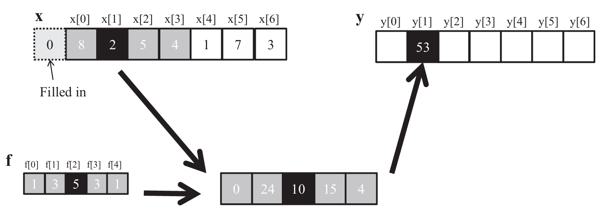

## Summary of Day 16:

> *Start of Chapter 7: Convolution

#### **Convolution: _What is it?_**

Convolution is an array operation where each output element is a weighted sum of an input element and its neighboring elements, using a filter array (convolution filter). Convolutions can be applied to 1D (audio), 2D (images), or 3D (video) data.

---
##### **1D Convolution**
- A ***1D convolution operates on a 1D array***, where each output element is computed as a weighted sum of an input element and its surrounding elements, based on a convolution filter.
- The filter size is always odd $(2r + 1)$, where $r$ is the filter radius, meaning the calculation is symmetric around the central element.
- ***Example:***
    - Input: $x= [8,2,5,4,1,7,3]$
    - Filter: $f= [1,3,5,3,1]$
    - Output $y$ is computed as an inner product between $x$ and $f$ over the corresponding positions.
    - For example; 
        - $y[2] = (1\times 8) + (3 \times 2) + (5 \times 5) + (3 \times 4)+ (1 \times 1) = 52$
        <br><br>
        <div align= "center">
            
            <p><b>Fig 16.01: </b><i>1D Convolution Example illustratory diagram.</i></p>
        </div>
##### **Boundary Conditions in 1D Convolution**

- At array boundaries, missing elements must be handled:
    - **Zero-padding:** Assume missing values are $0$ _(commonly used in audio processing)_.
    - **Edge-padding:** Extend the edge value to fill missing elements.
- ***Example:*** $y[1]$ is computed with a missing left-side element assumed to be $0$.
    <div align= "center">
        
        <p><b>Fig 16.02: </b><i>1D Convolution Boundary Condition</i></p>
    </div>
> [Click here](./1D_Conv.cu) to see the code implementation for 1D Convolution with Boundary Condition (Zero padded) enabled.

---

##### **2D Convolution**

- In image processing, convolution is applied to 2D arrays _(matrices)_ where each pixel interacts with its neighbors.
- A 2D filter of size $(2r_{x} + 1, 2r_{y} + 1)$ determines the weighted sum calculation.
```math
P_{y,x} = \sum_{j= -r_{y}}^{r_y} \sum_{k= -r_x}^{r_x} f_{y+j, x+k} \times N_{y,x}
```
- ***Example:***
    - A $5×5$ filter is applied to a matrix, and each output element is computed as a sum of element-wise products of the filter and a submatrix from the input.
        <div align="center">
            
            <p><b>Fig 16.03: </b><i>2D Convolution Example</i></p>
        </div>
```math
\begin{aligned}
    P_{2,2} = \space & N_{0,0} \times M_{0,0} + N_{0,1} \times M_{0,1} + N_{0,2} \times M_{0,2} + N_{0,3} \times M_{0,3} + N_{0,4} \times M_{0,4} +\\
  & N_{1,0} \times M_{1,0} + N_{1,1} \times M_{1,1} + N_{1,2} \times M_{1,2} + N_{1,3} \times M_{1,3} + N_{1,4} \times M_{1,4} +\\
  & N_{2,0} \times M_{2,0} + N_{2,1} \times M_{2,1} + N_{2,2} \times M_{2,2} + N_{2,3} \times M_{2,3} + N_{2,4} \times M_{2,4} +\\
  & N_{3,0} \times M_{3,0} + N_{3,1} \times M_{3,1} + N_{3,2} \times M_{3,2} + N_{3,3} \times M_{3,3} + N_{3,4} \times M_{3,4} +\\
  & N_{4,0} \times M_{4,0} + N_{4,1} \times M_{4,1} + N_{4,2} \times M_{4,2} + N_{4,3} \times M_{4,3} + N_{4,4} \times M_{4,4} \\
\end{aligned}
```
```math
= 1+4+9+8+5+4+9+16+15+12+9+16+25+24+21+8+15+24+21+16+5+12+21+16+5
```
```math
= 321
```
##### **Boundary Conditions in 2D Convolution**

- Boundaries exist in both x and y dimensions, leading to more complex conditions.
- Missing elements at edges can be handled similarly to 1D:
    - **Zero-padding**: Assume missing values are 0.
    - **Edge-padding**: Use the nearest pixel value.
- These boundary conditions impact the efficiency of tiling in parallel computing.

<div align="center">
    
    <p><b>Fig 16.04: </b><i>2D Convolution Boundary Condition</i></p>
</div>

> [Click here](./2D_Conv.cu) to see the code implementation for 2D Convolution with Boundary Condition (Zero padded) enabled.

---