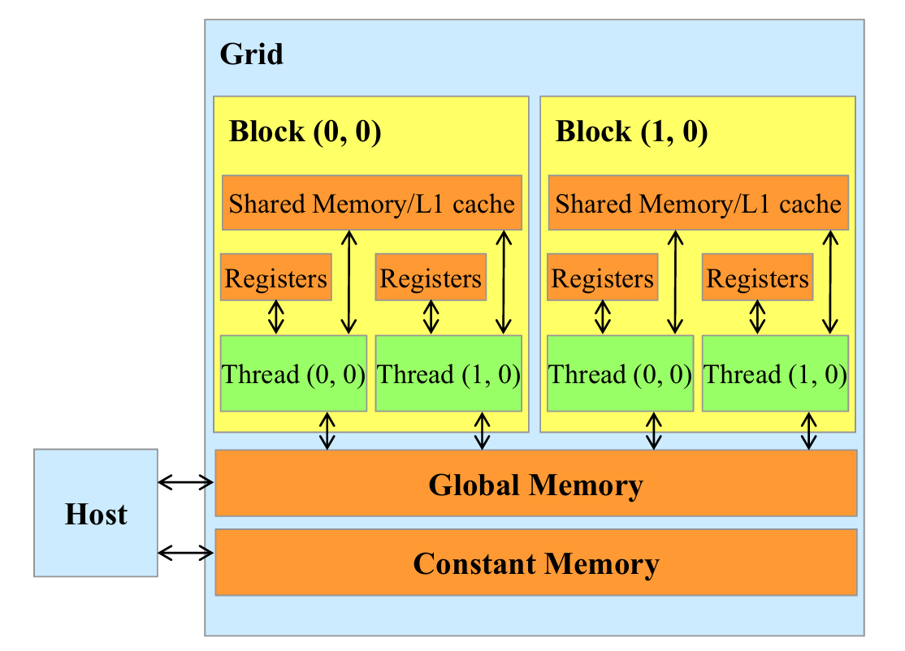
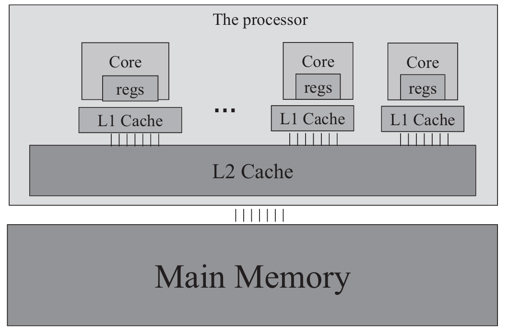
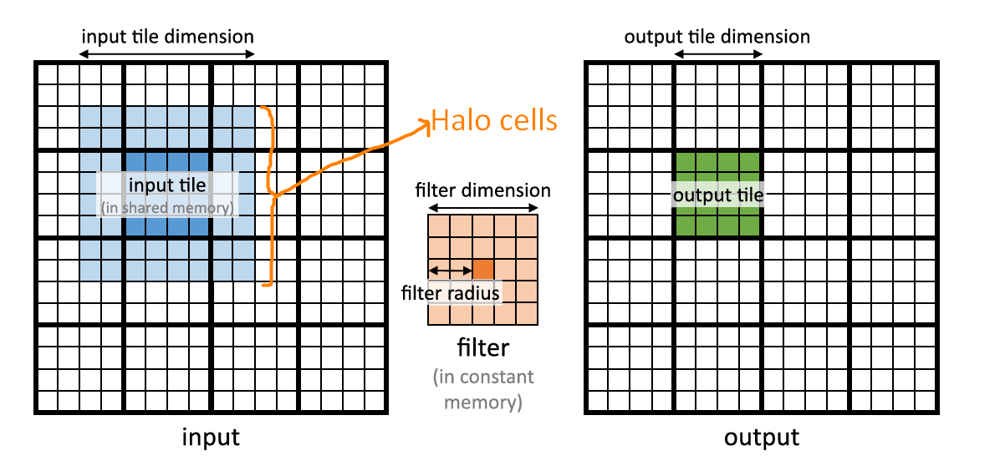

## Summary of Day 19:

> **Chapter 7 continue*

#### Key Properties of filter array $F$ in Convolution:

1. **Small Size:** The filter radius is typically $\le 7$, meaning $F$ is usually small.
2. **Costant During Execution:** The filter value _does not change_ throughout kernel execution.
3. **Uniform Access Pattern:** All threads access $F$ elements in the same order, making it ideal for [constant memory and caching]()

---
#### Using Constant Memory in CUDA

1. _Constant memory declaration:_

    ```cpp
    #define FILTER_RADIUS 2 
    __constant__ float F[2*FILTER_RADIUS+1][2*FILTER_RADIUS+1];
    ```
    - `__constant__` places $F$ in **device constant memory.**
    - *Declared globally* outside functions.

2. _Copying Data to Constant Memory:_

    ```cpp
    cudaMemcpyToSymbol(F, F_h, (2*FILTER_RADIUS+1)*(2*FILTER_RADIUS+1)* sizeof(float));
    ```
    - Uses `cudaMemcpyToSymbol(dest, src, size)` instead of `cudaMemcpy()`.
    - Ensures $F$ **remains unchanged** during kernel execution.

---
<div align="center">

<p><b>Fig 19.01: </b><i>Review of CUDA memory model</i></p>
</div>

#### Comparision with other CUDA Memory Types

<div align="center">

| **Memory Type**     | **Scope**        | **Access Speed**   | **Modifiable?**           | **Caching**              |
|-----------------|--------------|----------------|-----------------------|----------------------|
| Global Memory   | All threads  | Slow _(DRAM)_  | Yes _(by all threads)_| No automatic caching |
| Shared Memory   | Within an *SM | Fast _(On-chip)_| Yes _(by block threads)_| Explicitly managed   |
| Constant Memory | All threads  | Fast _(Cached)_| No _(Read-only)_      | Automatically cached |

</div>

> ***SM** stands for Streaming Multiprocessor.

---
> #### Benefits of Constant Memory in CUDA
> 1. **Aggressive Caching by Hardware:**
>    - Since constant memory never changes, the CUDA runtime aggressively caches it.
>    - Uses a specialized constant cache inside each Streaming Multiprocessor (SM).
> 2. **Efficient Bandwidth Usage:**
>    - When all threads in a warp access the same constant value, the constant cache provides high bandwidth.
>    - Minimal DRAM access → Saves memory bandwidth.
> 3. **Optimized Hardware Design:**
>    - No need for write support → More efficient chip design (less power & area usage).

___

#### Caching in CUDA and Memory Hierarchy
1. Why caching is Important??:
    - **DRAM access is slow** → Caching reduces the memory latency.
    - Caches store frequently used data; minimizing the use of DRAM accessing. 

2. Cache Levels in Modern GPUS:

    | Cache Level | Size | Latency | _Notes_ |
    |-------------|------|---------|---------|
    |L1 Cache | 16-64 KB | Fastest | Per core, close to processor |
    |L2 Cache | 100s of KBs to MBs | Moderate | Shared accross multiple SMs| 
    | L3 Cache _(and some GPUs)_ | 100s of MB | Slower than L2 | Used in high-end GPUs | 

<div align="center">
    
    <p><b>Fig 19.02: </b><i>Simplified view of the cache hierarchy of modern processors</i></p>
</div>

3. Shared Memory Vs. Cache:

    | Shared Memory | Cache | 
    |---------------|-------|
    | Manually managed by the programmer | Automatically managed by the hardware |
> _Caches automatically retain frequently used data, unlike shared memory, which needs explicit management._

---

#### Tiled Convolution with Halo cells

***To address memory bandwidth bottlenecks in convolution operations***, a tiled convolution algorithm is used, where threads collaborate to load input elements into shared memory before computation.
> **Key Concepts:**
> - **Output Tiles:** The collection of output elements processed by each thread block.
> - **Input Tiles:** The collection of input elements required to compute an output tile. These are larger than output tiles due to the need for halo cells _(extra elements around the edges)._
> - **Tile Size Ratio:** The input tile is usually larger than the output tile. For example, with a $5×5$ filter and $16×16$ output tiles, the input tile size is $400$, leading to a $1.6:1$ input-to-output ratio.
> <div align="center">
>   
>   <p><b>Fig 19.03: </b><i>Input Vs. Output tile in 2D Convolution</i></p>
> </div>
> *"Halo cells are extra elements added around the edges of the input tile. They help in computing the convolution for the output tile, especially at the borders. By using halo cells, the algorithm can handle edge cases better and keep the convolution accurate."*

#### Thread Organization Strategies

1. **Match Block Size to Input Tile:** Each thread loads a single input element. However, since the block size is larger than the output tile, some threads remain idle, reducing efficiency.
2. **Match Block Size to Output Tile:** Reduces idle threads but increases complexity, as threads must iterate to load all input elements.

> [Click Here](tiled_2D_conv.cu) to view the code for _"Tiled 2D Convolution"_
>
> ***Summary of Code:***
>  In this code, the convolution operation is performed on a $32\times32$ input image using a $3\times3$ Laplacian edge detection filter, with the kernel optimized to efficiently load data into shared memory and process halo regions.
> 
> The "Laplacian" filter is defined as: 
> ```text
>   [-1, -1, -1,
>    -1,  8, -1,
>    -1, -1, -1 ]
> ```
> The filter is used for "edge detection" — the same one I used yesterday. 
>
>**Key Code Components:**
> 1. **Host Code**:
>
>    The host code performs the following tasks:
>
>    - **Initialization:**
>
>        - Allocates memory for input and output images on both host and device.
>
>        - Initializes the input image with a gradient pattern `(i + j)`.
>
>        - Copies the Laplacian filter to constant memory on the device for efficient access during kernel execution.
> 
>    - **Kernel Configuration:**
>
>        - Defines `TILE_SIZE` as $16$ and appends a halo region of size $2$ (`FILTER_RADIUS` = 1), making the shared memory tile size $18 \times 18$.
>
>        - Sets up grid and block dimensions:
>
>            - **dim3 blockDims:** Defines a block size of `(TILE_SIZE + 2*FILTER_RADIUS, TILE_SIZE + 2*FILTER_RADIUS)` to include halo cells.
>
>            - dim3 gridDims: Specifies the number of blocks required to cover the input image.
>
>    - **Kernel Execution and Timing:**
>
>        - Records kernel execution time using CUDA events.
>
>    - **Results:**
>
>        - Copies the output from the device to the host.
>
>        - Validates the results by checking if interior pixels are close to zero _(as expected for a constant gradient input)_.
>
>    - **Output Visualization:**
>
>        - Prints the filtered output image ( $32\times32$ matrix) for inspection.
>
>2. **CUDA Kernel Logic**
>    The `tiledConv` kernel performs convolution using tiled shared memory and manages halo regions with boundary checks:
>
>    - **Shared Memory Setup:**
>
>        - Declares a shared memory array sharedMem of size $(18 \times18)$ to store a tile plus its surrounding halo cells.
>
>        - Each thread loads one value from global memory into shared memory, using boundary checks to handle out-of-bounds regions _(zero-padding)_.
>
>    - **Halo Cell Handling:**
>
>        - Halo cells are the extra rows/columns required for the convolution kernel to operate on boundary pixels. _(mentioned before as well)_
>
>        - For a $3\times3$ filter, a halo region of $1$-pixel thickness (`FILTER_RADIUS` = $1$) is added around each tile.
>
>    - **Convolution Computation:**
>
>        - After synchronizing all threads to ensure shared memory is fully populated, central threads _(those not in the halo region)_ perform the convolution.
>
>        - Each thread calculates the final value for a specific output pixel by:
>
>            1. Iterating over the filter dimensions $(3\times3)$.
>
>            2. Multiplying corresponding shared memory values with the filter weights stored in constant memory.
>
>            3. Accumulating the results into a `sum`.
>
>    - **Boundary Checks for Writing Output:**
>
>        - After computing the convolution result, the thread verifies whether the output pixel coordinates are within the image's boundaries before writing to global memory.


