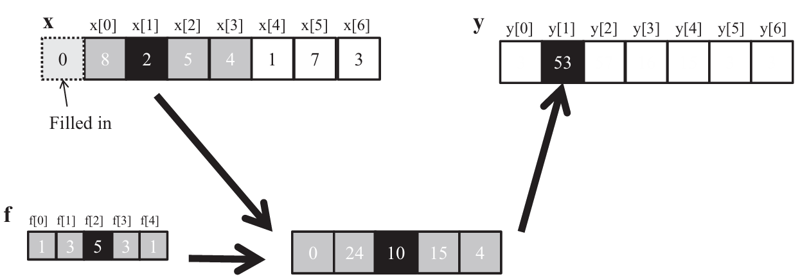

## Summary of Day 20

> **Ending Chapter 7*

#### Tiled Convolution Using Caches for Halo Cells

In traditional tiled convolution, each block loads an input tile into shared memory, including additional halo cells from neighboring tiles to ensure correct filtering at boundaries. However, a more optimized approach leverages **L2 cache** to reduce explicit shared memory usage for halo cells.

---

### What’s Different?

- **Traditional Approach:** Load the full tile plus extra halo cells into shared memory.
- **Optimized Approach:** Load only the tile into shared memory, and fetch halo cells from L2 cache or global memory when needed.

### Key Changes and Why They Matter

- **Keeping Input & Output Tiles the Same Size:** 
    - Usually, input tiles are bigger than output tiles to store extra halo cells.
    - Here, input and output tiles are identical (e.g., `TILE_SIZE × TILE_SIZE`).
    - This keeps memory access patterns simple and predictable for CUDA.

- **Loading Only the Required Pixels into Shared Memory:**
    - Each thread loads just one pixel from the tile into shared memory.
    - Halo cells are not stored in shared memory anymore.

- **Accessing Halo Cells Directly from L2 Cache/Global Memory:**
    - If a thread needs a halo cell, it checks where the value is:
        - **If it’s inside the tile**: Use shared memory *(fast)*.
        - **If it’s in the halo region**: Fetch from ***L2 cache or global memory*** *(cached)*.
        - **If it’s outside the image**: Assume zero *(avoids invalid access)*.

### Why Is This Better?

- **Less Shared Memory Usage:** More memory available for other computations.
- **Lower Register Pressure:** CUDA kernels run more efficiently.
- **Better Thread Scheduling:** Tiles are power of 2 in size, which improves memory coalescing.

### How Does It Work in the Code?

1. Each thread block loads only the required pixels (not extra halo cells).
2. Convolution is applied using shared memory (for tile) and L2 cache or global memory (for halo).
3. The output is stored in global memory, ready for the next step.

> [Click Here](./tiled_2D_with_cache.cu) to view the modified code. Modified on yesterday.

---

***Exercises***

1. Calculate the $\text{y}[0]$ value in figure below:

    <div align="center">
        
        <p><b>Fig 20_01: </b><i>1D Convolution Boundary Condition Diagram</i></p>
    </div>

    _Solution:_ 

    For calulating the value of y[0], `x` should be designed as folowing:

    <div align="center">

    | 0 | 0 | 8 | 2 | 5 | 4 | 1 | 7 | 3 |
    |---|--|--|--|--|--|--|--|--|

    </div>

    Then using  the function provided; 
```math
\text{y}[0] =  0 \times 1 + 0 \times 3 + 8 \times 5 + 2 \times 3 + 5 \times 1 = 40 + 6 + 5 = \boxed{51}
```

2. Consider performing a 1D convolution on array $\text{N} = \{4,1,3,2,3\}$ with filter $\text{F}= \{2,1,4\}$. What is the resulting output array?


    | Input Array (N) | 4 | 1 | 3 | 2 | 3 |
    |-----------------|---|---|---|---|---|
    | Filter (F)      | 2 | 1 | 4 |   |   |

    Here, the valid convolution output size: $\text{len}(N)- \text{len}(F) + 1 = 5-3+1 = 3$

    So, computing the values of $\text{y[0], y[1]}$ and $\text{y[2]}$:

    $\text{y[0]} = 4 \times 2 + 1 \times 1 + 3 \times 4 = 21$\
    $\text{y[1]} = 1 \times 2 + 3 \times 1 + 2 \times 4 = 13$\
    $\text{y[2]} = 3 \times 2 + 2 \times 1 + 3 \times 4 = 20$

    Hence, the output array would look like:

    | Output Array (y) | 21 | 13 | 20 | 
    |------------------|----|----|----|

3. What do you think the following 1D convolution filters are doing?

    1. $[0 \space 1 \space 0]$

        _Answer:_ This is an **identity filter**. The filter copies the value of the center element from the input.

    2. $[0 \space 0 \space 1]$

        _Answer:_ This filter picks the value two steps behind the input and shifts it forward. For example, if the input is `[a, b, c, d, e]`, the output will be `[c, d, e, 0, 0]`.

    3. $[1 \space 0 \space 0]$

        _Answer:_ This filter picks the value two steps ahead of the input and shifts it backward. For example, if the input is `[a, b, c, d, e]`, the output will be `[0, 0, a, b, c]`.

    4. $[\frac{21}{2} \space 0 \space \frac{1}{2}]$

        _Answer:_ This filter applies a weighted sum where the first element is multiplied by $\frac{21}{2}$ and the third element by $\frac{1}{2}$. It can be used to emphasize the first element while slightly considering the third element.

    5. $[\frac{1}{3} \space \frac{1}{3} \space \frac{1}{3}]$

        _Answer:_ This is an **averaging filter**. It computes the average of the current element and its two neighbors. It is often used for smoothing or blurring the input.

4. Consider performing a 2D convolution on a square matrix of size $N \times N$ with a square filter of size $M \times M$:
    1. How many ghost cells are there in total?
        > **Ghost cells:** Extra cells added when padding is applied.
        - For a filter of size $M \times M$, the padding $P$ on each side of the input matrix must satisfy:\
        \
        $P = \frac{M-1}{2}$\
        leading to total padding of $M -1$ in each dimension.\
        The total number of ghost cells is given by:\
        \
        $(N+M-1)^2 - N^2 = \boxed{(M-1)(2N+M-1)}$

    2. How many multiplications are performed if ghost cells are treated as multiplications _(by $0$)_?
        - When ghost cells are treated as valid inputs (multiplied by 0), the padded matrix ensures the filter slides across all $N \times N$ positions. Each position requires $M^2$ element-wise multiplications (including padded zeros). The total becomes:\
        \
        $\text{Total Multiplications} = \boxed{N^2 \times M^2}$

    3. How many multiplications are performed if ghost cells are not treated as multiplications?
        - Without padding (valid convolution), the filter remains entirely within the original matrix bounds. The output size reduces to $(N- M + 1) \times (N-M+1)$, and each position still requires $M^2$ multiplications:\
        \
        $\text{Total Multiplications} = \boxed{(N-M+1)^2 \times M^2}$


5. Revise the 2D kernel code below to perform 3D convolution.
    ```cpp
    __global__ void convolution2D_basic_kernel(float *N, float *F, float *P, int r, int width, int height) {
        int outCol = blockIdx.x * blockDim.x + threadIdx.x;
        int outRow = blockIdx.y * blockDim.y + threadIdx.y;
        float Pvalue = 0.0f;

        for (int fRow = 0; fRow < 2 * r + 1; fRow++) {
            for (int fCol = 0; fCol < 2 * r + 1; fCol++) {
                int inRow = outRow - r + fRow;
                int inCol = outCol - r + fCol;
                if (inRow >= 0 && inRow < height && inCol >= 0 && inCol < width) {
                    Pvalue += F[fRow * (2 * r + 1) + fCol] * N[inRow * width + inCol];
                }
            }
        }
        P[outRow * width + outCol] = Pvalue;
    }
    ```
    _Solution:_

    **Modified Kernel code:**
    ```cpp
    __global__ void convolution3D_basic_kernel(float *N, float *F, float *P, int r, int width, int height, int depth) {
        // Identify the output position
        int outCol = blockIdx.x * blockDim.x + threadIdx.x; // X-coordinate
        int outRow = blockIdx.y * blockDim.y + threadIdx.y; // Y-coordinate
        int outSlice = blockIdx.z * blockDim.z + threadIdx.z; // Z-coordinate (depth)

        // Ensure the thread operates within the bounds of the output matrix
        if (outCol < width && outRow < height && outSlice < depth) {
            float Pvalue = 0.0f;

            // Iterate through the 3D filter dimensions
            for (int fSlice = 0; fSlice < 2 * r + 1; fSlice++) {   // Depth of the filter
                for (int fRow = 0; fRow < 2 * r + 1; fRow++) {     // Height of the filter
                    for (int fCol = 0; fCol < 2 * r + 1; fCol++) { // Width of the filter
                        int inSlice = outSlice - r + fSlice;
                        int inRow = outRow - r + fRow;
                        int inCol = outCol - r + fCol;

                        // Check valid bounds for the input matrix
                        if (inSlice >= 0 && inSlice < depth && 
                            inRow >= 0 && inRow < height && 
                            inCol >= 0 && inCol < width) {
                            Pvalue += F[fSlice * (2 * r + 1) * (2 * r + 1) + fRow * (2 * r + 1) + fCol] * 
                                      N[inSlice * width * height + inRow * width + inCol];
                        }
                    }
                }
            }

            // Write the computed value to the output matrix
            P[outSlice * width * height + outRow * width + outCol] = Pvalue;
        }
    }
    ```
    ***Entire Code in Execution:*** [Click Here](3D.cu) to redirect!

---
> _End of Chapter -7_

<div align="center">
    <b>
        End of Day_20🫡
    </b>
</div>


