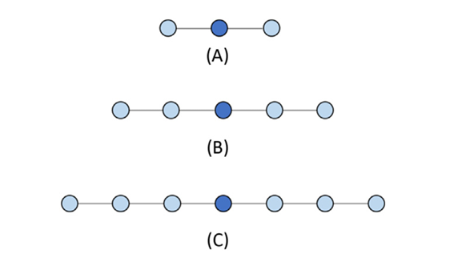
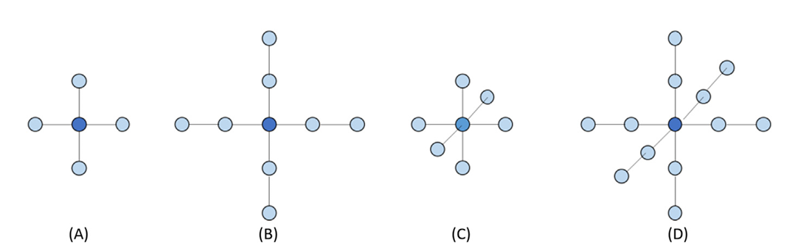

## Summary of Day 21:

> **Starting of new chapter; Chapter — 8 **Stencil***

#### Stencil Computation: _What is it?_
Stencil computations are a class of numerical algorithms used to **update elements in a data grid based on neighboring values**. They appear in many scientific and engineering applications, such as:

- **Solving Partial Differential Equations (PDEs)**
- **Heat Diffusion Simulations**
- **Image Processing _(Blurring, Edge Detection)_**
- **Fluid Dynamics & Weather Simulation**

Each point in a grid is updated by applying a fixed pattern (stencil) over its neighborhood.

---
#### Difference Between Stencil Computation and Convolution:
Though both apply a kernel to a region of data, they differ in intent:
|**Features**|	**Stencil Computation**|	**Convolution**|
|-------|----------------------|----------------|
|Purpose|	Used in PDEs, scientific computing|	Mostly used in deep learning & signal/image processing|
|Operation|	Updates each grid point based on its neighbors|	Computes weighted sum using a kernel|
|Data Dependency|	Strong dependencies on neighboring values|	Often applied with independent operations|

> _Stencil computations typically involve solving **differential equations**, while convolution is a **mathematical operation** used in filtering and feature extraction._

---
#### Stencils: 
> ***Definition:*** A stencil is a pattern of weights applied to grid points for numerical approximations of derivatives.

1. **Finite-Difference Approximation**
For a function $f(x)$, the first derivative is approximated as:

```math 
f'(x) = \frac{f(x+h)- f(x-h)}{2h} + O(h^2)
```
where:
- $h$: grid spacing
- $O(h^2)$: error term, proportional to $h^2$

> **Discrete Derivative Example:**
> Given grid array $F[i]$, 
> ```math
> F_{D}[i] = \frac{F[i+1]- F[i-1]}{2h}
> ```
> Rewriting as a weighted sum:
> ```math 
> F_{D}[i] = - \frac{1}{2h}F[i-1] + \frac{1}{2h} F[i+1]
> ```
> This defines a **three-point stencil**.

>_*Slight Notes:_  
>***Higher-Order Stencils*** 
> - **Five-point stencil** (second derivatives) involves $[i-2, i-1, i, i+1, i+2]$.
> - **Seven-point stencil** (third derivatives) involves three points on either side and so on. 
>
> <div align = "center">
>   
>    <p><b>Fig 21_01: </b><i> One-dimensional stencil examples. (A)Three-point (order1) stencil. (B)Five-point (order2) stencil. (C)Seven-point (order3) stencil.</i></p>
></div>
>
> #### 2D Stencils
> For PDEs with two variables $(x,y)$:
> - **Five-point stencil** (Order 1): Uses grid points along x/y axes.
> - **Nine-point stencil** (Order 2): Includes diagonals.
>
> <div align = "center">
>   
>    <p><b>Fig 21_02: </b><i> (A)Two-dimensional five-point stencil (order1).(B)Two-dimensional nine-point stencil (order2). (C)Three-dimensional seven-point stencil (order1). (D)Three-dimensional 13 point stencil (order2).</i></p>
></div>


#### Parallel Stencil: _A Basic Algorithm_

> **Boundary Conditions**:
Boundary cells store fixed values and do not update during computation.

*Kernel Code for basic CUDA for Stencil Swap:*
```cpp
__global__ void stencil_kernel(float* in, float* out, unsigned int N) {
    unsigned int i = blockIdx.z * blockDim.z + threadIdx.z;
    unsigned int j = blockIdx.y * blockDim.y + threadIdx.y;
    unsigned int k = blockIdx.x * blockDim.x + threadIdx.x;

    if (i >= 1 && i < N - 1 && j >= 1 && j < N - 1 && k >= 1 && k < N - 1) {
        out[i*N*N + j*N + k] = 
              c0 * in[i*N*N + j*N + k]
            + c1 * in[i*N*N + j*N + k - 1]
            + c2 * in[i*N*N + j*N + k + 1]
            + c3 * in[i*N*N + (j - 1)*N + k]
            + c4 * in[i*N*N + (j + 1)*N + k]
            + c5 * in[(i - 1)*N*N + j*N + k]
            + c6 * in[(i + 1)*N*N + j*N + k];
    }
}
```
The full code implementation: [Click Here](./basic_stencil.cu) to redirect!

> ***Performance Analysis:***
> Each thread:
>
> - Performs **13 floating-point operations** (7 multiplications + 6 additions).
> - Loads **7 input values** from global memory.
> 
> Arithmetic Intensity:
> ```math
>   \text{Ratio} =  \frac{13}{7 \times 4} = 0.46 \space \text{OP/B}
> ```
> _This **low ratio** suggests the kernel is memory-bound._

#### Shared Memory Tiling for Stencil Sweep

> ##### Shared Memory Optimization: 
> _Shared memory tiling reduces global memory access by caching reusable data on-chip._\
> **Input tile:** Includes **halo regions** around the output tile.

_Kernel Code for Optimized Kernel using Shared Memory_
```cpp
__global__ void tiled_stencil_kernel(float* in, float* out, unsigned int N) {
    __shared__ float tile[IN_TILE_DIM][IN_TILE_DIM][IN_TILE_DIM];

    int i = blockIdx.z * OUT_TILE_DIM + threadIdx.z - HALO;
    int j = blockIdx.y * OUT_TILE_DIM + threadIdx.y - HALO;
    int k = blockIdx.x * OUT_TILE_DIM + threadIdx.x - HALO;

    if (i >= 0 && i < N && j >= 0 && j < N && k >= 0 && k < N) {
        tile[threadIdx.z][threadIdx.y][threadIdx.x] = in[i*N*N + j*N + k];
    }
    __syncthreads();

    if (threadIdx.z >= HALO && threadIdx.z < IN_TILE_DIM-HALO &&
        threadIdx.y >= HALO && threadIdx.y < IN_TILE_DIM-HALO &&
        threadIdx.x >= HALO && threadIdx.x < IN_TILE_DIM-HALO) {
        out[i*N*N + j*N + k] = 
              c0 * tile[threadIdx.z][threadIdx.y][threadIdx.x]
            + c1 * tile[threadIdx.z][threadIdx.y][threadIdx.x - 1]
            + c2 * tile[threadIdx.z][threadIdx.y][threadIdx.x + 1]
            + c3 * tile[threadIdx.z][threadIdx.y - 1][threadIdx.x]
            + c4 * tile[threadIdx.z][threadIdx.y + 1][threadIdx.x]
            + c5 * tile[threadIdx.z - 1][threadIdx.y][threadIdx.x]
            + c6 * tile[threadIdx.z + 1][threadIdx.y][threadIdx.x];
    }
}
```
Full code implementation: [Click Here](./optimized_stencil.cu) to redirect! 

> ***Key Optimizations:***
> - Shared memory stores input tiles to minimize global memory accesses.
> - Threads load data collaboratively.
> - Halo regions ensure boundary conditions.
> - Synchronization (`__syncthreads()`) prevents race conditions.

#### Improved Arithmetic-to-Memory Ratio
With shared memory tiling:
```math 
\text{Ratio} = \frac{13(T-2)^3}{4T^3}
```

For **large tiles** $(T >> Halo)$:
```math 
\text{Ratio} \approx 3.25 \space \text{OP/B}
```

> ***Challenges with Small Tile Sizes:***
> - Small tiles (e.g., $T=8$) limit reuse ratio to $≈1.37 \space OP/B$.
> - High halo overhead reduces efficiency.

--- 
<div align="center">
    <b>
        End of Day_21🫡
    </b>
</div>
