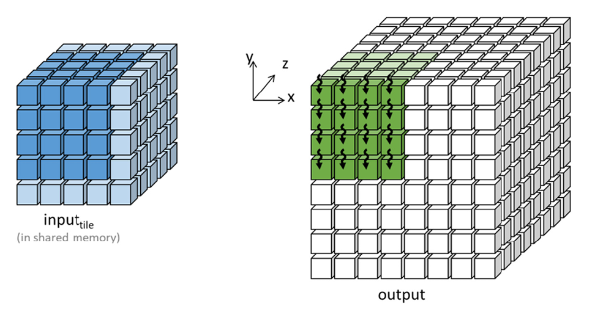

## Summary of Day 22:

> _*Starting of Thread Coarsening_

### Optimizing 3D Stencil Computations Through Thread Coarsening and Register Tiling:

#### **Fundamental Challenges in 3D Stencil Optimization**

***Limitations of Shared Memory Tiling:***

Stencil operations - critical for solving PDEs in fluid dynamics, weather modeling, and electrodynamics - face unique optimization hurdles compared to convolutions due to:

- **3D Grid Sparsity**: Each output point depends on sparse neighboring inputs (e.g., 7-point stencil: 6 face neighbors + center)
- **Halo Overhead**: Small tile sizes $(T^3)$ lead to disproportionate ghost cell transfers.
    <div align= "center">
        
        <p><b>Fig 22_01: </b><i>Thread coarsening in the z direction for a 3D seven-point stencil sweep</i></p>
    </div>
> _Here, in the diagram; to make it easier to visualize (front, left and top) have been removed from the blue cube. This allows us to see how threads access internal points and their neighbors during computation._

- **Memory-Compute Imbalance**: Original shared memory kernels achieve only 1.37 OP/B (operations per byte) vs theoretical 3.25 OP/B ceiling due to redundant halo loads.

---
#### **Thread Coarsening Architecture**

1. ***Core Concept:***
    Thread coarsening serializes parallel work units by:

    - Assigning z-direction columns *(Fig 22_01)* to each thread
    - Using $T×T$ thread blocks instead of 
    $T^3$, enabling larger tiles (e.g., $T=32 → 1024$ threads/block)

    *The kernel code would look like:*
    ```cpp
    __global__ void stencil_kernel(float* in, float* out, unsigned int N) {
        int iStart = blockIdx.z * OUT_TILE_DIM;
        int j = blockIdx.y * OUT_TILE_DIM + threadIdx.y - 1;
        int k = blockIdx.x * OUT_TILE_DIM + threadIdx.x - 1;

        __shared__ float inPrev_s[IN_TILE_DIM][IN_TILE_DIM];
        __shared__ float inCurr_s[IN_TILE_DIM][IN_TILE_DIM];
        __shared__ float inNext_s[IN_TILE_DIM][IN_TILE_DIM];

        if (iStart - 1 >= 0 && iStart - 1 < N && j >= 0 && j < N && k >= 0 && k < N) {
            inPrev_s[threadIdx.y][threadIdx.x] = in[(iStart - 1) * N * N + j * N + k];
        }

        if (iStart >= 0 && iStart < N && j >= 0 && j < N && k >= 0 && k < N) {
            inCurr_s[threadIdx.y][threadIdx.x] = in[iStart * N * N + j * N + k];
        }

        for (int i = iStart; i < iStart + OUT_TILE_DIM; ++i) {
            if (i + 1 >= 0 && i + 1 < N && j >= 0 && j < N && k >= 0 && k < N) {
                inNext_s[threadIdx.y][threadIdx.x] = in[(i + 1) * N * N + j * N + k];
            }
        }

        __syncthreads();

        if (iStart >= 1 && iStart < N - 1 && j >= 1 && j < N - 1 && k >= 1 && k < N - 1) {
            if (threadIdx.y >= 1 && threadIdx.y < IN_TILE_DIM - 1 &&
                threadIdx.x >= 1 && threadIdx.x < IN_TILE_DIM - 1) {
                out[iStart * N * N + j * N + k] =
                    c0 * inCurr_s[threadIdx.y][threadIdx.x] +
                    c1 * inCurr_s[threadIdx.y][threadIdx.x - 1] +
                    c2 * inCurr_s[threadIdx.y][threadIdx.x + 1] +
                    c3 * inCurr_s[threadIdx.y + 1][threadIdx.x] +
                    c4 * inCurr_s[threadIdx.y - 1][threadIdx.x] +
                    c5 * inPrev_s[threadIdx.y][threadIdx.x] +
                    c6 * inNext_s[threadIdx.y][threadIdx.x];
            }
        }

        __syncthreads();

        inPrev_s[threadIdx.y][threadIdx.x] = inCurr_s[threadIdx.y][threadIdx.x];
        inCurr_s[threadIdx.y][threadIdx.x] = inNext_s[threadIdx.y][threadIdx.x];
    }
    ```
    <details>
    <summary> <b>In detail breakdown of the kernel code: </b><i>(Click to expand)</i></summary>
    
    **Kernel Function Signature**
    ```cpp
    __global__ void stencil_kernel(float* in, float* out, unsigned int N)
    ```
    - **__global__** → Indicates this is a CUDA kernel that runs on the GPU.
    - **float* in** → Pointer to input data in **global memory**.
    - **float* out** → Pointer to output data in **global memory**.
    - **unsigned int N** → Grid size (NxNxN).<br><br>
    
    **Compute Thread and Block Indices**
    Each thread operates on a **3D grid**. We calculate `(i, j, k)` indices:
    ```cpp
    int iStart = blockIdx.z * OUT_TILE_DIM;
    int j = blockIdx.y * OUT_TILE_DIM + threadIdx.y - 1;
    int k = blockIdx.x * OUT_TILE_DIM + threadIdx.x - 1;
    ```
    - **iStart** → The depth index (**z** dimension).
    - **j, k** → Row (**y**) and column (**x**) positions.
    - Subtracting `1` helps with handling boundary conditions.<br><br>
    
    **Shared Memory Allocation**
    To speed up memory access, we use **shared memory** for storing slices:
    ```cpp
    __shared__ float inPrev_s[IN_TILE_DIM][IN_TILE_DIM];
    __shared__ float inCurr_s[IN_TILE_DIM][IN_TILE_DIM];
    __shared__ float inNext_s[IN_TILE_DIM][IN_TILE_DIM];
    ```
    - **inPrev_s** → Stores values from the **previous depth (z-1)**.
    - **inCurr_s** → Stores values from the **current depth (z)**.
    - **inNext_s** → Stores values from the **next depth (z+1)**.<br><br>
   
    **Load Data from Global Memory to Shared Memory**
    ```cpp
    if (iStart - 1 >= 0 && iStart - 1 < N) 
        inPrev_s[threadIdx.y][threadIdx.x] = in[(iStart - 1) * N * N + j * N + k];

    if (iStart >= 0 && iStart < N) 
        inCurr_s[threadIdx.y][threadIdx.x] = in[iStart * N * N + j * N + k];

    if (iStart + 1 >= 0 && iStart + 1 < N) 
        inNext_s[threadIdx.y][threadIdx.x] = in[(iStart + 1) * N * N + j * N + k];
    ```
    **`__syncthreads();`** is called to synchronize all threads before proceeding.<br>

    **Apply the Stencil Computation**
    ```cpp
    if (iStart >= 1 && iStart < N - 1 && j >= 1 && j < N - 1 && k >= 1 && k < N - 1) {
        if (threadIdx.y >= 1 && threadIdx.y < IN_TILE_DIM - 1 &&
            threadIdx.x >= 1 && threadIdx.x < IN_TILE_DIM - 1) {
            out[iStart * N * N + j * N + k] =
                c0 * inCurr_s[threadIdx.y][threadIdx.x] +
                c1 * inCurr_s[threadIdx.y][threadIdx.x - 1] +  // Left neighbor
                c2 * inCurr_s[threadIdx.y][threadIdx.x + 1] +  // Right neighbor
                c3 * inCurr_s[threadIdx.y + 1][threadIdx.x] +  // Bottom neighbor
                c4 * inCurr_s[threadIdx.y - 1][threadIdx.x] +  // Top neighbor
                c5 * inPrev_s[threadIdx.y][threadIdx.x] +      // Previous depth
                c6 * inNext_s[threadIdx.y][threadIdx.x];       // Next depth
        }
    }
    ```
    Each thread updates its `out[i, j, k]` using its neighbors.

    **Prepare for the Next Iteration**
    ```cpp
    __syncthreads();
    inPrev_s[threadIdx.y][threadIdx.x] = inCurr_s[threadIdx.y][threadIdx.x];
    inCurr_s[threadIdx.y][threadIdx.x] = inNext_s[threadIdx.y][threadIdx.x];
    ```
    This shifts the stencil window, making the next iteration efficient.
</details>

> [Click Here](./thread_coarsening1.cu) to redirect to the full code implementation. 

> ***Output looks like:***
> ```shell
> ========================================
>       3D STENCIL GPU ACCELERATOR       
> ========================================
> Grid Size: 256x256x256
> Tile Size: 32x32
> Shared Memory/Block: 13 KB
> ========================================
>
> Execution Summary:
> Grid Dimensions: 8x8x8
> Block Dimensions: 34x34
> Total Time: 30.2896 ms
> Throughput: 4.43115 GB/s
> ========================================
> ```

2. ***Quantitative Improvements***:

<div align="center">

| Metric|	Original|	Coarsened $(T=32)$|
|-------|-----------|---------------------|
|Threads/Block	|$T^3$| $T^2$ $(1024)$ |
|Shared Memory Usage|	$T^3$ | $3T^2 (3 \space \text{KB})$ |
|FLOP/Byte Ratio|	1.37|	2.68|
|Active Outputs/Block	| $(T−2)^3$ |$(T−2)^2 \times T$ |

</div>


3. ***Register Tiling Optimization***: 

    Register tiling exploits stencil sparsity:
    - **Registers:** Store z-neighbors _(inPrev, inNext)_ - single consumer
    - **Shared Memory:** Store x-y plane _(inCurr_s)_ - multi-consumer

    *Kernel Code for Tiled Shared Memory*
    ```cpp
    __global__ void stencil_kernel(float* in, float* out, unsigned int N) {
        int iStart = blockIdx.z * OUT_TILE_DIM;
        int j = blockIdx.y * OUT_TILE_DIM + threadIdx.y - 1;
        int k = blockIdx.x * OUT_TILE_DIM + threadIdx.x - 1;
        
        float inPrev;
        __shared__ float inCurr_s[IN_TILE_DIM][IN_TILE_DIM];
        float inCurr;
        float inNext;
        
        if (iStart - 1 >= 0 && iStart - 1 < N && j >= 0 && j < N && k >= 0 && k < N) {
            inPrev = in[(iStart - 1) * N * N + j * N + k];
        }
        
        if (iStart >= 0 && iStart < N && j >= 0 && j < N && k >= 0 && k < N) {
            inCurr = in[iStart * N * N + j * N + k];
            inCurr_s[threadIdx.y][threadIdx.x] = inCurr;
        }
        
        for (int i = iStart; i < iStart + OUT_TILE_DIM; ++i) {
            if (i + 1 >= 0 && i + 1 < N && j >= 0 && j < N && k >= 0 && k < N) {
                inNext = in[(i + 1) * N * N + j * N + k];
            }
            
            __syncthreads();
            
            if (i >= 1 && i < N - 1 && j >= 1 && j < N - 1 && k >= 1 && k < N - 1) {
                if (threadIdx.y >= 1 && threadIdx.y < IN_TILE_DIM - 1 && threadIdx.x >= 1 && threadIdx.x < IN_TILE_DIM - 1) {
                    out[i * N * N + j * N + k] = c0 * inCurr
                        + c1 * inCurr_s[threadIdx.y][threadIdx.x - 1]
                        + c2 * inCurr_s[threadIdx.y][threadIdx.x + 1]
                        + c3 * inCurr_s[threadIdx.y + 1][threadIdx.x]
                        + c4 * inCurr_s[threadIdx.y - 1][threadIdx.x]
                        + c5 * inPrev
                        + c6 * inNext;
                }
            }
            
            __syncthreads();
            
            inPrev = inCurr;
            inCurr = inNext;
            inCurr_s[threadIdx.y][threadIdx.x] = inNext;
        }
    }
    ```
    > For Full Code implementation of this [Click Here](./thread_coarsening2.cu)

> ***Output looks like:***
> ```shell
> =======================================================================
>       3D STENCIL GPU ACCELERATOR: OPTIMIZED WITH REGISTER TILING     
> =======================================================================
> Grid Size: 256x256x256
> Tile Size: 32x32
> Shared Memory/Block: 4 KB
> =======================================================================
>
> Execution Summary:
> Grid Dimensions: 8x8x8
> Block Dimensions: 34x34
> Total Time: 16.6221 ms
> Throughput: 8.07465 GB/s
> =======================================================================
> ```

---
<div align="center">
    <b>
        End of Day_22🫡
    </b>
</div>

