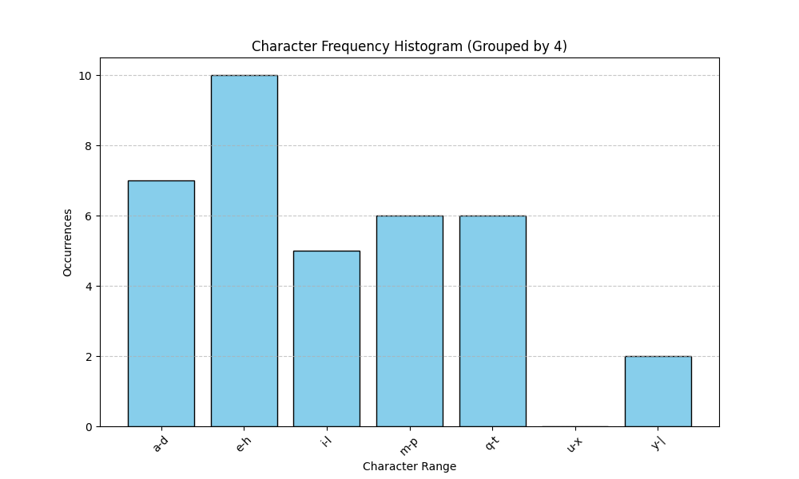

## Summary of Day 24:

>**Starting of Chapter 9 — Parallel Histogram*

#### **Parallel Histogram** — *What's the difference in Parallel Computation and Parallel Histogram Computation?*

The parallel histogram computation pattern differs from previous parallel computation techniques where each output element is exclusively assigned to a thread. In a parallel histogram, multiple threads may update the same output element, requiring careful coordination to prevent data corruption.

> ***Key Concepts:***
> 1. **Atomic Operations:**
>       - A simple but inefficient method to prevent race conditions.
>       - Each thread uses atomic operations to update shared memory safely, but serialization leads to slow execution.
>
> 2. **Privatization (Optimization Technique):**
>       - Instead of all threads updating a shared histogram, each thread maintains a private copy.
>       - These private histograms are later merged, reducing contention and improving speed.
>       - Performance depends on hardware and input data characteristics.
> 3. **Applications of Histograms:**
> 
>       - **Fraud Detection**: Analyzing unusual spending patterns.
>       - **Computer Vision**: Identifying objects in images through pixel intensity histograms.
>       - **Speech Recognition & Scientific Data Analysis**: Identifying significant patterns in large datasets.

---

[Click Here](./parallel_hist.cu) to redirect towards a simple parallel Histogram Using Atomic Operations 

> Output looks like:
> ```shell
> Enter the text (Limited to 100 Characters): Welcome to Day 24 of 100 days CUDA challenge. This is Chapter 9
> 
> Histogram Data:
> Interval 0-3 [a-d]: 7 occurrences
> Interval 4-7 [e-h]: 10 occurrences
> Interval 8-11 [i-l]: 5 occurrences
> Interval 12-15 [m-p]: 6 occurrences
> Interval 16-19 [q-t]: 6 occurrences
> Interval 20-23 [u-x]: 0 occurrences
> Interval 24-27 [y-|]: 2 occurrences
> 
> Histogram saved to 'histogram.csv'.
> ``` 

I also createad a python file that plots the histogram _(might as well)_.

[Click Here](./parallel_hist_plot.py) to redirect to python file. 
> ***Output image:***
> <div align="center">
>   
> </div>

---
<div align="center">
    <b>
        End of Day_24🫡
    </b>
</div>