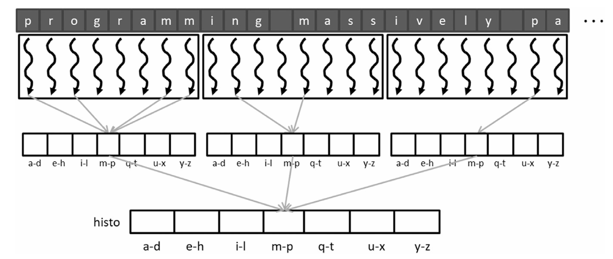
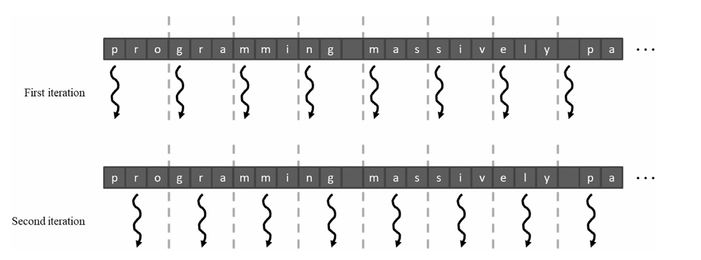
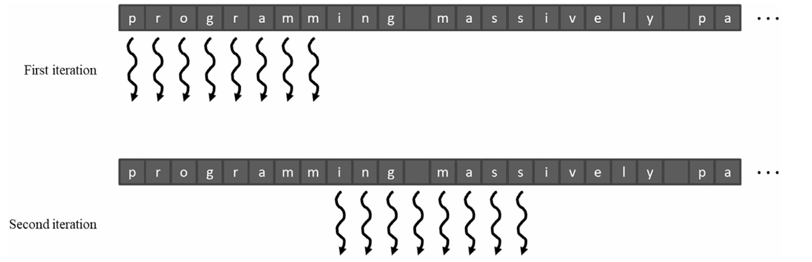

## Summary of Day 25:

> * Starting from 9.3 onwards

### Latency and throughput of atomic operations

#### **Atomic Operations and Their Challenges**
- Atomic operations ensure correctness by serializing updates to a memory location.

- *Performance Bottleneck:*

    - Serialized atomic operations reduce throughput and increase execution time.

    - *Example:* A system with 200-cycle latency achieves only 2.5M atomic operations/second, far below peak throughput.

- *Optimization:*

    - Modern GPUs use last-level caches for atomic operations, reducing latency from hundreds to tens of cycles and improving throughput.

#### Privatization:

- ***Concept:*** Reduce contention by creating private copies of data structures for subsets of threads.

- *Implementation:*
    - Each thread block updates its private copy of the histogram.
    - Private copies are merged into a global histogram after computation.
    

        
        
<b>Fig 25_01: </b><i>Privatization illustration</i>

    

- *Benefits:*
    - Reduces contention and improves throughput.

- *Drawbacks:*
    - Overhead in merging private copies back into the global structure.
  
    > [Click Here](privatization.cu) to redirect to the code example that uses Privatization with Shared Memory.

#### Coarsening
- *Objective:* Reduce privatization overhead by assigning multiple input elements to each thread.

- **Partitioning Strategies:**
    - *Contiguous Partitioning:*
        - Threads process contiguous segments of input data.
        - Suitable for CPUs but suboptimal for GPUs due to poor memory coalescing.

    

        
        
<b>Fig 25_02: </b><i>Contiguous Partitioning</i>

    

    - *Interleaved Partitioning:*
        - Threads process interleaved elements, ensuring memory coalescing.
        

        
        
<b>Fig 25_03: </b><i>Interleaved Partitioning</i>

        

    > [Click Here](./coarserning.cu) _to redirect to example code that uses CUDA Histogram with Shared Memory Coarsening with both **Contiguous and Interleaving Kernels**.Interleaved Partitioning_

#### Aggregation
- *Purpose:* Reduce contention by aggregating updates locally before committing them to the histogram.

- *Implementation:*
    - Each thread maintains an accumulator variable and tracks the last updated histogram index (`prevBinIdx`).

- *Advantages:*
    - Reduces the number of atomic operations on heavily contended bins.
    - By contended, I mean bins that are frequently accessed and updated by multiple threads.
  

    > [Click Here](aggregation.cu) to redirect to example code implementing aggregation in Hist on CUDA.
---

    <b>
        End of Day_25🫡
    </b>

