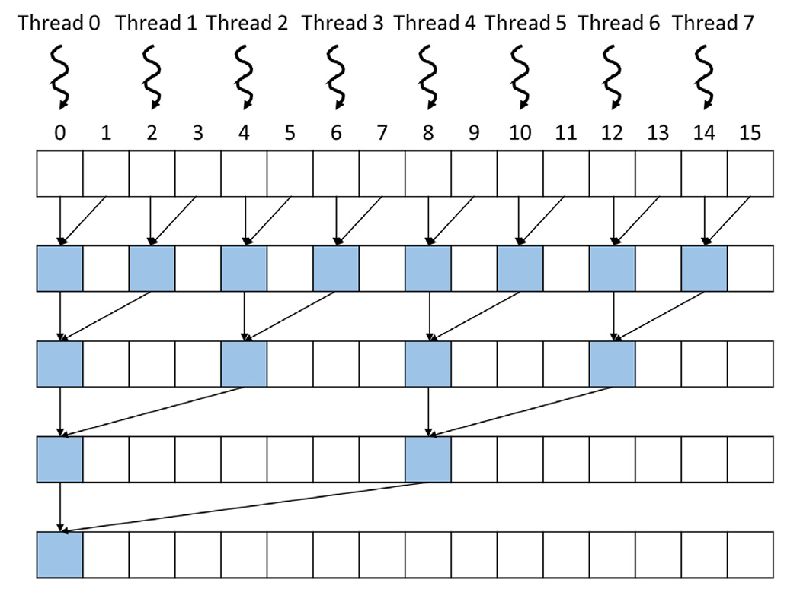
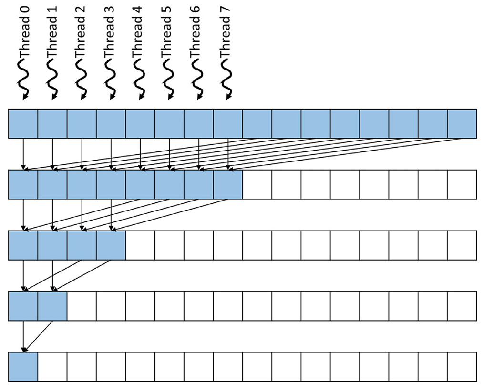

## Summary of Day 27:

> *Starting from 10.3 — A simple sum reduction kernel

#### Simple Sum Reduction Kernel

***How It Works:***
- Threads are assigned to even indices of the input array:

    - Thread 0 → Input, Thread 1 → Input[2], Thread 2 → Input[4], etc.

- The kernel operates as a reduction tree:

    - In each iteration, active threads add elements at a distance defined by the `stride` variable.

    - The `stride` starts at 1 and doubles each iteration (`stride *= 2`).

- Fewer threads participate in each iteration:

    - For example, in the second iteration, only threads with indices divisible by 2 remain active.

- Thread 0 writes the final sum to the output after all iterations.

> [Click Here](./SimpleSumReductionKernel.cu) to redirect towards fully implemented Simple Sum Reduction Kernel Code. 

<div align="center">

<p><b>Fig 27_01: </b><i>The assignment of threads (“owners”) to the input array locations and progress of execution over time for the SimpleSumReudctionKernel code above. The time progresses from top to bottom, and each level corresponds to one iteration of the for-loop.</i></p>
</div>

> ***Analogy for future me:*** 
> Imagine this as a tournament bracket where players (threads) compete in pairs. As rounds progress, fewer players remain active until only one winner (final sum) is left.

#### Optimized Thread Assignment *(Convergent Sum Reduction)*

***Changes?***
- Threads are now assigned to consecutive indices instead of even ones:
    - Thread 0 → Input, Thread 1 → Input[1], Thread 2 → Input[2], etc.

- The `stride` starts at half the array size and halves each iteration (`stride /= 2`).

<div align="center">

<p><b>Fig 27_02: </b><i> A better assignment of threads to input array locations for reduced control divergence.</i></p>
</div>

***How It Works:***
- In the first iteration:

    - Threads add elements that are halfway across the array.

    - *For example*, **Thread 0** adds `Input` to `Input`, **Thread 1** adds `Input` to `Input[1]`, and so on.

- In subsequent iterations:
    - Remaining active threads add elements closer together as the stride decreases.

- This keeps active threads grouped together within warps, significantly reducing control divergence.

> [Click Here](./optimizedKernel.cu) to redirect towards fully implemented Convergent Sum Reduction Kernel Code comparing against Simple Sum Reduction.

> ***Output:***
> ```pwsh
> Enter the number of elements (power of 2): 8
> Enter 8 float values:
> 8.5 4.9 78.5 2.1 45.2 6.9 4.8 6.3
> 
> Results:
> CPU Sum: 157.2
> Simple Sum Reduction (Kernel 1): 157.2 (Time: 0.386336 ms)
> Convergent Sum Reduction (Kernel 2): 157.2 (Time: 0.024576 ms)
> Mismatch detected! Debugging needed.
> ```

> ****Analogy:*** This is like organizing workers on an assembly line. Instead of randomly assigning tasks far apart, workers handle tasks that are closer together, making the process more streamlined and efficient.*

##### TL;DR

| Feature  | Simple Kernel| Optimized Kernel|
|----------|--------------|-------------------|
| Thread Assignment | Even indices| Consecutive indices|
| Stride Progression| Doubles (`stride *= 2`)| Halves (`stride /= 2`)|
| Control Divergence| High| Reduced |
| Resource Utilization Efficiency| $~35\%$ | $~66\%$ |
 
---
<div align="center">
    <b>
        End of Day_27🫡
    </b>
</div>