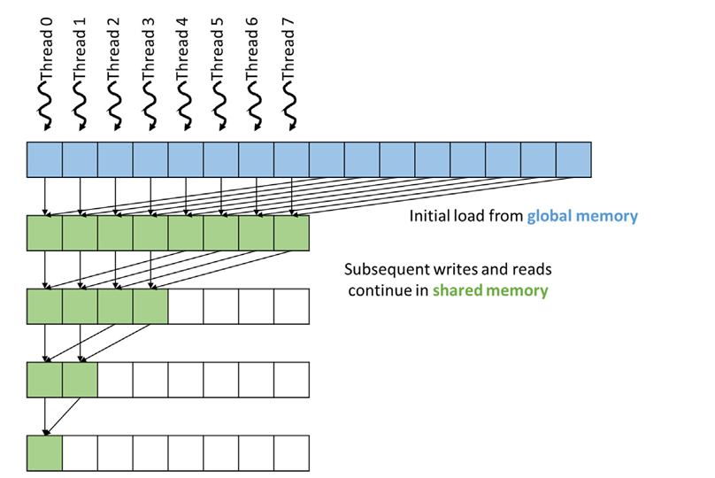
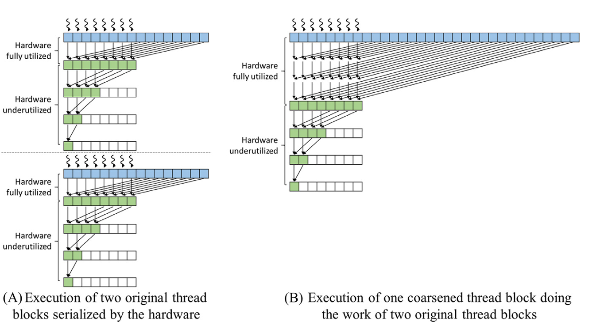

## Summary of Day 28:

> _*We are now focusing on more advanced CUDA reduction techniques, including shared memory usage, hierarchical reductions, and thread coarsening. These methods aim to improve performance by reducing global memory accesses, minimizing hardware underutilization, and optimizing thread execution._

1. Shared Memory for Reduction:

***Concept***:
- In previous kernels, threads repeatedly accessed global memory to read and write intermediate results. This is inefficient due to the high latency of global memory.
- Shared memory offers much lower latency and higher bandwidth, making it ideal for storing intermediate results during the reduction process.

***How It Works***:
- Each thread loads two elements from global memory, adds them, and stores the result in shared memory.

- The reduction process continues in shared memory:

    - Threads add elements at a decreasing stride (`stride /= 2`).

    - Synchronization (`__syncthreads()`) ensures all threads complete their operations before the next iteration.

- Finally, thread $0$ writes the result from shared memory to global memory.

    
    
<b>Fig 28_01: </b><i>Shared Memory to reduce access to global memory</i>

> [Click Here](shared_mem.cu) to redirect towards fully implemented Convergent Shared Memory Sum Reduction Kernel Code.

    

        <i>Slight Summary of How the Code Works</i>
    

    <ul>
        <li><code>BLOCK_DIM</code> of 1024 is defined first, next in the CUDA kernel, <code>2 * BLOCK_DIM</code> = 2048</li>
        <li>If I Input the value 5 while initializing an array, 5 * 2048 will be the final sum. ie., 10240</li>
    </ul>

> ***Benefits***
> - Reduces global memory accesses to just the initial load and final write.
> - For an array of size `N`, global memory accesses are reduced to `N + 1` (from `36` in previous kernels for a 256-element example).
> - Shared memory ensures coalesced access, further improving performance.

2. Hierarchical Reduction for Large Inputs

***Concept***:
- Previous kernels assume all threads are in a single block, limiting parallelism to the maximum number of threads per block (e.g., 1024).

- For large inputs _(millions or billions of elements)_, we need multiple blocks working independently.

- Hierarchical reduction splits the input into segments, processes each segment in a block, and combines results using atomic operations.

***How It Works***
- The input array is divided into segments, each assigned to a block.

- Each block performs a reduction on its segment using shared memory.

- The partial sum from each block is added to the global output using `atomicAdd`.

> [Click Here](hierarchial.cu) to redirect towards fully implemented Segmented Sum Reduction Kernel Code.

> ***Benefits***
> - Allows processing of arbitrarily large inputs by dividing work across multiple blocks.
> - Atomic operations ensure correct accumulation of partial sums.

3. Thread Coarsening for Reduced Overhead 

***Concept***
- Previous kernels maximize parallelism by assigning as few elements as possible to each thread.

- However, this leads to overhead due to synchronization and underutilization of hardware as threads drop out during reduction stages.

- Thread coarsening assigns more work to each thread, reducing the number of threads and synchronization overhead.

***How It Works***
- Each thread processes multiple elements independently before collaborating with other threads in its block.

    - A loop is used to sum up these elements locally (sum += ...).

- Once local sums are computed, threads collaborate using shared memory for the final reduction.

- Results are combined across blocks using atomic operations.

> [Click Here](Coarsened.cu) to redirect towards fully implemented Coarsened Sum Reduction Kernel Code.

***Benefits***
- Reduces synchronization overhead by performing more work independently within each thread.

- Improves hardware utilization:
    - More work is done while all threads are active.
    - Fewer steps require synchronization or shared memory access.

***Comparison: Without vs. With Coarsening***

| Feature                     | Without Coarsening | With Coarsening |
|-----------------------------|--------------------|-----------------|
| Steps Fully Utilizing Hardware | Fewer           | More            |
| Synchronization Overhead    | Higher             | Lower           |
| Total Steps                 | More               | Fewer           |

    
    
<b>Fig 28_02: </b><i>Comparing parallel reduction with and without thread coarsening</i>

---

    <b>
        End of Day_28🫡
    </b>

> End of Chapter 10: Exercises for tomorrow