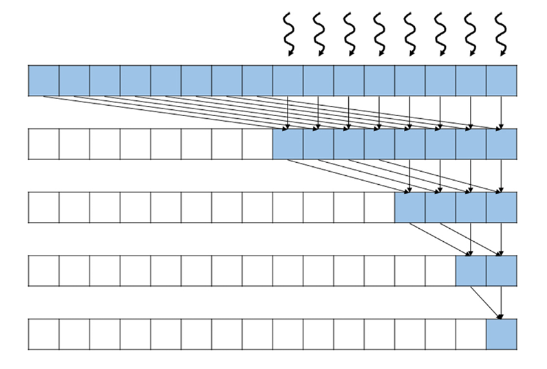

## Summary of Day 29

> *Exercises from Chapter 10

***Exercises***:
1.  For the simple reduction kernel in code below, if the number of elements is $1024$ and the warp size is $32$, how many warps in the block will have divergence during the fifth iteration?

    ```cpp
    __global__ void SharedMemorySumReductionKernel(float* input, float* output) {
        __shared__ float input_s[BLOCK_DIM];
        unsigned int t = threadIdx.x;

        input_s[t] = input[t] + input[t + BLOCK_DIM];
        __syncthreads();

        for (unsigned int stride = blockDim.x / 2; stride >= 1; stride /= 2) {
            if (threadIdx.x < stride) {
                input_s[t] += input_s[t + stride];
            }
            __syncthreads();
        }

        if (threadIdx.x == 0) {
            *output = input_s[0];
        }
    }
    ```

***Solution:***

For the given reduction kernel with 1024 elements and a warp size of 32, 1 warp will experience divergence during the fifth iteration. Here's the breakdown:

1. **Initial Setup:**
    - The kernel starts with `num_threads = 1024` (matching the number of elements) and iteratively halves the active threads.

2. **Iteration Analysis:**
    - By the fifth iteration, the number of active threads is reduced to:
    ```math 
    \frac{1024}{2^5} = 32 \space \text{threads}
    ```
    - These $32$ threads fit into exactly **1 warp** (since $32 \div 32 = 1$).

3. **Divergence Mechanism:**
    - In CUDA, divergence occurs when threads in the same warp follow different execution paths. During the fifth iteration:

        - Only threads with `threadIdx.x < 32` execute the reduction logic.

        - This condition splits the single active warp between threads executing the reduction and those idling, creating divergence within that warp.

Thus, **1 warp** contains a mix of active and inactive threads during the fifth iteration, leading to divergence.

---

2. For the improved reduction kernel in code below, if the number of elements is $1024$ and the warp size is $32$, how many warps will have divergence during the fifth iteration?

    ```cpp
    __global__ void ConvergentSumReductionKernel(float* input, float* output, int N) {
        unsigned int i = threadIdx.x;

        for (unsigned int stride = blockDim.x; stride >= 1; stride /= 2) {
            if (threadIdx.x < stride) {
                input[i] += input[i + stride];
            }
            __syncthreads();
        }

        if (threadIdx.x == 0) {
            *output = input[0];
        }
    }
    ```
***Solution***:

For the improved reduction kernel with 1024 elements and a warp size of 32, no warps will experience divergence during the fifth iteration. Here's the analysis:

1. **Kernel Behavior:**
    - The loop starts with `stride = blockDim.x` ($1024$ threads) and halves the stride each iteration.
    - Active threads at each iteration are `threadIdx.x < stride`.

2. **Fifth Iteration Details:**
    - Stride at fifth iteration:
    ```math 
    \text{stride} = \frac{1024}{2^4} = 64
    ```
    - Active threads: `0–63` (64 threads total).

3. **Warp Alignment:**
    - $64$ threads correspond to $2$ full warps $(64 ÷ 32 = 2)$.
    - **Both warps execute uniformly:** all threads in these warps satisfy `threadIdx.x < 64`, so no divergence occurs.

4. **Key Optimization:**
    - The improved kernel avoids partial warp activation by ensuring active threads always align with full warps until the final iteration with `stride < 32`.

---
3. Modify the above kernel to use the access pattern illustrated below:

<div align= "center">
    
    <p><b>Fig 29_01: </b><i> Question number 3 illustratory diagram</i></p>
</div>

***Solution***:

The modified kernel would look like:

```cpp
__global__ void OptimizedReductionKernel(float* input, float* output, int N) {
    unsigned int t = threadIdx.x;
    unsigned int stride;

    for (stride = 1; stride < blockDim.x; stride *= 2) {
        if (t % (2 * stride) == 0) {
            input[t] += input[t + stride];
        }
        __syncthreads();
    }

    if (t == 0) {
        *output = input[0];
    }
}
```

---

4. Modify the kernel below to perform a max reduction instead of a sum reduction.

    ```cpp
    __global__ void CoarsenedSumReductionKernel(float* input, float* output, int numElements) {
        __shared__ float input_s[BLOCK_DIM];
        unsigned int segment = COARSE_FACTOR * 2 * blockDim.x * blockIdx.x;
        unsigned int i = segment + threadIdx.x;
        unsigned int t = threadIdx.x;

  
        float sum = input[i];
        for (unsigned int tile = 1; tile < COARSE_FACTOR * 2; ++tile) {
            sum += input[i + tile*BLOCK_DIM];
        }

        input_s[t] = sum;

        for (unsigned int stride = blockDim.x / 2; stride >= 1; stride /= 2) {
            __syncthreads();
            if (t < stride) {
                input_s[t] += input_s[t + stride];
            }
        }

        if (t == 0) {
            atomicAdd(output, input_s[0]);
        }
    }
    ```
***Solution***:

The modified Kernel:

```cpp
__global__ void CoarsenedMaxReductionKernel(float* input, float* output, int numElements) {
    __shared__ float input_s[BLOCK_DIM];
    unsigned int segment = COARSE_FACTOR * 2 * blockDim.x * blockIdx.x;
    unsigned int i = segment + threadIdx.x;
    unsigned int t = threadIdx.x;

    float maxVal = input[i];

    for (unsigned int tile = 1; tile < COARSE_FACTOR * 2; ++tile) {
        maxVal = fmaxf(maxVal, input[i + tile * BLOCK_DIM]);
    }

    input_s[t] = maxVal;

    for (unsigned int stride = blockDim.x / 2; stride >= 1; stride /= 2) {
        __syncthreads();
        if (t < stride) {
            input_s[t] = fmaxf(input_s[t], input_s[t + stride]);
        }
    }

    if (t == 0) {
        atomicMax((int*)output, __float_as_int(input_s[0])); 
    }
}
```
---
5. Assume that parallel reduction is to be applied on the following input array:
<div align="center">

| 6 | 2 | 7 | 4 | 5 | 8 | 3 | 1 |
|---|---|---|---|---|---|---|---|

</div>

Show how the contents of the array change after each iteration if:
- The unoptimized kernel below is used.

    ```cpp
    __global__ void SimpleSumReductionKernel(float* input, float* output, int N) {
        unsigned int i = threadIdx.x;

        for (unsigned int stride = 1; stride < N; stride *= 2) {
            int index = 2 * stride * i;
            if (index + stride < N) {  
                input[index] += input[index + stride];
            }
            __syncthreads();  
        }

        if (i == 0) {
            *output = input[0];
        }
    }
    ```
- The kernel optimized for coalescing and divergence in below kernel code is used.
    ```cpp
    __global__ void ConvergentSumReductionKernel(float* input, float* output, int N) {
        unsigned int i = threadIdx.x;

        for (unsigned int stride = blockDim.x; stride >= 1; stride /= 2) {
            if (threadIdx.x < stride) {
                input[i] += input[i + stride];
            }
            __syncthreads();
        }

        if (threadIdx.x == 0) {
            *output = input[0];
        }
    }
    ```
***Solution***:
1. **Simple Sum Reduction Kernel _(Unoptimized)_**

This kernel follows a **non-optimal sequential addressing** pattern, leading to divergence and inefficient memory accesses.

Each iteration reduces elements spaced by a stride of 
$2^n$, with the first thread working on elements at index $0, 2, 4, ...$, the second on index $4, 8, ...$, and so on.

**Initial Array:**
```math 
[6,2,7,4,5,8,3,1]
```
**Step-By-Step Execution**:

**Iteration 1** _(Stride 1)_
- Array: $[6,2,7,4,5,8,3,1]$
    - `Thread 0`: $6+2 = 8 \longrightarrow \text{index 0}$ 
    - `Thread 1`: $7+4 = 11 \longrightarrow \text{index 2}$
    - `Thread 2`: $5+8 = 13 \longrightarrow \text{index 4}$
    - `Thread 3`: $3+1 = 4 \longrightarrow \text{index 6}$

- **Iteration 1** Output: $[8, 2, 11, 4, 13, 8, 4, 1]$

**Iteration 2** _(Stride 2)_
> Add elements spaced 2 tiles apart:
- Input array: $[8, 2, 11, 4, 13, 8, 4, 1]$
    - `Thread 0`: $ 8+ 11 = 19 \longrightarrow \text{index 0}$
    - `Thread 1`: $ 13+ 4 = 17 \longrightarrow \text{index 4}$
- **Iteration 2** Output: $[19, 2, 11, 4, 17, 8, 4, 1]$

**Iteration 3** _(Stride 4)_
- Input array: $[19, 2, 11, 4, 17, 8, 4, 1]$
    - `Thread 0`: $19 + 17 = 36 \longrightarrow \text{index 0}$
- Final Output of array: $[36, 2, 11, 4, 17, 8, 4, 1]$

2. **Convergent Sum Reduction Kernel _(Optimized for Coalescing and Divergence Reduction)_**

This kernel performs **more efficient memory accesses by reducing in a tree-like fashion**, where each thread updates elements based on the next half of the array, reducing warp divergence.

**Initial Array:**
```math 
[6,2,7,4,5,8,3,1]
```
**Step-By-Step Execution**:
> Stride progresses as $ 4 \rightarrow 2 \rightarrow 1$

**Iteration 1** _(Stride 4)_
- Array: $[6,2,7,4,5,8,3,1]$
    - `Thread 0`: $6 + 5 = 11 \longrightarrow \text{index 0}$
    - `Thread 1`: $2 + 8 = 10 \longrightarrow \text{index 1}$
    - `Thread 2`: $7 + 3 = 10 \longrightarrow \text{index 2}$
    - `Thread 3`: $4 + 1 = 5 \longrightarrow \text{index 3}$

- **Iteration 1** Output: $[11, 10, 10, 5, 5, 8, 3, 1]$

**Iteration 2** _(Stride 2)_
- Input array: $[11, 10, 10, 5, 5, 8, 3, 1]$
    - `Thread 0`: $11 + 10 = 21 \longrightarrow \text{index 0}$
    - `Thread 1`: $10 + 5 = 15 \longrightarrow \text{index 1}$

- **Iteration 2** Output: $[21, 15, 10, 5, 5, 8, 3, 1]$

**Iteration 3** _(Stride 1)_
- Input array: $[21, 15, 10, 5, 5, 8, 3, 1]$
    - `Thread 0`: $21 + 15 = 36 \longrightarrow \text{index 0}$

- Final Output of array: $[36, 15, 10, 5, 5, 8, 3, 1]$

---
> _Chapter 10 Exercises Completed!!_

