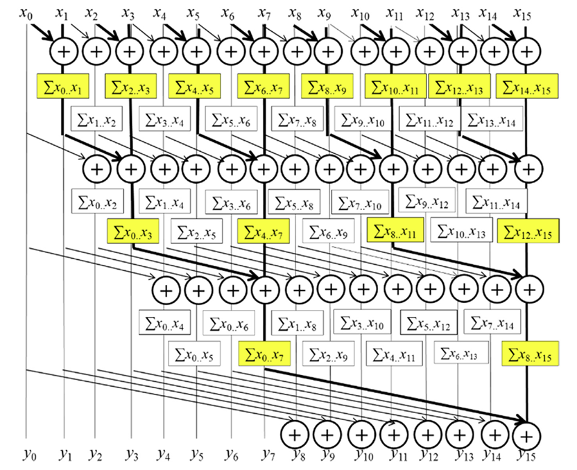
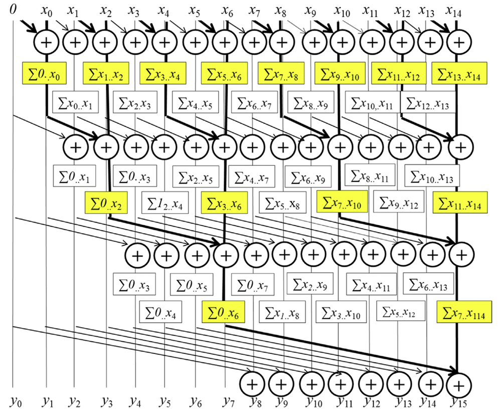

## Summary of Day 31:

> **Detailed Explanation of Kogge Stone Algo Continued*

Okay, So today let's dive deeper into this Algo and try to understand its mechanism, why we are using this and code implementation in more detailed way.

### 1. So what is Kogge-Stone Algo?

***Answer***: The Kogge-Stone algorithm is a parallel prefix sum algorithm optimized for **fast execution with minimal dependencies**.

### 2. Slight Overview:

- The algo operates on an array $\text{XY}$ that initially contains the input elements.
- It iteratively evolves the contents of $\text{XY}$ into cumulative sums *(inclusive/exclusive scan)* by leveraging a binary tree structure.
- After $\text{log}_{2}(N)$ iterations, where $N$ is the number of elements in the array, all cumulative sums are finalized.

### 3. Inclusive Prefix Sum Algorithm
---
#### **Algorithm Steps**
---
##### **Initialization**
1. The input array $\text{X}$ is loaded into $\text{XY}$.
2. Each element $\text{XY}[i]$ initially contains $\text{X}[i]$.

##### **Iterations**
for $k = 0$ to $\log_2(N) - 1$:

1. Compute the stride as $2^k$.
2. For each element $i$:
   - If $i \geq \text{stride}$, update:
     $$XY[i] = XY[i] + XY[i - \text{stride}]$$
   - Otherwise, leave $XY[i]$ unchanged.

##### **Final State**
After all iterations, $\text{XY}$ contains the inclusive scan results.

---

***Example with a $16$- Element Array***
<div align="center">
  
  <p><b>Fig 31_01: </b><i>A parallel inclusive scan algorithm based on Kogge-Stone adder design.</i></p>
</div>

**Step-by-step Execution:**

1. Initial State: Each element in $\text{XY}$ contains its corresponding input value:
$$\text{XY} = [x_0, x_1, x_2, ..., x_{15}]$$

2. Iteration 1 _(Stride= 1)_: Each element $XY[i]$ is updated  by adding it's immediate left neighbour
$(XY[i-1])$
$$\text{XY} = [x_0, x_0 + x_1, x_1+x_2, ..., x_{14}+x_{15}]$$

3. Iteration 2 _(Stride= 2)_: Each element $XY[i]$ is updated  by adding the value two positions into its left $(XY[i-2])$:
$$\text{XY}= [x_0, x_0 + x_1, x_0+x_1+x_2, x_0+x_1+x_2+x_3, ... ]$$

4. Iteration 3 _(Stride= 4)_: Each element $XY[i]$ is updated  by adding the value four positions into its left $(XY[i-4])$:

$$\text{XY}= [x_0, x_0 + x_1, x_0+x_1+x_2, x_0+x_1+x_2+x_3, x_0+x_1+x_2+x_3+x_4, ... ]$$

5. Continue untill all cumulative sums are computed.

> After $\log_2(16) = 4$ iterations, the final array contains all cumulative sums.

#### ***Implementation:***

> *[Click Here](./inclusive_scan.cu) to redirect towards complete inclusive scan.*

> *[Click Here](./exclusive_scan.cu) to redirect towards complete exclusive scan.*

#### So how different is Exclusive from Inclusive?

***Answer:***

The main difference between inclusive and exclusive prefix sums lies in whether the current element is included in the sum.

**Inclusive Prefix Sum:**

-   Each element in the output array is the sum of all elements up to and including the corresponding element in the input array.
-   In other words, the $i$-th element of the output array is the sum of the first $i$ elements of the input array.
-   The last element of the output array is the sum of all elements in the input array.

**Exclusive Prefix Sum:**

-   Each element in the output array is the sum of all elements *before* the corresponding element in the input array.
-   In other words, the $i$-th element of the output array is the sum of the first $i-1$ elements of the input array.
-   The first element of the output array is always zero.
-   The last element of the output array is the sum of all elements except the last one in the input array.

**Example**

Let's consider an input array:

```
Input: [1, 2, 3, 4, 5]
```

**Inclusive Prefix Sum:**

```
Output: [1, 3, 6, 10, 15]
```

**Exclusive Prefix Sum:**

```
Output: [0, 1, 3, 6, 10]
```

**Implementation Difference**

The exclusive scan can be implemented by performing an inclusive scan and then shifting the array to the right by one position and setting the first element to zero.
<div align="center">
  
  <p><b>Fig 31_02: </b><i>A parallel exclusive scan algorithm based on Kogge-Stone adder design.</i></p>
</div>

---
#### **Algorithm Steps for Exclusive Scan**
---

##### **Initialization:**
  -   The input array $X$ is loaded into $XY$.
  -   Each element $XY[i]$ initially contains $X[i]$.

##### **Iterations:**
  -   for $k = 0$ to $\log_2(N) - 1$:
      -   Compute the stride as $2^k$.
      -   For each element $i$:
          -   If $i \geq \text{stride}$, update:
                $$XY[i] = XY[i] + XY[i - \text{stride}]$$
          -   Otherwise, leave $XY[i]$ unchanged.

##### **Shift Right:**
  -   Shift all elements in $XY$ one position to the right.
  -   Set $XY[0]$ to 0.

##### **Final State:**
  -   After shifting, $XY$ contains the exclusive scan results.
---

### Complexity Analysis of Kogge-Stone Algorithm

#### Time Complexity

*   **Number of Iterations:** The algorithm performs $\log_2(N)$ iterations.
*   **Work per Iteration:** In each iteration, each element (or at least half of the elements) potentially performs one addition. In parallel this happens in constant time.
*   **Overall:** Since we have $\log_2(N)$ iterations and each iteration takes constant time ($O(1)$) in parallel, the total time complexity of the Kogge-Stone algorithm is **$O(\log(N))$** in parallel.
* **Sequential time complexity:** Since in each step there are $N/2$ operations to be performed, and this happens $\log(N)$ times, sequentially it would take $O(N\log N)$.

#### Space Complexity

*   **Input/Output:** The algorithm requires space to store the input array ($N$ elements) and the output array ($N$ elements).
*   **Shared Memory:** In our CUDA implementation, we use shared memory of size `SECTION_SIZE`. However, `SECTION_SIZE` is often kept constant in most cases.
*   **Overall:** The primary space usage is for the input and output arrays. Thus the space complexity is **$O(N)$**, where $N$ is the number of input elements. However, if we consider the shared memory as well, it can be added as constant value $C$ to this, therefore becoming $O(N+C)$. Since in the big-Oh notation constant is ignored, it is still just $O(N)$.

**Summary for both Inclusive and Exclusive:**
Both inclusive and exclusive prefix sum algorithms using Kogge-Stone's parallel method have the same big-Oh time and space complexity, as only additional $O(1)$ steps are needed for shifting the data.

* **Time Complexity (Parallel):** $O(\log(N))$
* **Space Complexity:** $O(N)$

---
***TL;DR***
<div align="center">

| **Metric** | **Inclusive Scan** | **Exclusive Scan** |
|--------|----------------|----------------|
| Parallel Time Complexity | $O(\log(N))$ | $O(\log(N))$ |
| Sequential Time Complexity | $O(N \cdot \log (N))$ |  $O(N \cdot \log (N))$ |
| Space Complexity | $O(N)$ | $O(N)$ |

</div>

---
