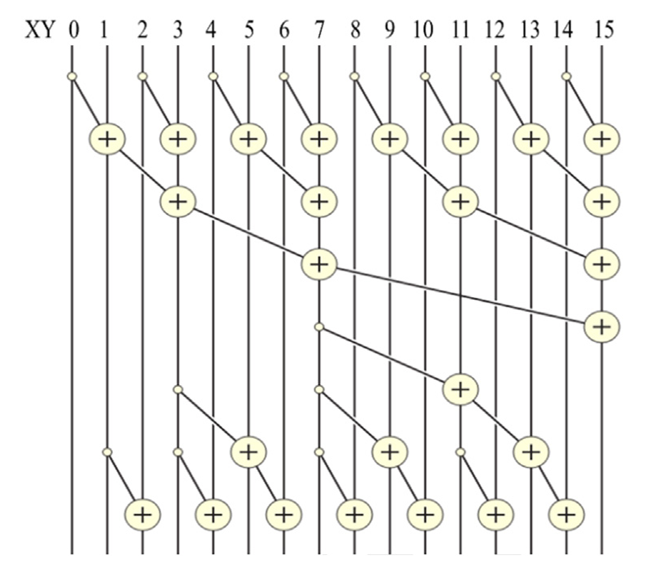
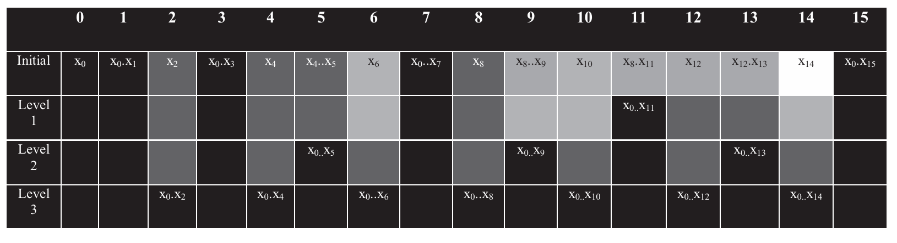

## Summary of Day 32:

> *Brent-Kung Parallel Inclusive Scan Algorithm

### 1. About **Brent-Kung** Parallel Inclusive Scan Algorithm

Similar to **Kogge-Stone** algo studied earlier. But the difference is that **Brent-Kung** is more area-efficient, requiring fewer adders and less memory bandwidth, making it a better choice when hardware resources are limited.

The *Kogge-Stone* algorithm has an **aggressive parallelization strategy**, leading to a lower depth $(O(\log n))$ but a high number of operations $(O(n \log n))$. In contrast, the **Brent-Kung algorithm balances computational efficiency with lower resource usage**, achieving the same $O(\log n)$ depth while reducing the number of operations to $O(n)$.

> **_Simple analogy that makes understanding this even more easier:_** 
>
> Imagine we are organizing a relay race where each runner passes a baton to the next. \
> However, instead of simply passing the baton forward, each runner also adds a number written on their baton to the total sum and then passes the updated total to the next runner. \
> But here's a **twist**:
> 1. **First Phase *(Reduction Tree)***: Instead of passing directly to the next runner, we use a hierarchical structure. Runners group into pairs, sum their numbers, and pass the result up a *tree-like structure* until one runner holds the total sum.
>
> 2. **Second Phase *(Reverse Tree)***: After reaching the top of the tree, the total is distributed back down to all runners, ensuring every runner knows their cumulative total up to their position.
> 
> This two-phase process ensures that all runners (or data elements) receive their prefix sum efficiently without unnecessary communication.

### 2. How **Brent-Kung** Works:
The algorithm operates in two main phases:

1. **Reduction  Tree Phase**
- This phase computes partial sums in a hierarchial manner. 
- Think of it as climbing up a binary tree.
    - At each level, threads compute sums for pairs of elements separated by increasing powers of 2 *(stride)*.
    - For example:
        - At stride = 1: Compute sums for adjacent elements (e.g., `x0 + x1`, `x2 + x3`).
        - At stride = 2: Compute sums for elements separated by 2 indices (e.g., `x0 + x1 + x2 + x3`).
        - Continue until only one thread computes the total sum.
2. **Reverse Tree Phase**
- This phase distributes partial sums back down the tree to compute final results.
- Think of it as descending down a binary tree:
- Threads propagate partial sums to their neighbors.
- For example:
    - At stride = 4: Distribute partial sums from higher levels to lower levels.

    - At stride = 2: Fill in missing values by adding propagated results.

### Visual Explanation Using Figure:

    
    
<b>Fig 32_01: </b><i> A parallel inclusive scan algorithm based on Brent-Kung adder design</i>

This diagram represents how the Brent-Kung algorithm processes an array of size $16$.

***Reduction Tree Phase***:
- The top half shows how partial sums are computed hierarchically:
    - **Level 1**: Add adjacent elements (`XY+XY[1]`, `XY[2]+XY[3]`, etc.).
    - **Level 2**: Add results from Level 1 with larger strides (`XY+XY[1]+XY[2]+XY[3]`, etc.).
    - This continues until one thread computes the total sum.

***Reverse Tree Phase:***
- The bottom half shows how partial sums are propagated back down:
    - Results from higher levels are distributed to lower levels to compute final inclusive sums.

Each $+$ operation represents an addition performed by a thread.

    
    
<b>Fig 32_02: </b><i> Progression of values in XY after each level of additions in the reverse tree.</i>

This table shows how values evolve during the reverse tree phase for an array of size $16$.

***Key Observations:***
- Each level progressively fills in more values with cumulative sums.
- By Level 3, all positions contain their final inclusive scan result.

> [Click Here](./Brent_kung.cu) to redirect towards complete code implementation for Brent-Kung algorithm.

---

    <b>
        End of Day_32🫡
    </b>

