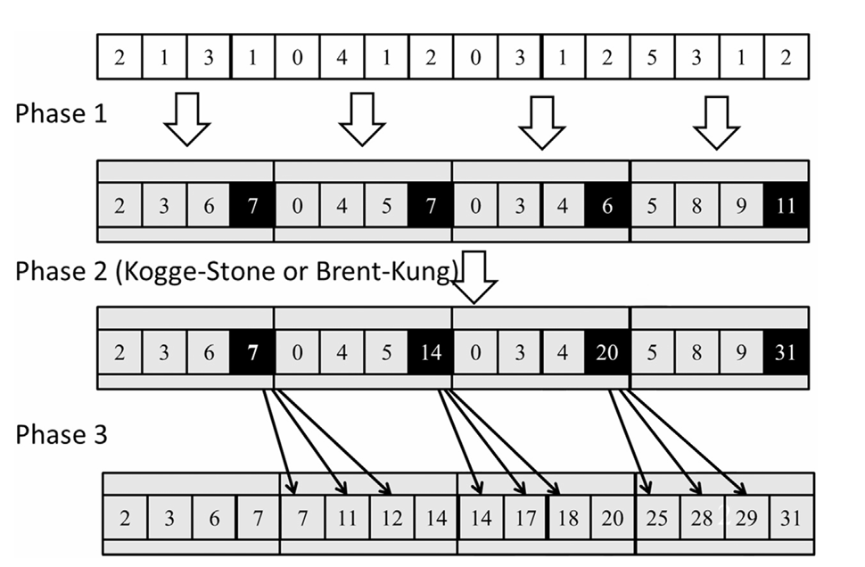

## Summary of Day: 33

> *Coarsening for Even More Work Efficiency:

Alright, let’s take a step back and focus on coarsening, which is an **optimization technique aimed at improving work efficiency in parallel scan algorithms**. Before diving into the three-phase hierarchical scan or segmented scan, it’s important to understand how thread coarsening works and why it is necessary.

### Why Coarsening?
We know that parallel scan algorithms inherently have some overhead:
1. **Hardware Underutilization:** Not all threads are active during certain stages of the reduction or scan phases.
2. **Synchronization Overhead:** Threads need to synchronize frequently, especially in tree-based patterns like Brent-Kung or Kogge-Stone.
3. **Reduced Work Efficiency:** Parallel scan performs more operations than a sequential scan due to the need for intermediate computations.

Now, here’s the *key insight:* If the hardware ends up serializing the threads *(due to limited parallelism)*, we might as well serialize them ourselves in a controlled way to improve work efficiency. This is where thread coarsening comes into play.

### What is it?
> ***Ahh well it was explained even earlier in chapters but well let's just revise once again:***

Thread coarsening is a technique where each thread is assigned a larger chunk of work (a subsection of the input) instead of processing just one element. By doing this:
1. We reduce the number of threads required.
2. Each thread performs more sequential work, which improves work efficiency.
3. Memory accesses are optimized by using shared memory for coalescing.

### How Coarsening Works:
> ***Breaking down step by step***

**Step 1: Partitioning the Input**
- The input array is divided into sections, one for each thread block.
- Each section is further divided into subsections, one for each thread in the block.
- ***For example:***
    - If we have 16 elements and 4 threads in a block, each thread gets 4 elements (a subsection).

**Step 2: Loading Data into Shared Memory**
- Threads collaborate to load their subsections into shared memory in a coalesced manner:
- Adjacent threads load adjacent elements from global memory.
- ***For example:***
    - Thread $0$ loads elements `[4]`.
    - Thread $1$ loads elements `[1]`.
- Once all elements are loaded into shared memory, threads operate on their subsections locally.

**Step 3: Performing Sequential Scans**
- Each thread performs a sequential scan on its subsection within shared memory.
- At the end of this step:
    - The last element of each subsection contains the sum of all elements in that subsection.
- ***For example:***
    - If Thread 0 processes `[2][1][3][1]`, it produces `[2][3]`.

**Step 4: Combining Results**
- The last elements of all subsections are gathered and processed using a parallel scan *(e.g., Brent-Kung or Kogge-Stone)*.
- This step computes cumulative sums across all subsections.

**Step 5: Propagating Results**
- Each thread updates its subsection by adding the cumulative sum of all preceding subsections.
- The last element of each subsection remains unchanged because it already contains the correct value.

***Example Walkthrough:***
<div align="center">

<p><b>Fig 33_01: </b><i>Three-Phase parallel Scan</i></p>
</div>

Okay, so here; **Input array**:
```text
[2, 1, 3, 1, 0, 4, 1, 2, 0, 3, 1, 2, 5, 8, 9, 11]
```
**Phase 1: Local Sequential Scans**
Each thread performs a sequential scan on its subsection:

- Thread $0$ processes `[2][1][3][1]` → `[2][3][6][7]`
- Thread $1$ processes `[0][4][1][2]` → `[0][4][5][7]`
- Thread $2$ processes `[0][3][1][2]` → `[0][3][4][6]`
- Thread $3$ processes  `[5][3][1][2]` → `[5][8][9][11]`

> ***The last element of each subsection contains the sum of its elements.***

That would make the array be like:
```text
[7 (T_O), 7 (T_1), 6 (T_2) , 11 (T_3)]
```

**Phase 2: Block-Wide Scan**
In Phase 2:
- A parallel scan is performed on the last elements of each subsection `([7 (T0), 7 (T1), 6 (T2), and 33 (T3)])`.
- This step computes cumulative sums across all subsections.

Hence, the last elements of threads would be like:
`[7(T_0), 14(T_1), 20(T_2), 31(T_3)]`

**Phase 3: Propagation**
- The final elements of each Threads now get added to the element in other successive thread _(except the last one)_. 

Hence the final array looks like:
```text
[2, 3, 6, 7] | [7, 11, 12, 14] | [14, 17, 18 20] | [25, 28, 29, 31]
```
> ****Note: Okay so it is the single array. Just trying to show the threads breakdown with this***

### Advantages of Coarsening
1. **Improved Work Efficiency:**
    - By assigning more work to each thread and reducing synchronization overhead.
2. **Better Memory Coalescing:**
    - Using shared memory ensures that global memory accesses are coalesced.
3. **Scalability:**
    - The size of each section is limited only by shared memory capacity instead of the number of threads per block.
4. **Reduced Number of Threads:**
    - Fewer threads mean less pressure on hardware resources like registers and shared memory.
