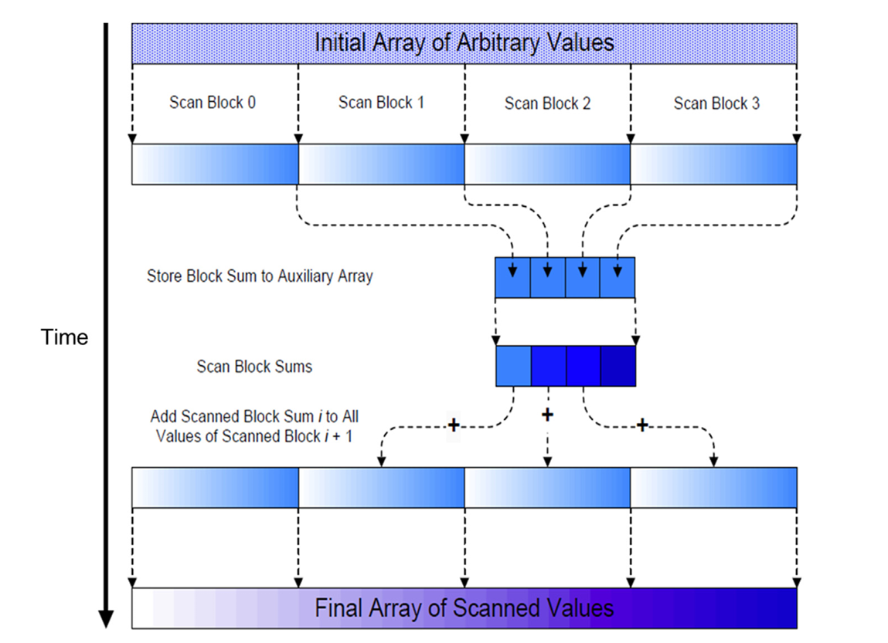

## Summary of Day 34:

> ****Continuing yesterdays:***

> **Complexity Analysis of Coarsening**:
>
>For an input array with $N$ elements and $T$ threads per block:
>1. **Phase 1**: $O(N/T)$ work per thread for sequential scans.
>2. **Phase 2**: $O(\log T)$ work per block for parallel scans.
>3. **Phase 3**: $O(N/T)$ work per thread for propagation.
>
>***Overall Complexity:***
>```math 
>O(\frac{N}{T} + \log T)
>```

***Code Example:***
> *[Click Here](./coarsening.cu) to redirect towards the code implementation for Coarsening.*

<blockquote style="border-left: 6px solid #2196F3; padding: 10px;">
  ⓘ <strong>Note:</strong> Since there are three phases, it's also called as <strong>Three Phase Scan Algo</strong>.
</blockquote>

#### Why Use Three Phases?
We use this approach because:
1. It **reduces synchronization overhead** by limiting global memory accesses.
2. It improves work efficiency by performing **most operations locally within shared memory**.
3. It allows us to **scale to larger datasets** by ***_dividing the problem into smaller sections_** that fit into shared memory.

> _The *'d part in point number 3 is the explanation for Hierarchial Scan which we going to read about next._ 

### Hierarchial Scan:
Alright, let’s dive into the hierarchical scan, which is an **extension of the three-phase scan algorithm**. It’s designed to handle arbitrarily large datasets by *dividing the input into manageable sections and processing them hierarchically*. This method ensures scalability while maintaining efficiency.

#### What is it 🤔??
A hierarchical scan is a multi-level scan algorithm that processes large datasets by:
1. Dividing the input into smaller sections (called **scan blocks**) that fit into shared memory.
2. Performing local scans within each block using a parallel scan algorithm (e.g., Kogge-Stone or Brent-Kung).
3. Combining the results from all blocks to produce the final inclusive scan.

#### Why use it? 
We know that for very large datasets _(millions or billions of elements)_, it’s impractical to process the entire array in one go due to:

1. **Shared Memory Limitations**: Each block can only process as many elements as can fit into shared memory.
2. **Thread Count Limitations**: The number of threads per block is limited, so we cannot assign one thread per element for extremely large arrays.

The hierarchical scan solves these issues by:
- Processing sections independently in parallel.
- Using a second-level scan to combine results across sections.

#### Key Steps in Hierarchial Scan:
**Step 1: Divide Input into Sections**
- The input array is divided into multiple sections _(scan blocks)_, each of which can fit into shared memory.
- Each section is processed independently by a thread block.

**Step 2: Perform Local Scans**
- A parallel scan (e.g., Kogge-Stone or Brent-Kung) is performed on each section.
- This produces partial results for each section, stored in an auxiliary array (Y).

**Step 3: Combine Results Across Sections**
- The last elements of each section are gathered into an array (S).
- A second-level scan is performed on this array (S) to compute cumulative sums across sections.

**Step 4: Propagate Results**
- The cumulative sums from Step 3 are added back to update the partial results in Y, producing the final inclusive scan.

***Example Case:***
<div align="center">

<p><b>Fig 34_01: </b><i>Example of Hirerarchial Scan.</i></p>
</div>

Here, 
**Input Array**:
```text
[2, 1, 3, 1, 0, 4, 1, 2, 0, 3, 1, 2, 5, 3, 1, 2] → (X)
```
Again as Before, *(we called Threads in prev but well pretty similar)* we divide into sections and calculate the cumulative sums in each sections. Let's assign that to (Y)

So now Y becomes:
```text
[2, 3, 6, *7, 0, 4, 5, *7, 0, 3, 4, *6, 5, 8, 9, *11] → (Y)
```
> All *'d elements are the last element of the section. 

Now, Calculate S:

which is basically the array of *'d elements:

```text
[7, 7, 6, 11] → (S)
```

Then Local Scan on S would give:
```text
[7, 14, 20, 31] ← ∑(S)
```

Next, we skip the first section and add the each index values to like; other sections respectively _(in order and one index value per section)_

Leading  to the answer in Figure above.

---
> **Summary diagram that explains this in nutshell**
> <div align="center">
>   
> <p><b>Fig 34_02: </b><i>Summary diagram </i></p>
> </div>

##### Advantages of Hierarchical Scans
1. **Scalability:**
    - Handles arbitrarily large datasets by dividing them into manageable sections.
    - Each section fits into shared memory, ensuring efficient processing.
2. **Work Efficiency:**
    - Combines coarsening techniques with hierarchical design for optimal performance.
3. **Parallelism:**
    - Local scans and second-level scans are highly parallelizable.

***Code Example:***
> *[Click Here](./hierarchial.cu) to redirect towards the code implementation for Hierarchial Scan.*
