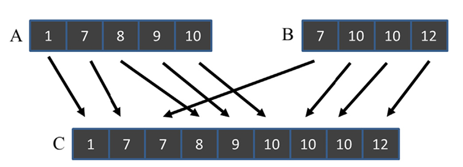

## Summary of Day 36:

> *Starting of Chapter 12 — Merge

#### Merge Operations - Intro:
- Widely used for sorting and combining data. 

> ***The goal:*** Merge two sorted arrays into a single sorted list *while maintaining order and stability*.

- Stability ensures that **elements with equal keys** retain their relative order from the input lists in the output list.

> ***Explaining Stability a bit more in detail:***
>
> Okay, so let's try to explain this using the figure below:
> <div align = "center">
> 
> <p><b>Fig 36_01: </b><i>Example of merge operation.</i></p></div>
> Well here, we can illustrate 2 different types of stability at once.
>
> 1. **Across input lists/arrays:**
>       - The element `7` from both arrays $A$ and  $B$ are handled such that the `7` from $A$ comes before $B$ and then merged in array $C$. This demonstrates stability across input lists because the order of equal elements is preserved.
> 2. **Within input list:**
>       - The two elements `10` from array $B$ maintain their relative order in the output array $C$. This shows stability within a single input list.
> 
>
> ##### **Why is matters??**
> Stability is essential for scenarios where input arrays have been previously sorted based on other keys. *For example*:
> - Array $A$ might have been sorted by name, and then by age.
> - Array $B$ might have been sorted similarly.
> - When merging these arrays based on age, stability ensures that the previous sorting by name remains intact.

#### Sequential Merge Algorithm *(CPU Based)*:
The sequential merge algorithm merges two sorted arrays, $A$ and $B$, into a single sorted array, $C$. Let’s break this down step by step:

**Step 1: Initialization**:
- We start with three indices:
     - `i` for traversing array $A$ *(initialized to $0$)*.
     - `j` for traversing array $B$ *(initialized to $0$)*.
     - `k` for filling array $C$ *(initialized to $0$)*.

**Step 2: Merging Elements from Arrays $A$ and $B$**:
- The algo uses a while loop to iterate through both arrays as long as neither is fully traversed (`i < m && j < n`, where `m` is the size of $A$ and `n` is the size of $B$).
- At each iteration:
    - Compare the current elements of $A[i]$ and $B[j]$.
    - If $A[i] <= B[j]$, we copy the element from $A[i]$ into $C[k]$, then increment both `i` and `k`.
    - Otherwise, copy the element from $B[j]$ into $C[k]$, then increment both `j` and `k`.

**Step 3: Handling Remaining Elements**
- Once one of the arrays is fully traversed:
    - If array $A$ is exhausted `(i == m)`, copy all remaining elements of array $B$ into array $C$.
    - If array $B$ is exhausted `(j == n)`, copy all remaining elements of array $A$ into array $C$.

> ***Complexity Analysis:***
>
> **Time Complexity:** $O(m+n) \sim O(i+j)$\
> **Space Complexity:** $O(m+n)$

> [Click Here](./seq_merge.cu) to redirect towards sequential merge implementation comparing with parallel approach ***(GPU based)***.

<blockquote style="border-left: 6px solid #2196F3; padding: 10px;">
  ⓘ <strong>Note:</strong> While running the above code, the CPU execution time is way quicker than GPU for smaller arrays (Even till 10,000 elements), however when we put the input array sizes like in range of 10000000's parallesim starts kicking in.
</blockquote>

> ***Sample Output for various array sizes:*** *(Array output part is excluded in larger ones to reduce too much output)*
>
> For A and B = `100000`
> ```shell
> CPU Time: 969 microseconds
> GPU Time: 514 microseconds
> ```
>
> **However for smaller array sizes:**
> ```shell
> Enter size of array A: 12
> Enter size of array B: 13
> Array A: 7 10 11 14 24 31 34 38 42 48 55 59 
> Array B: 9 10 15 17 22 29 35 36 45 54 57 60 61
> 
> CPU Merged Array: 7 9 10 10 11 14 15 17 22 24 29 31 34 35 36 38 42 45 48 54 55 57 59 60 61 
> GPU Merged Array: 7 9 10 10 11 14 15 17 22 24 29 31 34 35 36 38 42 45 48 54 55 57 59 60 61
> Result: Match :)
> CPU Time: 0 microseconds
> GPU Time: 473 microseconds
> ```

<details>
    <summary><b>The reason behind GPU execution time way longer than CPU for smaller array sizes</b><i> (Click to expand)</i></summary>
    
<p>The reason why GPU execution time is longer than CPU for smaller array sizes is due to the overhead associated with GPU operations. Here's a breakdown of the key factors:</p>
    
<ol>
        <li><b>Data Transfer Overhead:</b> Transferring data between the host (CPU) and the device (GPU) involves significant overhead. For small datasets, this transfer time can dominate the overall execution time, making the GPU slower than the CPU.</li>
        <li><b>Kernel Launch Overhead:</b> Launching a kernel on the GPU also incurs overhead. This includes setting up the execution environment, scheduling the kernel, and managing resources. For small tasks, this overhead can be substantial.</li>
        <li><b>Parallelism Overhead:</b> GPUs excel at parallel processing, but this parallelism comes with its own overhead. Managing threads, synchronizing them, and coordinating their work takes time. For small datasets, the benefits of parallelism may not outweigh these costs.</li>
        <li><b>Memory Latency:</b> Accessing GPU memory can be slower than accessing CPU cache. For small datasets, the amount of computation may not be enough to hide this latency.</li>
        <li><b>Thread Divergence:</b> If the workload is not well-suited for parallel execution, threads may diverge, leading to inefficient use of GPU resources.</li>
</ol>
<p>In essence, GPUs are designed for large-scale parallel computations. When the dataset is small, the overheads associated with GPU operations outweigh the benefits of parallelism, resulting in slower execution compared to the CPU.</p>

</details>

---
<div align="center">
    <b>
        End of Day_36🫡
    </b>
</div>