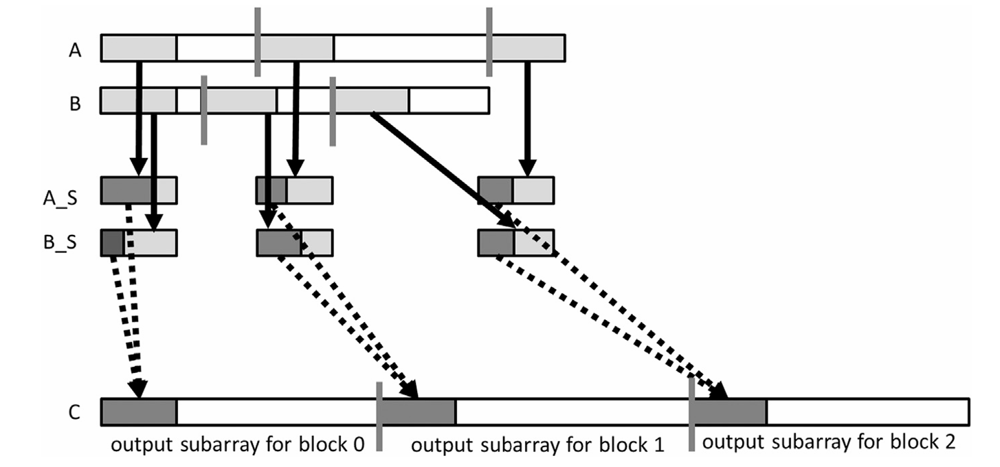
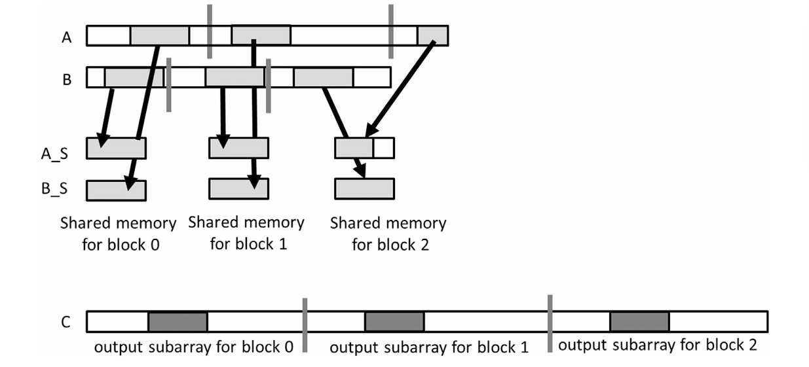

## Summary of Day 38:

> *Merge continues...

#### Tiled merge kernel to improve coalescing

- Reduces global memory accesses by leveraging shared memory. 
- This kernel divides the merging process into **block-level subarrays** and processes them in **tiles** iteratively.
- The goal is to maximize memory bandwidth utilization while ensuring correctness in merging.

> ⓘ Note: ***Key Strategies for Improving Coalescing***:
>
> 1. **Using Shared Memory:**
>    - Shared memory is used to store tiles of input arrays ($A$ and $B$) temporarily.
>    - *Irregular memory accesses* are performed in shared memory instead of global memory, which *improves efficiency*.
> 
> 2. **Block-Level Subarrays:**
>    -  Each thread block processes a specific portion of the output array ($C$).
>    - The input arrays ($A$ and $B$) are partitioned into subarrays corresponding to the block's output range.
> 
> 3. **Iterative Tiling:**
>    - Due to the limited size of shared memory, the kernel processes data in smaller tiles.
>    - Each tile contains a fixed number of elements from $A$ and $B$.

    
<b>TL;DR</b>

    <ul>
        <li><b>Shared memory</b> reduces uncoalesced global memory reads.</li>
        <li><b>Block-level partitioning</b> ensures contiguous memory access.</li>
        <li><b>Tiling</b> improves cache locality & reduces global memory traffic.</li>
    </ul>

#### Key Components of Tiled Merge kernel

<b>Fig 38_01: </b><i>Tiled Merge Kernel Diagramatic Approach</i>

Okay, so from the above diagram; let's talk about some of the key components during Tiled Merging:

1.  **Output Subarray Partitioning**: 
    - The output array $(C)$ is divided into *block-level subarrays*, with each block responsible for generating one subarray.
    - In figure above, shown by grey vertical bars in array $C$.

2. **Input Subarray Partitioning**:
    -  As each thread block is tasked with generating a specific subarray of the output array ($C$), it needs to know which portions of the input arrays ($A$ and $B$) it should be pulling data from. This is where partitioning the input arrays comes in.
    - Because $C$ is a *merged* array from sorted $A$ and $B$, the relationship between an index in $C$ and its source in $A$ or $B$ is not directly linear.  A block cannot simply take a slice of $A$ and $B$ based on its output range in $C$.
    - The **co-rank function** plays a pivotal role here. It acts as a translator, mapping the output subarray's range in $C$ back to the relevant subarrays in $A$ and $B$.
    - **How it works conceptually:**
        - The co-rank function analyzes the starting and ending indices of the block's assigned subarray in $C$.
        - It then uses the sorted nature of $A$ and $B$ *(which is a precondition for merge)* and uses an algorithm to determine which ranges in $A$ and $B$ contribute elements to the corresponding section in $C$.
        - Each block now has the ranges it needs in A and B. Without the co-rank function, we would have to do a linear search of both A and B, which would be highly inefficient.
    - With the start and end indices now available, the code within the block loads the corresponding subarrays from $A$ and $B$ into the block's shared memory.

3. **Shared Memory Allocation:**
    - Each block **declares two shared memory arrays**:
        - $A\_S$: Stores tiles of elements from array $A$
        - $B\_S$: Stores tiles of elemets from array $B$.
    - Due to limited shared memory size, these arrays cannot hold the entire input subarrays for the block. Instead, they process data iteratively in smaller chunks *(tiles)*.

4. **Iterative Tiling:**
    - Each block processes its assigned input subarrays in **y/x** iterations, where:
        - y: Number of elements in the output subarray.
        - x: Number of elements that can fit into shared memory _(tile size)_.
    - During each iteration:
        - Threads cooperatively load tiles of elements from global memory into shared memory.
        - These tiles are used to generate a portion of the output subarray.

  
<b>How Tiling Works:</b>

  <ul>
    

      
      
<b>Fig 38_02: </b><i>Iteration 1 diagram</i>

    

    <li><b>First Iteration:</b></li>
    <ul>
      <li>For each block, a light gray section of the input subarrays (A and B) is loaded into shared memory (A_S and B_S).</li>
      <li>With these tiles in shared memory, threads use their assigned portions (dark gray sections) to generate a section of output elements in C.</li>
    </ul>
    <li><b>Subsequent Iterations:</b></li>
    <ul>
      <li>After processing the first tile, threads load the next tile from global memory into shared memory.</li>
      <li>This process repeats until all elements in the input subarrays are processed.</li>
    </ul>
  </ul>

> #### ***Challenges in Tiling Design***
> 
> **1. Uncertainty in Input Usage:**
> 
> In the worst case, all output elements may come from one input array (e.g., all elements from $A$ or all elements from $B$). This uncertainty makes it difficult to predict how many elements to load into shared memory during each iteration.
> 
> **2. Redundant Data Loading:**
> 
> Only half of the data loaded into shared memory is used during each iteration. The unused data is reloaded in subsequent iterations, wasting memory bandwidth.
> 
> ---
> 
> #### ***Advantages***
> 
> **1. Improved Memory Coalescing:**
> Threads within a block access consecutive elements when loading data into shared memory. This ensures efficient utilization of global memory bandwidth.
> 
> **2. Reduced Global Memory Accesses:**
> By using shared memory for intermediate storage, irregular accesses are performed locally instead of globally.
> 
> **3. Scalability:**
> The tiled approach allows large arrays to be processed efficiently by dividing work among blocks and threads.

> _[Click Here](./tiled_merged.cu) to redirect towards complete code implementation._

---

    <b>
        End of Day_38🫡
    </b>

 