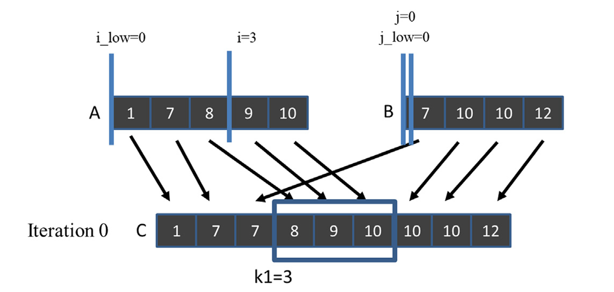
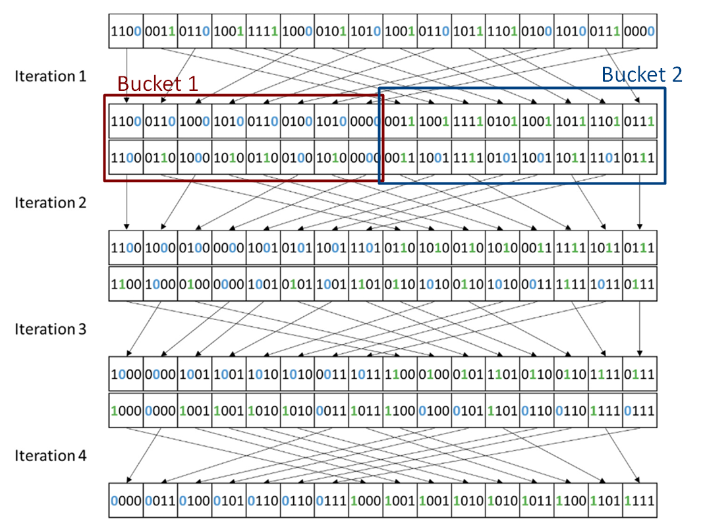

## Summary of Day 39:

> *Exercises from chapter 12- Merge

***Exercises:***

1. **Assume that we need to merge two lists $A=(1, 7, 8, 9, 10)$ and $B=(7, 10, 10, 12)$.What are the co-rank values for $C[8]$?**

***Solution:***

First, let's merge the the lists $A$ and $B$:
$$C= (1,7,7,8,9,10,10,10,12)$$

Here, the $8^\text{th}$ element of $C$ is :

> ⓘ ***Well, It actually depends which approach we are taking***.
Lemme explain: 
>
> It actually depends on how we are taking  the indexing. Like is it $0$-based or $1$-based?

Assuming it's $0$-based indexing of $C$;
ie., the $9^\text{th}$ element. Which is $12$. While reaching that index we go through all elements of $A$ and $B$. So, the values of `i` and `j` would be $5$ and $4$.

> Likewise, if we were to assume it to be $1$-based indexing, the value it would point to would be $10$. $A$ gets all used up but $12$ from $B$ gets untouched. Hence, co-rank would be: $(5, 3)$

2. **Complete the calculation of co-rank functions for thread $2$ in figure below:**
<div align="center">
    
    <p><b>Fig 39_01: </b><i>Iteration 0 of the co-rank function</i></p>
</div>

***Solution:***
So, thread $2$ is responsible for calculating the co-rank functions with $k1 =3$. This means we need to determine which elements from lists $A$ and $B$ contribute to position $3$ *(using $0$-based indexing)* in the merged list $C$.

At position $3$ in list $C$, we have $C[3] =8$.

So same as in qn 1, A= (1, 7, 8) and from B= (7). 

$$\therefore \space\text{co-rank would be}\space (3,1) $$

3. For the for-loops that load A and B tiles in code below, add a call to the co-rank function so that we can load only the $A$ and $B$ elements that will be consumed in the current generation of the while-loop.
```cpp
int counter = 0; // iteration counter
int C_length = C_next - C_curr;
int A_length = A_next - A_curr;
int B_length = B_next - B_curr;
int total iteration = ceil((C_length) / tile size); // total iteration
int C_completed = 0;
int A_consumed = 0;
int B_consumed = 0;
while (counter < total_iteration)
{
    /* loading tile-size A and B elements into shared memory */
    for (int i = 0; i < tile size; i += blockDim.x)
    {
        if (i + threadIdx.x < A_length - A_consumed)
        {
            A_S[i + threadIdx.x] = A[A curr + A_consumed + i + threadIdx.x];
        }
    }
    for (int i = 0; i < tile size; it += blockDim.x)
    {
        if (i + threadIdx.x < B_length - B_consumed)
        {
            B_S[i + threadIdx.x] = B[B_curr + B_consumed + i + threadIdx.x];
        }
    }
    __syncthreads();
```

***Solution:***
Here's the modified code with co-rank function calls added:
```cpp
int counter = 0;                               // iteration counter
int C_length = C_next - C_curr;                // length of C segment to process
int A_length = A_next - A_curr;                // length of A segment
int B_length = B_next - B_curr;                // length of B segment
int total_iteration = ceil((C_length)/tile_size); // total iterations needed
int C_completed = 0;                           // elements of C already processed
int A_consumed = 0;                            // elements of A already consumed
int B_consumed = 0;                            // elements of B already consumed

while (counter < total_iteration) {
    // Calculate how many elements to process in this iteration
    int elements_this_iteration = min(tile_size, C_length - C_completed);
    
    // Calculate the target position in the merged array
    int target_pos = C_completed + elements_this_iteration;
    
    // Use co-rank function to determine how many elements from A and B 
    // will be needed to reach the target position
    int i_target, j_target;
    co_rank(target_pos, A_curr, A_next, B_curr, B_next, &i_target, &j_target);
    
    // Calculate how many new elements we need from each array in this iteration
    int A_needed = i_target - A_consumed;
    int B_needed = j_target - B_consumed;
    
    /* loading only the needed A elements into shared memory */
    for (int i = 0; i < A_needed; i += blockDim.x) {
        if (i + threadIdx.x < A_needed) {
            A_S[i + threadIdx.x] = A[A_curr + A_consumed + i + threadIdx.x];
        }
    }
    
    /* loading only the needed B elements into shared memory */
    for (int i = 0; i < B_needed; i += blockDim.x) {
        if (i + threadIdx.x < B_needed) {
            B_S[i + threadIdx.x] = B[B_curr + B_consumed + i + threadIdx.x];
        }
    }
    
    __syncthreads();
    
    // Update counters for next iteration
    C_completed += elements_this_iteration;
    A_consumed = i_target;
    B_consumed = j_target;
    counter++;
}
```
<details><summary><b>Explaining the key changes:</b></summary>
<ul>
<li><b>Target Position Calculation</b>: Before loading any elements, we calculate the target position in the merged array that we'll reach by the end of this iteration.</li>
<li><b>Co-rank Function Call</b>: The co-rank function determines exactly how many elements from A and B are needed to reach this target position. This gives us the stopping indices <code>i_target</code> and <code>j_target</code>.</li>
<li><b>Element Count Calculation</b>: We determine how many new elements we need from each array by subtracting what we've already consumed.</li>
<li><b>Optimized Loading</b>: We only load the elements we know we'll need from each array, rather than full tiles regardless of whether they'll be used.</li>
<li><b>Counter Updates</b>: After processing, we update our consumption counters based on the co-rank values to track exactly how many elements from each array have been consumed.</li>
</ul>
</details>

4. Consider a parallel merge of two arrays of size $1,030,400$ and $608,000$.Assume that each thread merges **eight elements** and that a thread block size of $1024$ is used.

    1.  In the basic merge kernel below, how many threads perform a binary search on the data in the global memory?

    ```cpp
    __global__ void merge basic kernel(int *A, int m, int *B, int n, int *C)
    {
        int tid = blockIdx.x * blockDim.x + threadIdx.x;
        int elementsPerThread = ceil((m + n) / (blockDim.x * gridDim.x));
        int k curr = tid * elementsPerThread;                    // start output index
        int k next = min((tid + 1) * elementsPerThread, m + n); // end output index
        int i curr = co_rank(k_curr, A, m, B, n);
        int i next = co_rank(k next, A, m, B, n);
        int j_curr = k curr - i_curr;
        int j next = k next - i next;
        merge_sequential(&A[i_curr], i_next - i_curr, &B[j_curr], j_next - j_curr, &C[k_curr]);
    }
    ```
    ***Solution:***

    So, here;
    - Array $A$ size = $1,030,400$ and $B$ size = $608,000$ elements.
    - Total elements to merge = $1,638,400$
    - Each thread processes $8$ elements
    - Thread Block size= $1,024$ threads.

    In the kernel code above, each thread calculates:
    - Its starting position (`k_curr`) in the output array.
    - Its ending position (`k_next`) in the output array.
    - The corresponding starting and ending positions in both input arrays using the `co_rank` function.

    Each thread calls `co_rank` twice:

    1. Once to find `i_curr` (which determines `j_curr`)
    2. Once to find `i_next` (which determines `j_next`)

    Since every thread performs these calculations independently, and the `co_rank` function involves binary searches on the global memory data, all $204,800$ threads will perform binary searches on the data in global memory.

    >_This is actually one of the inefficiencies of the basic merge kernel shown here - each thread independently performs global memory binary searches, leading to redundant calculations and high global memory access patterns_

    2. In the tiled merge kernel in Part 1 to 3 below, how many threads perform a binary search on the data in the global memory?
    ```cpp
    //-----Part 1------//
    __global__ void merge tiled kernel (int* A,int m, int* B, int n, int* C, int tile size) ({
        /* shared memory allocation */
        extern shared int shareAB[];
        int *A_S = &shareAB[0];          // shareA is first half of shareAB
        int * B_S = &shareAB[tile_size]; // shareB is second half of shareAB
        int C_curr = blockIdx.x * ceil ((m+n)/gridDim.x); // start point of block’s C subarray
        int C_next = min((blockIdx.x+1) * ceil ((m+n)/gridDim.x), (m+n)); // ending point
        if (threadIdx.x ==0) {
            A_S[0] = co rank(C_curr, A, m, B, n); // Make block-level co-rank values visible
            A_S[1] = co_rank(C_next, A, m, B, n); // to other threads in the block
        }
        __syncthreads() ;
        int A_curr = A_S[0];
        int A_next = A_S[1];
        int B_curr = C_curr - A_curr;
        int B_next = C_next - A_next;
        __syncthreads() ;

    //-------Part:2---------//
    int counter = 0;                                    // iteration counter
    int C_length = C_next - C_curr;                     // length of C segment to process
    int A_length = A_next - A_curr;                     // length of A segment
    int B_length = B_next - B_curr;                     // length of B segment
    int total_iteration = ceil((C_length) / tile_size); // total iteration
    int C_completed = 0;
    int A_consumed = 0;
    int B_consumed = 0;
    while (counter < total_iteration)
    {
        /* loading tile-size A and B elements into shared memory */
        for (int i = 0; i < tile_size; i += blockDim.x)
        {
            if (i + threadIdx.x < A_length - A_consumed)
            {
                A_S[i + threadIdx.x] = A[A_curr + A_consumed + i + threadIdx.x];
            }
        }
        for (int i = 0; i < tile_size; i += blockDim.x)
        {
            if (i + threadIdx.x < B_length - B_consumed)
            {
                B_S[i + threadIdx.x] = B[B_curr + B_consumed + i + threadIdx.x];
            }
        }
        __syncthreads();
    }

    //------Part:3-----------//
            int c_curr = threadIdx.x * (tile_size / blockDim.x);
            int c_next = (threadIdx.x + l) * (tile_size / blockDim.x);
            int c_curr_val = (c_curr <= C_length - C_completed) ? c_curr : C_length - C_completed;
            int c_next_val = (c_next <= C_length - C_completed) ? c_next : C_length - C_completed;
            /* find co-rank for c curr and c next */
            int a_curr = co_rank(c_curr_val, A_S, min(tile_size, A_length - A_consumed),
                                B_S, min(tile_size, B_length - B_consumed));
            int b_curr = c_curr_val - a_curr;
            int a_next = co_rank(c_next_val, A_S, min(tile_size, A_length - A_consumed),
                                B_S, min(tile_size, B_length - B_consumed));
            int b_next = c_next_val - a_next;
            /* All threads call the sequential merge function */
            merge_sequential(A_S + a_curr, a_next - a_curr, B_S + b_curr, b_next - b_curr,
                            C + C_curr + C_completed + c_curr_val);
            /* Update the number of A and B elements that have been consumed thus far */
            counter++;
            C_completed += tile_size;
            A_consumed += co_rank(tile_size, A_S, tile_size, B_S, tile_size);
            B_consumed = C_completed - A_consumed;
            __syncthreads();
        }
    }
    ```
    ***Solution:***

    In Part $1$, only a single thread (thread $0$) in each block performs `co_rank` operation on global memory.
    ```cpp
    if (threadIdx.x ==0) {
        A_S[0] = co_rank(C_curr, A, m, B, n); // Block level co-rank calculations
        A_S[1] = co_rank(C_next, A, m, B, n);
    }
    ```
    - These `co_rank` calls perform binary searches on the global arrays $A$ and $B$ to determine block-level split points.
    - Since each block has one thread (thread $0$) performing these binary searches, the total number of such threads is equal to the number of blocks (`gridDim.x`).

    3. In the tiled merge kernel in Part 1 to 3 prev, how many threads perform a binary search on the data in the shared memory?

    ***Solution:***

    > Part $1$ and $2$ have no binary searches on shared memory. Just Part $3$ involved here!
    
    The number of threads that perform a binary search on the data in shared memory (`A_S` and `B_S`) is `gridDim.x * blockDim.x`, which is the total number of threads launched in the kernel. Each thread in each block performs at least two binary searches per iteration (for `a_curr` and `a_next`), and potentially a third (for `A_consumed`), repeated total_iteration times per block, where t`otal_iteration = ceil((C_next - C_curr) / tile_size)`.

<details>
  <summary><b>Click to expand Detailed Reasoning</b></summary>
  <b>Per Block</b>
  <ul>
    <li><b>Threads:</b> Each block contains <code>blockDim.x</code> threads.</li>
    <li><b>Execution:</b> These threads execute <code>co_rank</code> on <code>A_S</code> and <code>B_S</code> in Part 3.</li>
  </ul>
  
  <b>Across Grid</b>
  <ul>
    <li><b>Total Blocks:</b> There are <code>gridDim.x</code> blocks.</li>
    <li><b>Total Threads:</b> Each block has <code>blockDim.x</code> threads, so the total number of threads executing <code>co_rank</code> is <code>gridDim.x * blockDim.x</code>.</li>
  </ul>
  
  <b>Binary Searches</b>
  <ul>
    <li><b>Each Thread:</b> Performs 2 or 3 <code>co_rank</code> calls per iteration.</li>
    <li><b>Clarification:</b> The question asks for the number of threads, not the number of searches.</li>
  </ul>
  
  <b>Verification</b>
  <ul>
    <li><b>Parts 1 and 2:</b> No threads use shared memory for <code>co_rank</code>.</li>
    <li><b>Part 3:</b> All activity occurs on shared memory, involving all available threads.</li>
  </ul>
</details>

---

> *Starting of new chapter: Chapter 13 - **Sorting**

#### What's Sorting??

Arranging elements of list into a certain order. 
>_Numerical order for numbers and lexicographical order for text strings._

Sorting algos can be classified into *stable and unstable* algos. 
Also, they can be classified into *comparison-based and non_comparision-based* algos.

<details>
    <summary><b>Stable and Unstable Algorithms</b></summary>
    <ul style="list-style-type: disc;">
        <li><b>Stable Algorithms:</b>
            <ul style="list-style-type: circle; margin-left: 20px;">
                <li>Preserve the original order of appearance when two elements have equal key values.</li>
                <li><b><i>Example:</i></b> Sorting [(30,150), (32,80), (22,45), (29,80)] by income in non-increasing order:
                    <ul style="list-style-type: square; margin-left: 20px;">
                        <li>Result: [(30,150), (32,80), (29,80), (22,45)]</li>
                        <li>(32,80) appears before (29,80) because:
                            <ul style="list-style-type: none; margin-left: 20px;">
                                <li>- Both have the same income (80)</li>
                                <li>- (32,80) came before (29,80) in the original list</li>
                            </ul>
                        </li>
                    </ul>
                </li>
                <li>Required for cascaded sorting using multiple keys:
                    <ul style="list-style-type: square; margin-left: 20px;">
                        <li>Example: Sort employees first by department, then by salary</li>
                        <li>Stable sort ensures correct ordering within each department</li>
                    </ul>
                </li>
            </ul>
        </li>
        <li><b>Unstable Algorithms:</b>
            <ul style="list-style-type: circle; margin-left: 20px;">
                <li>Do not guarantee preservation of original order for equal key values.</li>
                <li>May swap the positions of elements with equal keys, potentially leading to unexpected results in multi-key sorts.</li>
            </ul>
        </li>
    </ul>
</details>

<details>
    <summary><b>Comparison-based vs Non-comparison-based Algorithms</b></summary>
    <ul style="list-style-type: disc;">
        <li><b>Comparison-based Algorithms:</b>
            <ul style="list-style-type: circle; margin-left: 20px;">
                <li>Cannot achieve better than <code>O(N log N)</code> complexity:
                    <ul style="list-style-type: square; margin-left: 20px;">
                        <li>This is a theoretical lower bound for comparison-based sorting</li>
                        <li>Examples: Merge Sort, Quick Sort, Heap Sort</li>
                    </ul>
                </li>
                <li>Generalizes to arbitrary types of keys:
                    <ul style="list-style-type: square; margin-left: 20px;">
                        <li>Can sort any data type that has a defined comparison operation</li>
                        <li>Example: Sorting strings, custom objects, etc.</li>
                    </ul>
                </li>
            </ul>
        </li>
        <li><b>Non-comparison-based Algorithms:</b>
            <ul style="list-style-type: circle; margin-left: 20px;">
                <li>Can achieve better than <code>O(N log N)</code> complexity:
                    <ul style="list-style-type: square; margin-left: 20px;">
                        <li>Example: Radix Sort can achieve <code>O(d * (n + k))</code> complexity</li>
                        <li>Where d is the number of digits, n is the number of elements, and k is the range of values</li>
                    </ul>
                </li>
                <li>May not generalize to arbitrary types of keys:
                    <ul style="list-style-type: square; margin-left: 20px;">
                        <li>Often work only with specific data types (e.g., integers, strings)</li>
                        <li>Rely on properties of the data rather than comparisons</li>
                    </ul>
                </li>
            </ul>
        </li>
    </ul>
</details>

#### Radix Sort:

- Non-comparison based sorting algorithm.

> Radix sort is like sorting a deck of cards by looking at one characteristic at a time. Imagine you have a pile of cards, and you want to sort them by suit *(clubs, diamonds, hearts, spades)* and then by number *(2 through Ace)*. You wouldn't necessarily try to put the whole deck in order all at once, would you?

-  It's a sorting algorithm that doesn't compare elements directly. **Instead, it sorts elements by grouping them according to their individual "digits" or "radix."** 

> ***The radix is the base of the number system being used (e.g., base $10$ for decimal numbers, base $2$ for binary numbers).***

#### How does it work?
<div align="center">
    
    <p><b>Fig 39_02: </b><i>Radix Sort Example</i></p>
</div>

Let's use figure above as an example. We have a list of $4$-bit integers that we want to sort using Radix Sort with $1$-bit radix. 
> *A $1$-bit radix means we look at one bit at a time.*

***Breakdown:***
1. **Iteration 1** *(Least Significant Bit)*:
    - We start by looking at the least significant bit (LSB), which is the rightmost bit, of each number.
    - We create two **"buckets"**: One for numbers with a $0$ in the LSB and another for numbers with a $1$ in the LSB.
    - We go through the original list and place each number into the appropriate bucket based on its LSB.
    - **Important**: We maintain the original order of the numbers within each bucket. This is called a "stable" sort. *For example*, if two numbers both have an LSB of $0$, they appear in the same order in the $0$-bucket as they did in the original list.

2. **Iteration 2** *(Second Least Significant Bit*):
    - Now, we take the output list from the previous iteration and repeat the process, but this time, we look at the second least significant bit.
    - Again, we create two buckets ($0$ and $1$) and place the numbers accordingly, maintaining the order within each bucket.
    - Because the previous iteration was stable, the numbers within each bucket are already sorted by their LSB. This means that after this iteration, the numbers are sorted by their lower two bits.

3. **Iteration 3** *(Third Least Significant Bit)*:
    - We repeat the process, considering the third bit from the right.
    - The output list is now sorted by the lower three bits.

4. **Iteration 4** *(Most Significant Bit)*:
    - Finally, we repeat the process, considering the most significant bit (MSB), which is the leftmost bit.
    - After this iteration, the numbers are fully sorted by all four bits.

> [Click Here](./radix_sort_normie.cu) to redirect towards a simple radix sort implementation. 