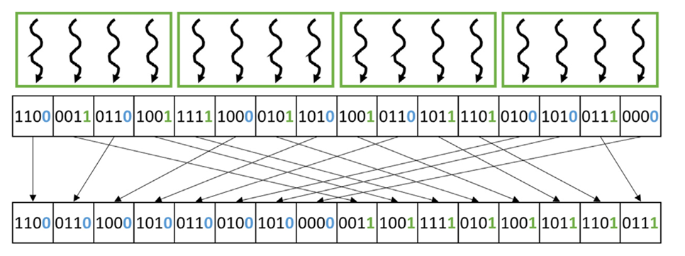
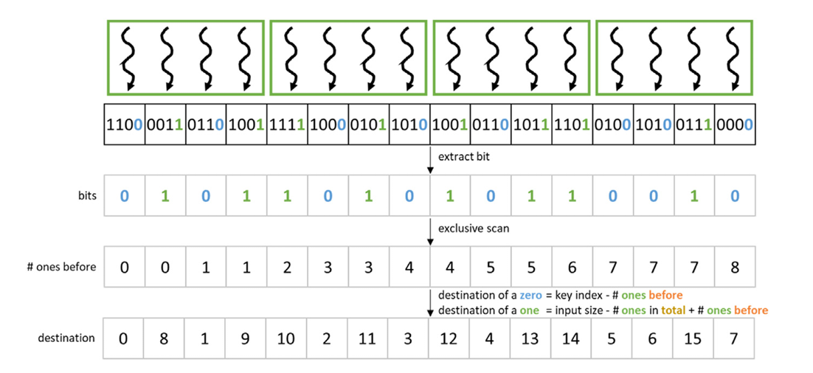

## Summary of Day 40:

> *Starting from Parallel Radix Sort

Well yesterday, we discussed about simple radix sort and its working mechanism. Today, let's make it work in parallel. ***(GPU Mode 🔥)***.

#### **Parallel Radix Sort:**

So, first explain the approach, then we going to dive into coding stuffs:

So here are the steps we follow:

1. **Thread Assignment**:
    

        
        
<b>Fig 40_01: </b><i>Thread Assignment</i>

    

    - *Core Idea*: Assign one thread to **each key** in the **input array**.
    - *Outcome*: $N$ keys $\sim$ $N$ threads. 

    > ***Each thread's job is to figure out where its key goes in the sorted output.***

2. **Destination Logic**:
    - *Problem*: Figure out the *correct* index for each key in the output array.
    - *Factors*:
        - **Bucket**: $0$ or $1$ based as explained yesterday.
        - **Position**: How many keys ***before** this belong to the same bucket?

3. **Exculsive Scan**:
    - Aka. Prefix Sum.
    - *Goal*: Find out how many $1$'s came before the current key.
    - *Calculations*:
        - If key is $0$: $\text{Destination} = \text{key's original index} - \text{\# of 1's before it}.$
        - If key id $1$: $\text{Destination} = \text{toal array size} - \text{\# of 1's before it}.$
    - *Result*: After scan, each thread knows where its key should go. 

    

        
        
<b>Fig 40_02: </b><i>Destination Index Calculation</i>

    

> ***Also, we need to create temp. storage for exclusive scan.***

4. **Memory Coalescing** — ***The problem***:
    - Threads writing **directly** to the final output can be ***slow***. 
    - *Reason being*: the threads next to each other might be writing to widely separated memory locations *(uncoalesced access)*.

5. ***The solution***— **Local Buckets**:
    - Each *block* of threads gets its own small, fast, shared memory.

6. **Shared to Global Memory**— ***for faster writes***:
    - Writing from shared memory to the final output is now coalesced *(neighboring threads write to neighboring memory)*.
    - Way more effecient than the original direct writing approach.

> [Click Here]() to redirect towards code implementation for parallel radix sort. 