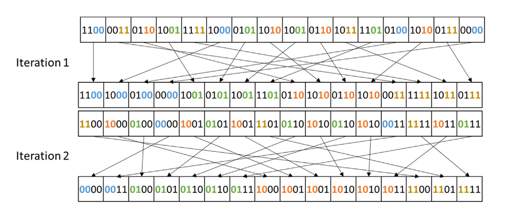
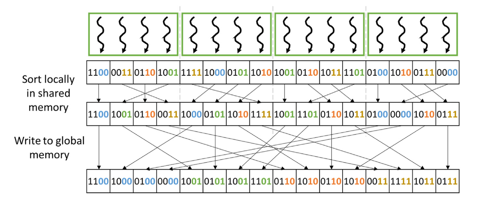
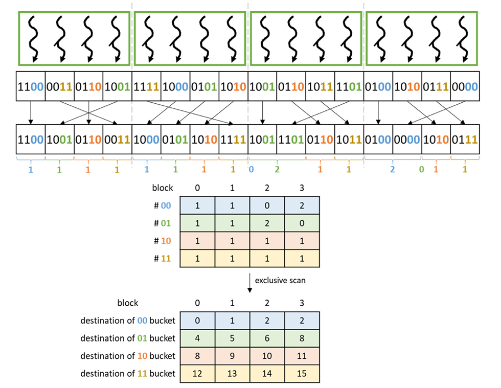
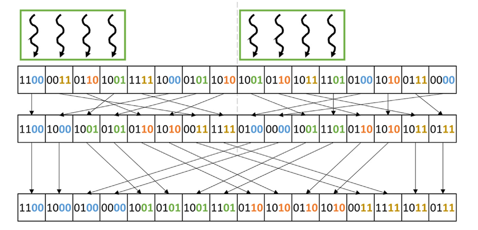
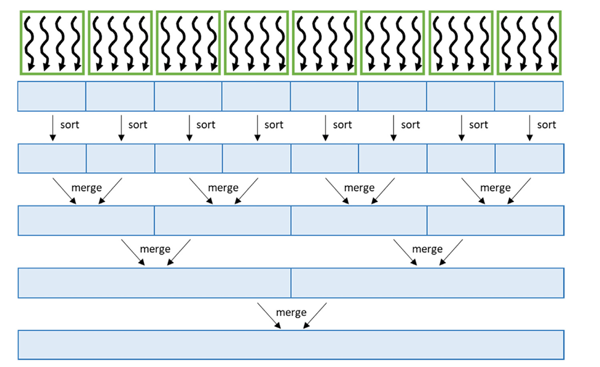

## Summary of Day 41:

> *Continuation from choice of radix:

Okay, so yesterday we discussed how **radix sort** works and how it can be parallelized using a $1$-bit radix. Each iteration of the algorithm focused on sorting the "keys" based on single bit, which required $N$ iterations for $N$-bit keys.

While this approach is straight forward, it can be ineffecient due to the large number of iterations required. 

So, today we'll explore how the **choice of radix** implements the effeciency of radix sort and how using a **multi-bit radix** can reduce the number of iterations and improve performance. 

#### Why choose multi-bit radix?

> ***1-bit Radix Recap***:
>- In a $1$-bit radix sort, each iteration sorts keys into two buckets ($0$ and $1$) based on a single bit.
>- For 4-bit keys, this requires 4 iterations to fully sort the keys.
> - Each iteration involves:
>   - Extracting the bit.
>   - Performing an exclusive scan.
>   - Sorting keys into two buckets.

***2-bit Radix Example***:

    
    
<b>Fig 41_01: </b><i>2-bit radix sort example</i>

- With a $2$-bit radix, each iteration considers two bits instead of one.
- For $4$-bit keys, only $2$ iterations are needed:
    - **First iteration**: Sort by the lower two bits `(00, 01, 10, 11)`.
    - **Second iteration**: Sort by the upper two bits `(00, 01, 10, 11)`.
- This reduces the number of iterations by half compared to a $1$-bit radix.

#### Advantages of Using a Larger Radix:

**Fewer Iterations**
- A larger radix reduces the total number of iterations required to fully sort the keys.
- *For example:*
    - A $1$-bit radix requires $N$ iterations for $N$-bit keys.
    - A $2$-bit radix requires only $N/2$ iterations.
    - An $r$-bit radix requires $N/r$ iterations.

**Reduced Overhead**
- Fewer iterations mean:
    - Fewer kernel launches.
    - Fewer global memory accesses.
    - Fewer global exclusive scan operations.

**Improved Performance**
- By reducing the number of iterations, we minimize overhead and improve overall performance.

#### Challenges with Larger Radix 😔:

While using a larger radix reduces the number of iterations, it introduces new challenges:

**More Buckets**
- A larger radix results in more buckets:
    - A $1$-bit radix has $2^1 = 2$ buckets `(0 and 1)`.
    - A $2$-bit radix has $2^2 = 4$ buckets `(00, 01, 10, 11)`.
    - An $r$-bit radix has $2^r$ buckets.
- Each thread block must manage more local buckets in shared memory, which increases complexity.

**Smaller Buckets**
- With more buckets, each bucket contains fewer keys on average.
- This reduces opportunities for memory coalescing when writing local buckets to global memory.

**Larger Global Exclusive Scan Table**
- The global exclusive scan table grows with the number of buckets and thread blocks:
    - For a $1$-bit radix, the table has **two rows** *(one for each bucket)*.
    - For a $2$-bit radix, the table has **four rows** *(one for each bucket)*.
    - For an $r$-bit radix, the table has $2^r$ rows.
- This increases the overhead of performing the global exclusive scan.

#### Optimizing Memory Coalescing:

    
    
<b>Fig 41_02: </b><i> Parallelizing a radix sort iteration and optimizing it for memory coalescing using the shared
 memory for a 2-bit radix.</i>

The above figure ***(41_02)*** shows how memory coalescing is optimized for a multi-bit radix:

1. Each thread block **sorts its keys locally** in **shared memory using a multi-bit radix** *(e.g., $2$ bits)*.
    - This involves performing multiple local exclusive scans *(one for each bit in the multi-bit radix)*.
    - For example, a $2$-bit radix requires two local exclusive scans *(one for each bit)*.

2. After sorting locally, each thread block writes its local buckets to global memory in a coalesced manner.

#### Determining Global Bucket Positions

    
    
<b>Fig 41_03: </b><i>Finding the destination of each block’s local buckets for a 2-bit radix</i>

**Figure 41_03** illustrates how to *find the destination of each block’s local buckets in global memory*:

1. **Each thread block** calculates the size of its local buckets (e.g., #$00$, #$01$, #$10$, #$11$).
2. These sizes are s**tored in a table** with **one row per bucket and one column per block**.
3. An **exclusive scan** is performed on this table to calculate the starting position of each bucket in global memory.

> **Summary Table representing the tradeoffs in choosing the radix value:**
> | Radix Value | Advantages | Disadvantages |
> |-------------|-------------|---------------|
> | **Small** *(eg. 1)* | Simple implementation | More iterations; *more space-time complexity* | 
> | **Large** *(> 1)* | Fewer iterations; reduced overhead | More buckets; smaller bucker sizes; reduced coalescing |
> | **Very Large** | Minimal iterations; minimal kernel launches | High global exclusive scan overhead |

#### Thread Coarsening to Improve Coalescing

> ⓘ ***Two similar sounding terms detected:*** 
> - **Thread Coalescing:** Grouping memory accesses from threads into a single transaction for efficiency.
> - **Thread Coarsening:** Assigning more work to each thread to reduce overhead and improve performance.

Okay, let's shift gears and focus on **thread coarsening**, a powerful technique to enhance memory coalescing in parallel radix sort. 

Building upon our previous discussions about **multi-bit radix and memory coalescing**, we'll explore how thread coarsening addresses the trade-offs between parallelism and memory access efficiency.

***The Problem: Small Local Buckets***:
- As we discussed, using **more thread blocks increases parallelism**, but it comes at a cost:
    - Each thread block has **fewer keys**.
    - **Local buckets become smaller**.
    - **Fewer opportunities** for coalescing.
- In essence, the *overhead from non-coalesced writes* can negate the benefits of parallelism ⚠️!!

So, the solution?
***Thread Coarsening*** 🙂‍↕️

> ##### What is thread coarsening??
>
> Well, we studied before about this in earlier chapters as well... _let's just revise once again_:
> - Thread coarsening involves **assigning each thread to multiple keys** instead of just one.
> - This **reduces the number of active threads** but increases the workload per thread.
> - Think of it as having fewer librarians but giving each librarian more books to sort.

#### Benifits of Thread Coarsening
1. **Larger Local Buckets:**
    - Each thread processes more keys, leading to larger local buckets within the shared memory.

2. **Improved Memory Coalescing:**
    - Larger buckets expose more opportunities for coalesced writes when writing to global memory.
    - Consecutive threads are more likely to access consecutive memory locations.

3. **Reduced Overhead for Global Exclusive Scan:**
    - Fewer thread blocks mean a smaller table for the global exclusive scan.
    - This reduces the overhead associated with the scan operation.

    
    
<b>Fig 41_04: </b><i> Radix sort for a 2-bit radix with thread coarsening to improve memory coalescing</i>

Okay, let's compare this figure with previous (**[Fig 41_02](#optimizing-memory-coalescing)**):
- **Figure 41_02** showed a scenario where each thread processed a single key.

- **Figure 41_04**, on the other hand, illustrates thread coarsening:
    - fewer thread blocks, but each block handles more keys.
    - local buckets are noticeably larger.
    - greater likelihood that consecutive threads will write to consecutive memory locations when writing local buckets to global memory.

#### How this works.
1. **Assign Multiple Keys per Thread:**
    - Determine how many keys each thread should process *(e.g., 2, 4, 8)*.

2. **Local Sorting:**
    - Each thread sorts its assigned keys into local buckets in shared memory.

3. **Exclusive Scan on Local Buckets:**
    - Perform a local exclusive scan to determine the offset of each key within its bucket.

4. **Global Exclusive Scan _(on Block Bucket Sizes)_:**
    - Calculate the sizes of local buckets for each thread block and perform a global exclusive scan to determine the starting positions of the global buckets.

5. **Write to Global Memory:**
    - Threads calculate their global destination based on their local bucket offset and the global bucket starting position.
    - Each thread writes its assigned keys to the calculated location in global memory.

> ***Trade-offs of Thread Coarsening:***
> 1. **Decreased Parallelism**
> - With fewer active threads, the degree of parallelism is reduced.
> - If the number of thread blocks becomes too small, the GPU may not be fully utilized.
> 
> 2. **Increased Complexity**
> - Thread coarsening increases the complexity of the code, as each thread must manage multiple keys.

> [Click Here](./coarsening_applied.cu) to redirect towards radix sort with thread coarsening implemented!

#### Parallel Merge Sorting

***Key-TakeAways***:
- Comparison based sorting algorithm.
- Divides input into smaller segments, sorts them independently and merges in parallel. 

    
    
<b>Fig 41_05: </b><i> Parallelizing merge sort.</i>

The above **Figure 41_ 05** shows how merge sort can be parallelized:
- The input list is divided into multiple segments.
- Each segment is sorted independently in the first stage.
- **In subsequent stages**, pairs of segments are merged in **parallel until the entire list is sorted**.

> [Click Here](./parallel_merge_sort.cu) to redirect towards code implementation 