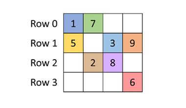
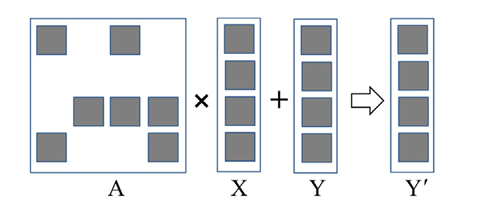

## Summary of Day 42:

> \*Solving exercises from Chapter 13- Sorting

**_Exercises_**:

1. Extend the kernel in **Code 42_01** by using shared memory to improve memory coalescing.

```cpp
__global__ void radix_sort_iter (unsigned int* input, unsigned int* output, unsigned int* bits, unsigned int N, unsigned int iter) {
    unsigned int i = blockIdx.x*blockDim.x + threadIdx.x;
    unsigned int key, bit;
    if (i < N) {
        key = input[i];
        bit = (key >> iter) & 1;
        bits[i] = bit;
    }
    exclusiveScan (bits, N);
    if (i < N) {
        unsigned int numOnesBefore = bits[i];
        unsigned int numOnesTotal = bits[N];
        unsigned int dst = (bit == 0) ? (i - numOnesBefore) : (N - numOnesTotal - numOnesBefore) ;
        output [dst] = key;
    }
}
```
<div align="center">
    <p><b>Code 42_01: </b><i>Radix Sort Iteration Kernel Code</i></p>
</div>

***Solution***:

```cpp
__global__ void radix_sort_iter (unsigned int* input, unsigned int* output, unsigned int* bits, unsigned int N, unsigned int iter) {
    // Shared Memory...
    extern __shared__ unsigned int s_data[];
    unsigned int* S_input = s_data;                 //Stores input keys
    unsigned int* S_bits = &S_input[blockDim.x];    //Stores bit flags 
    unsigned int* S_scan = &S_bits[blovkDim.x];     // Store scan results

    unsigned int i = blockIdx.x*blockDim.x + threadIdx.x;
    unsigned int key, bit;
 
    if (i < N) {
        key = input[i];
        s_input[tid] = key;
        bit = (key >> iter) & 1;  // 1 << 2 ~ 100; kinda like shifting 
        s_bits[tid] = bit;
    } else {
        s_bits[tid] = 0;
    }
    __syncthreads();
    
    // Perform exclusive scan in shared memory
    // Block-level scan (using work-efficient parallel scan)
    // idk could have just written Shared_exclusiveScan(); and got rid of this but whatever 
    unsigned int offset = 1;
    
    // Build sum in place up the tree
    for (int d = blockDim.x >> 1; d > 0; d >>= 1) {
        __syncthreads();
        if (tid < d) {
            int ai = offset * (2 * tid + 1) - 1;
            int bi = offset * (2 * tid + 2) - 1;
            if (bi < blockDim.x) {
                s_scan[bi] += s_scan[ai];
            }
        }
        offset *= 2;
    }
    
    // Clear the last element
    if (tid == 0) {
        s_scan[blockDim.x - 1] = 0;
    }
    
    // Traverse down the tree and build scan
    for (int d = 1; d < blockDim.x; d *= 2) {
        offset >>= 1;
        __syncthreads();
        if (tid < d) {
            int ai = offset * (2 * tid + 1) - 1;
            int bi = offset * (2 * tid + 2) - 1;
            if (bi < blockDim.x) {
                unsigned int temp = s_scan[ai];
                s_scan[ai] = s_scan[bi];
                s_scan[bi] += temp;
            }
        }
    }
    __syncthreads();
    
    // Write scan result to global memory for block scans to be combined later
    if (i < N) {
        bits[i] = s_scan[tid];
    }
    
    // Perform global scan combination
    // Note: This assumes exclusiveScan is modified to work with the block scans
    exclusiveScan(bits, N);

    __syncthreads();

    if (i < N) {
        unsigned int numOnesBefore = bits[i];
        unsigned int numOnesTotal = bits[N];
        unsigned int dst = (bit == 0) ? (i - numOnesBefore) : (N - numOnesTotal - numOnesBefore) ;
        output [dst] = key;
    }
}
```

2. Extend the same code **Code 42_01** to work for multibit radix.

***Solution***:

> [Click Here](./exercise_02_solution.cu) to redirect towards the solution code.

3. Extend the same kernel by applying thread coarsening to improve memory coarsening.

***Solution***:

> [Click Here](../Day_41/coarsening_applied.cu) to redirect towards the solution code.

4. Implement parallel merge sort using the parallel merge implementation from Chapter 12, Merge. 

***Solution***:

> [Click Here](../Day_41/parallel_merge_sort.cu) to redirect towards the solution code.

---

> *Starting new chapter. **Chapter 14: Sparse Matrix Computation**

### Introduction to Sparse Matrices

***What is it?***
- A sparse matrix is a matrix in which the majority of elements are zeros.
- Storing and processing these zero elements is wasteful in terms of:
    - Memory capacity
    - Memory bandwidth
    - Time
    - Energy

***Why are they important?***
- Sparse matrices arise in many scientific, engineering, and financial modeling problems.
- They are used to represent:
    - Coefficients in a system of linear equations
    - Relationships between variables in complex systems.
    - Financial models with limited dependencies.

### Background

***Applications***
1. **Solving Linear Systems of Equations**
    <div align="center">
        
        <p><b>Fig 42_01: </b><i>A simple sparse matrix example</i></p>
    </div>

    **Linear Systems and Sparse Coupling:**
    - In a linear system of equations, each row of a matrix represents one equation.
    - In science and engineering problems, equations and variables are *sparsely coupled*.
    - This means each equation involves only a small number of variables, as shown in above figure **42_01**.

    **Matrix Structure:**
    - Each column in the matrix corresponds to the coefficients for a variable: column $0$ for $x_0$, column $1$ for $x_1$, and so on.
    - Nonzero elements indicate variable involvement:
        - Row $0$: Nonzero elements in columns $0$ and $1$ indicate that only variables $x_0$ and $x_1$ are involved in equation $0$.
        - Row $1$: Nonzero elements in columns $0$, $2$, and $3$ indicate that only variables $x_0$, $x_2$, and $x_3$ are involved in equation $1$.
        - And so on...

2. **Matries in Linear Systems**:

    <div align="center">
        
        <p><b>Fig 42_02: </b><i>A small example of matrix-vector multiplication and accumulation. </i></p>
    </div>

    - The above figure **42_02** describes matrix vector accumulation and the main equation to solve is given as: $AX + Y = 0$
        - $A$ is a matrix shown above *(sparse)*
        - $X$ is a vector *(solution)* which needs to be derived
        - $Y$ is a vector that has to be accumulated.

    - **Objective**: to find the values of $X$ *(a vector of $N$ variables)* that satisfy all equations.

    In short, iterative methods depend on efficient ***SpMV** operations to approach a solution to $AX + Y = 0$ iteratively, particularly where $A$ is sparse.

    > *SpMV = Sparse-Matrix Vector Multiplication and accumulation.

### SpMV

A normal **SpMV** kernel would look sth like this:

```cpp
__global__ void basic_spmv_kernel(
    const int nnz,       // number of non-zero elements
    const int* rows,     // row indices of non-zero elements
    const int* cols,     // column indices of non-zero elements
    const float* values, // values of non-zero elements
    const float* x,      // Input vector
    float* y,            // Output vector
    const int num_rows   // Number of rows in the matrix
) {
    int idx = blockIdx.x * blockDim.x + threadIdx.x;

    if (idx < nnz) {
        int row = rows[idx];
        int col = cols[idx];
        float val = values[idx];

        // Perform multiplication and atomic addition to the result vector
        // We need atomic operations as multiple threads may update the same row
        // Above figure replication 🙂‍↕️
        int y_prime = atomicAdd(&y[row], val * x[col]);
    }
}
```
- The most time-consuming part of iterative approaches to solving linear systems of equations is the evaluation of $AX + Y$.
- This operation is a **sparse matrix-vector multiplication and accumulation (SpMV)**.

---