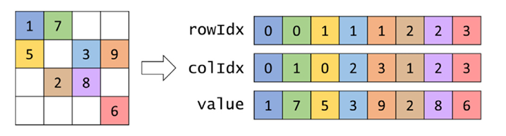
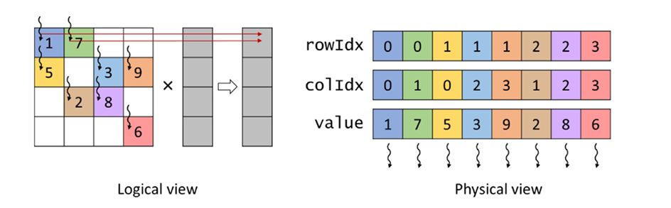

## Summary of Day 43:

> *SmPV with COO format starts:

Okay, so first **COO** stands for **(Coordinate List)** format. So lets dive into what it is, pros cons and **SmPV/COO** implementation in the end. 

### What is COO?

- The Coordinate List (COO) format is one of the simplest sparse matrix storage formats.
- It stores nonzero values along with their row and column indices.
    
    ***Storage:***
        <div align = 'center'>
            
            <p><b>Fig 43_01: </b><i>Example of COO format.</i></p>
        </div>

    - COO uses three $1 \text{D}$ arrays:
        - `value`: Stores the nonzero values.
        - `rowIdx`: Stores the row indices corresponding to the nonzero values.
        - `colIdx`: Stores the column indices corresponding to the nonzero values.

### Pros and Cons:

***Pros***:
1. **Complete Removal of Zeros**: **COO** completely removes zero elements from storage.

1. **Flexibility**: Elements in the **COO** format can be reordered without losing information. Reordering the `rowIdx`, `colIdx`, and `value` arrays in the same way maintains correct identification of each element’s location.
    - **COO** is a popular choice when a matrix is initially constructed because the data source might not provide non-zeros in any particular order.
    - Appending entries is easy for adding non-zeros, making it popular when the matrix is modified during the computation.

1. **Accessibility**:

    - **COO** allows easy access, for a given non-zero, to its corresponding row and column index.
    - This feature enables parallelization across nonzero elements in **SpMV/COO**.

1. **Memory Access Efficiency**:

    - The access pattern is such that consecutive threads access consecutive elements in each of the three arrays, resulting in coalesced memory access.

1. **Load Balance**:

    - Each thread is responsible for a single nonzero value, ensuring all threads have the same amount of work.

***Cons***:
1. **Storage Overhead**:

    - Introduces `colIdx` and `rowIdx` arrays, increasing storage overhead. In cases where the number of zero elements isn't significantly higher than the number of non-zero elements, the overhead can negate the space saved.
    - It is more effective in sparse matrices in which the vast majority of elements are zeros. For example, in a sparse matrix with only $1$% non-zero values, the total **COO** storage, including overhead, would be around $3$% of the space required to store both zero and nonzero elements.

2. **Lack of Accessibility**:

    - **COO** does not easily allow access to all non-zeros in a given row or column. This makes it a bad choice if computation requires a row-wise or column-wise traversal of the matrix.
3. **Atomic Operations**:

    - SpMV with COO (**SpMV/COO**) requires atomic operations because multiple threads might be assigned to non-zeros in the same row, resulting in multiple threads updating the same output value.

> ***Revision/ TL;DR section:***
>
> **COO Pros:**
> - Removes zeros.
> - Flexible (easy reordering, appending).
> - Easy access to (row, col, value) for each non-zero.
>
> **COO Cons:**
> - Overhead from storing row/col indices.
> - Not good for row/column-wise access.
> - Requires atomic operations for SpMV.

Okay, so now lets implement **SpMV with COO**.

### Implementation of **SpMV/COO**
1. Defining the **COO** Matrix Structure first:

    ```cpp
    struct COOMatrix{
        int numRows;            //Number of rows
        int numCols;            //Number of columns
        int numNonZeros;        //Number of non-zeros
        unsigned int* value;    //Value of non-zero elements
        unsigned int* rowIdx;   //Row index of non-zero elements
        unsigned int* colIdx;   //Column index of non-zero elements
    };
    ```
2. Parallel **SpMV/COO** Kernel

    ```cpp
    __global__ void smpv_coo_kernel (COOMatrix cooMatrix, float* x, float* y){
        unsigned int i = blockIdx.x * blockDim.x + threadIdx.x;
        if (i < cooMatrix.numNonZeros){
            unsigned int row = cooMatrix.rowIdx[i];
            unsigned int col = cooMatrix.colIdx[i];
            float value = cooMatrix.value[i];
            atomicAdd(&y[row], x[col]*value);
        }
    }
    ```

    ***Visual representation***
    <div align = 'center'>
        
        <p><b>Fig 43_01: </b><i>Example of parallelizing SpMV with the COO format.</i></p>
    </div>

> ***Parallelization Strategy***
>- Assign a thread to each nonzero element.
>- Each thread accesses the `rowIdx`, `colIdx`, and `value` arrays to retrieve the information about its assigned nonzero element.
>- The thread multiplies the nonzero value by the corresponding element from the input vector $X$.
>- Finally, the thread adds the result to the appropriate element in the output vector $Y$ using an atomic operation.
>
> ***A simple breakdown***:
>
> **Thread 0**
> - Assigned to $A$ (value = $1$)
> - Multiplies $1 \times X_1$ ($X_1$ is the first element of the input vector)
> - Adds the result to $Y_1$ ($Y_1$ is the first element of the output vector)
>
> **Thread 1**
> - Assigned to $A$ (value = $5$)
>- Multiplies $5 \times X_1$ (X is the first element of the input vector)
>- Adds the result to $Y_2$ ($Y_2$ is the second element of the output vector)
> 
> and so on...

> [Click Here](./SpMV_COO.cu)