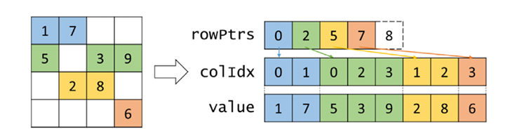
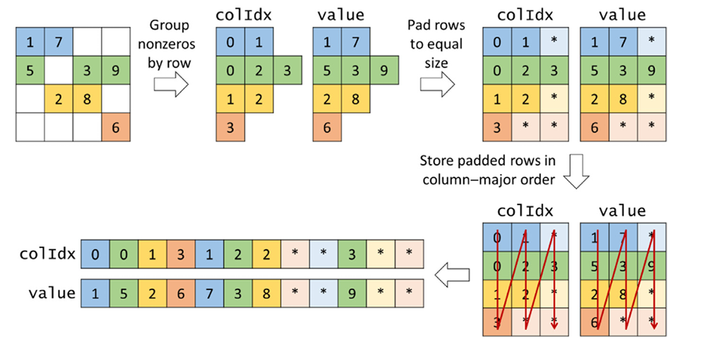
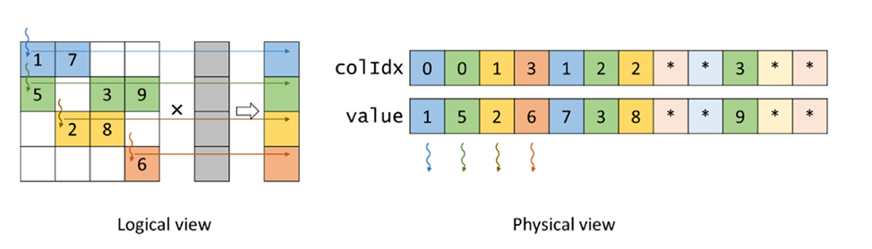

## Summary of Day 44:

> *Starting from **CSR**  format :) 

### CSR (Compressed Sparsed Row) Format

The Compressed Sparse Row **(CSR)** format is a popular storage method for sparse matrices that **groups nonzero elements by rows**. This approach offers an important advantage over COO format: *it avoids atomic operations when performing operations like Sparse Matrix-Vector multiplication (SpMV)*.

#### How CSR Works:
<div align="center">
    
    <p><b>Fig 44_01: </b><i>Example of CSR format.</i></p>
</div>

Looking in the above figure **44_01**, we can see the CSR uses three arrays:
- `value`: Stores all nonzero values in the matrix, *grouped by row*.
- `colIdx`: Stores all column indices corresponding to each nonzero value.
- `rowPtrs`: Unlike **COO**'s `rowIdx` array, this stores the starting positions of each row in the `value`/`colIdx` arrays.

> The `rowPtrs` array has `(numRows + 1)` elements, with the last element indicating the total number of nonzeros. **This allows finding both the start and end of any row's elements.**

**Structure Example:**
For the natrix shown in figure **44_01**:
- Nonzeros from row $0$ (elements $1$ and $7$) are stored first

- Followed by nonzeros from row $1$ (elements $5$, $3$, and $9$)
- Then row $2$ (elements $2$ and $8$)
- And finally row $3$ (element $6$)
- The `rowPtrs` array would look like..., indicating:
    - Row $0$ starts at position $0$
    - Row $1$ starts at position $2$
    - Row $2$ starts at position $5$
    - Row $3$ starts at position $7$
    - The "extra" entry $(8)$ marks the end of the last row.

> The key advantage here is that each thread writes to a distinct output position, so no atomic operations are needed.

#### Advantages and Disadvantages:

***Advantages***:
- **No Atomic Operations**: Each thread handles all nonzeros in a row
- **Space Efficiency**: More efficient than COO (needs fewer arrays)
- **Row Accessibility**: Easy to access all nonzeros in a given row

***Disadvantages***:
- **Memory Access Pattern**: Non-coalesced memory accesses. 
- **Load Imbalance**: Rows with different numbers of nonzeros cause control flow divergence
- **Less Flexibility**: Adding new nonzeros is more difficult than with **COO**.


#### Kernel Implementation:

```cpp
__global__ void spmv_csr_kernel(CSRMatrix csrMatrix, float* x, float* y) {
    unsigned int row = blockIdx.x*blockDim.x + threadIdx.x;
    if (row < csrMatrix.numRows) {
        float sum = 0.0f;
        for (unsigned int i=csrMatrix.rowPtrs[row]; i<csrMatrix.rowPtrs[row+1]; ++i) {
            unsigned int col = csrMatrix.colIdx[i];
            float value = csrMatrix.value[i];
            sum += x[col]*value;
        }
        y[row] += sum;
    }
}
```
> [Click Here](./CSR_Implementation.cu) for full CSR implementation.

If we compare this kernel with previous **COO** implementation; 

1. [**COO Implementation:**](../Day_43/SpMV_COO.cu)
    - Each nonzero element is assigned to a thread. 
    - Atomic operations are used to accumulate values into `y[row]` since multiple threads may contribute to the same row.
    - Memory access pattern is random as elements are stored in `(row, col, value)` format without row-wise ordering.
    - ***Performance Bottleneck***: High contention due to frequent `atomicAdd` operations.

2. [**CSR Implementation:**](./CSR_Implementation.cu)
    - Each row of the matrix is assigned to a thread.
    - The thread iterates through the row’s nonzero elements using row pointers (`rowPtrs`), accumulating the result in a local variable sum, which is finally written to `y[row]`.
    - No atomic operations are needed since a single thread computes the full sum for a row.
    - Memory access is more structured due to contiguous storage of nonzero elements in `value[]` and `colIdx[]`.
    - ***Performance Benefit***: Fewer atomic operations, better memory locality.

> ***Complexity Analysis:***
> | Implementation | Work Per Thread | Synchronization | Memory Access Pattern | Time Complexity |
> |--------------|------------------|---------------|------------|-------------|
> | **COO SpMV** | One element (`O(1)`) | `atomicAdd` *(Concatenation)* | Random (scattered `rowIdx[]`) | `O(N)` for elements, high overhead from atomics |
> | **CSR SpMV** | One row (`O(N_row)`) | None *(local accumulation)* | Structured (traverses `rowPtrs[]`) |` O(N + M)`, where `N` = nonzeros, `M` = rows |

> ***TL;DR***
> - **COO**: Higher atomic overhead, especially in matrices with many nonzeros per row.
> - **CSR**: More efficient as threads work on independent rows without atomic operations.

### ELL Format 

> ***From ELLPACK— a package for solving elliptic boundary value problems.***

The ELL format **addresses one of the major limitations of  CSR: non-coalesced memory accesses**. This format uses *clever data padding and transposition* to enable better memory coalescing when performing operations like SpMV on GPUs.

#### How ELL works??
<div align= "center">
    
    <p><b>Fig 44_02: </b><i>Example of ELL storage format.</i></p>
</div>

Okay, let's look at the abvove figure **44_02**. Here, we can see that **ELL** format is created through these steps:
- **Start with grouped nonzeros** *(like CSR)*
- **Pad rows to equal length**: Each row is padded with placeholder elements *(marked with \*asterisks)* to match the length of the row with the most nonzeros
- **Store in column-major order**: The padded matrix is stored with all elements of column $0$ first, then column $1$, and so on...

For our example matrix, row $1$ has the most nonzeros (three), so all other rows are padded to have three elements each. The padding elements are marked with asterisks in the figure.

> The ELL format uses two arrays:
> - `value`: Contains nonZero values *(and zeros for padding elements)*
> - `colIdx`: Contains column indices for each nonZero *(and placeholder indices for padding)*.
> 
> Unlike **CSR**, **ELL** doesn't need a `rowPtr` array because:
> - The number of elements per row is fixed *(after padding)*
> - Elements for row `r` start at position `r` in each column's section
> - To access the next element in a row, simply add the number of rows to the current index


#### Parallel SpMV Implementation with ELL:
<div align="center">
    
    <p><b>Fig 44_03: </b><i>SpMV with ELL parallelization</i></p>
</div>

Also the kernel code would look like:

```cpp
__global__ void spmv_ell_kernel (ELLMatrix ellmatrix, float* x, float* y){
    unsigned int row = blockIdx.x*blockDim.x + threadIdx.x;
    if (row < ellMatrix.numRows) {
        float sum = 0.0f;
        for (unsigned int t = 0; t < ellMatrix.nnzPerRow[row]; t++){
            unsigned int i = t*ellMatrix.numRows + row;
            unsigned int col = ellMatrix.value[i];
            float value = ellMatrix.value[i];
            sum += x[col]*value;
        }
        y[row] = sum;
    }
}
```

As shown in the figure **44_03** and `smpv_ell_kernel` above:
1. Each thread processes one thread of the matrix.
2. For each nonZero in its row, the thread:
    - Calculates the array index using: `i = t*ellMatrix.numRows + row`
    - Retrieves columnIndex and value
    - Performs multiplication and accumulation
    - Writes final sum to output vector.

> The key advantage here is that threads with consecutive IDs access consecutive memory locations in the `value` and `colIdx` arrays, enabling memory coalescing and better performance.

#### Advantages and Disadvantages:

***Advantages:***
-   **Coalesced Memory Access**: Consecutive threads access consecutive memory locations.
-   **Better Flexibility**: Easier to add nonzeros by replacing padding elements.
-   **Dual Accessibility**: Can access by row (like CSR) or by element (like COO).

***Disadvantages:***
-   **Space Inefficiency**: Padding can waste significant space, especially when rows have very different numbers of nonzeros.
-   **Control Divergence**: Still suffers from load imbalance as threads process rows with different numbers of actual nonzeros.

> **ⓘ Note**: \
> In practice, **ELL**'s space inefficiency can be severe. As the authors note, if a $1000×1000$ matrix has one row with $200$ nonzeros while most rows have fewer than $10$, ELL would require padding all rows to $200$ elements. This would make the ELL representation about 40% of the uncompressed size—***$20$ times larger than CSR***!
>
>This space concern leads to hybrid formats like **ELLPACK-R** and **Hybrid ELL-COO (HYB)**.

---
> ***Well, let's keep that for tommorow !!*** 😅