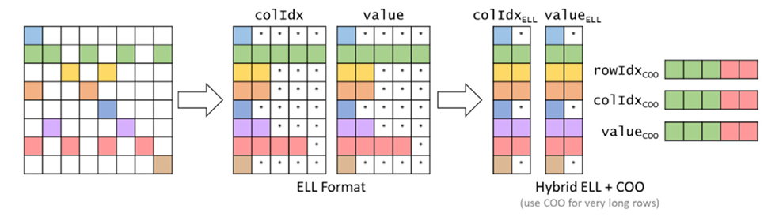
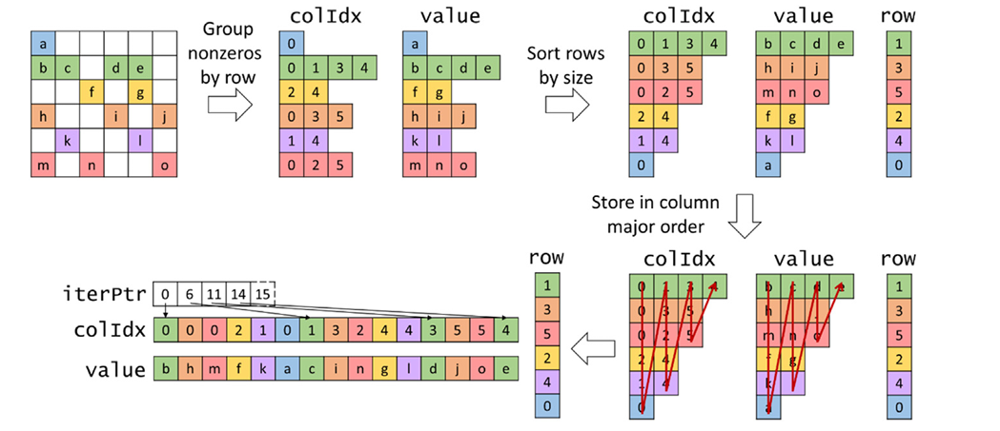
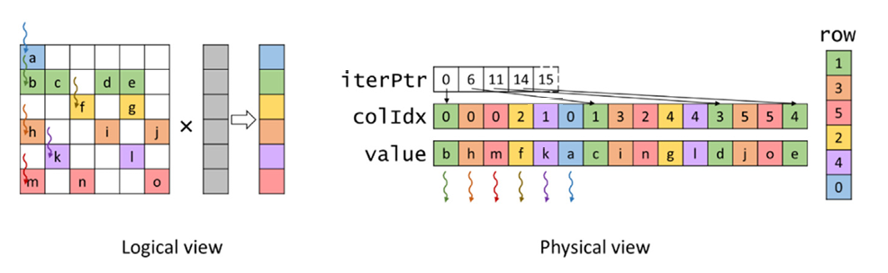

## Summary of Day 45:

> *Continuation from Hybrid **ELL-COO** format

Yesterday, we studied the ineffeciencies of **ELL** format, *particularly its space ineffeciency and control divergence* when rows have widely varying numbers of nonzeros. To address these issues, today we dive into the **Hybrid ELL-COO** format, which combines the strengths of **ELL** and **COO** formats to improve space effeciency, flexibility and load balance.

### Hybrid ELL-COO:
The **hybrid ELL-COO** format mitigates all above mentioned problems about **ELL** by:
1. ***Removing excess nonzeros*** from long rows in the **ELL** representation.
2. ***Storing these excess nonzeros separately*** in a **COO** representation.
3. Using **SpMV/ELL** for the remaining elements and **SpMV/COO** for the excess elements.

#### How it works:

<b>Fig 45_01: </b><i>Hybrid ELL-COO example</i>

1. Start with Sparse Matrix:

    - Begin with a sparse matrix where some rows have significantly more nonzeros than others.

1. Convert to **ELL** Format:

    - Convert the matrix to **ELL** format but identify rows with excessive nonzeros.

1. Move Excess Nonzeros to **COO** Format:

    - For rows with more nonzeros than the threshold *(e.g., the maximum number of nonzeros in most rows)*, move the extra nonzeros to a separate COO representation.
    - This reduces padding in ELL and improves load balance.

1. Perform **SpMV** in $2$ Steps:
    - Use **SpMV/ELL** for the padded matrix (remaining elements).
    - Use **SpMV/COO** for the excess elements stored in COO format.

> In figure **45_01**;
> - Rows $1$ and $6$ have the largest number of nonzeros, causing excessive padding in other rows.
>- The last three nonzeros of row $1$ and the last two nonzeros of row $6$ are moved to **COO** format.
>- This reduces the maximum number of nonzeros per row in ELL from $5$ to $2$, significantly reducing padding (from $22$ padded elements to just $3$).

#### Pros and Cons

***Benefits of Hybrid ELL-COO***
1. **Space Efficiency:**
    - By removing excess nonzeros from long rows, **hybrid ELL-COO** reduces padding compared to pure **ELL**.
    - For example, **Figure 45_01** shows padding reduced from $22$ elements to just $3$.

1. **Flexibility:**

    **Hybrid ELL-COO** is more flexible than pure **ELL**:
    - Nonzero elements can be added by replacing padding elements in **ELL**.
    - Additional nonzeros can also be appended to the **COO** part if no padding is available.

1. **Memory Access Efficiency:**
    - Both **SpMV/ELL** and **SpMV/COO** exhibit coalesced memory access patterns, ensuring efficient sparse matrix computations.

1. **Control Divergence Reduction**
    - Removing excess nonzeros from long rows reduces control divergence in the **SpMV/ELL** kernel.

    - Since **SpMV/COO** does not exhibit control divergence, moving excess elements to **COO** improves load balance.

***Drawbacks of Hybrid ELL-COO***

1. **Accessibility**
Hybrid **ELL-COO** sacrifices accessibility compared to pure **ELL**:
    - Accessing all nonzeros in a given row is straightforward for rows entirely within the **ELL** part.
    - For rows that overflow into **COO**, accessing all nonzeros requires searching both parts, which is expensive.

1. **Overhead of Creating Hybrid Format**
    - Separating **COO** elements from an **ELL** representation incurs additional work.
    - This overhead can be significant if **SpMV** is performed only once on the matrix.
    - However, in iterative solvers where **SpMV** is repeated many times _(e.g., conjugate gradient methods)_, this overhead can be distributed across iterations.

> [Click Here](./ELL_COO.cu) for peeking on full code implementation. 

### Jagged Diagonal Storage (JDS) Format:

> Eliminates padding entirely while maintaining coalesced memory access and reducing control divergence.

#### Motivation behind JDS Format:
**ELL** format achieves coalesced memory access but suffers from space inefficiency due to padding. **JDS** addresses this issue by:

1. **Sorting Rows by Size:**

    - Rows are sorted from longest to shortest based on the number of nonzeros.

1. **Storing Nonzeros in Column-Major Order:**

    - After sorting, nonzeros are stored column-wise to enable coalesced memory access.

1. **Tracking Iteration Boundaries:**

    - An `iterPtr` array is introduced to track where each iteration begins.
    - This approach avoids padding altogether while preserving coalesced memory access patterns.

#### How JDS Works:

<b>Fig 45_02: </b><i>JDS Storage Format Example</i>

1. **Group Nonzeros by Row:**

    - Start with the sparse matrix and group all nonzeros by row *(similar to CSR and ELL formats)*.

1. **Sort Rows by Size:**

    - Sort rows based on the number of nonzeros *(longest to shortest)*.
    - Maintain a row array to preserve the original row indices.

1. **Store in Column-Major Order:**

- After sorting, store nonzeros in column-major order using two arrays:
    - `value`: Contains nonzero values.
    - `colIdx`: Contains column indices corresponding to the nonzero values.

1. **Add `iterPtr` Array:**

    - Introduce an `iterPtr` array that tracks the starting position of each iteration.

    - For example:
        - Iteration $0$ starts at position $0$.
        - Iteration $1$ starts at position $6$.
        - Iteration $2$ starts at position $11$, and so on.
    
#### Parallelizing SpMV with JDS:

    
    
<b>Fig 45_03: </b><i>Parallel SpMV with JDS</i>

- Each thread is assigned to one row of the matrix.
- Threads iterate through nonzeros in their assigned row using the `iterPtr` array to identify iteration boundaries.
- For each nonzero, threads:
    - Retrieve the column index from `colIdx`.
    - Retrieve the value from value.
    - Multiply the value with the corresponding element from the input vector (`x[colIdx]`).
    - Accumulate the result into a local sum.
- Write the final sum to the output vector (`y[row]`).

> ***TL;DR***:
>
> The **JDS** format improves upon **ELL** by eliminating padding and sorting rows based on their length, enabling coalesced memory access patterns and reducing control divergence during **SpMV** operations. While it introduces preprocessing overhead and sacrifices some accessibility, these trade-offs are justified for iterative solvers where **SpMV** is performed repeatedly on the same matrix.

> **ⓘ Note**:
> | **Feature**| **Hybrid ELL-COO**| **JDS Format**|
> |--------------|-------------------|---------------|
> | **Space Efficiency** | Better than pure **ELL**; reduces padding by moving excess elements to **COO** | Eliminates padding entirely by sorting rows and storing nonzeros column-wise  |
> | **Flexibility** | Easier to add new nonzeros: can replace padding in **ELL** or append to **COO** | Less flexible; adding nonzeros may require restructuring and resorting rows   |
> | **Accessibility** | Requires searching both **ELL** and **COO** parts to access all nonzeros in a row | Similar to **CSR**; allows row-wise access but not as accessible as **COO**           |
> | **Memory Access Efficiency** | Coalesced memory access for both **SpMV/ELL** and **SpMV/COO** | Coalesced memory access due to column-major storage |
> | **Load Balance** | Reduces control divergence by handling long rows separately in **COO** | Reduces control divergence by sorting rows and grouping rows of similar length |

---
> ***End of Chapter!!***
