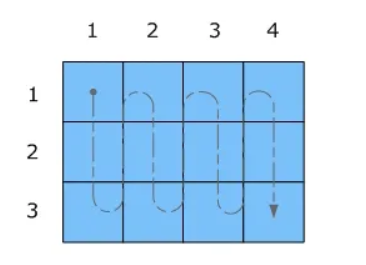

## Summary of Day 46:

> *Exercises from Chapter-14
 
###
1. Consider the following sparse matrix:

```math 
\begin{bmatrix}
    1 & 0 & 7 & 0 \\
    0 & 0 & 8 & 0 \\ 
    0 & 4 & 3 & 0 \\
    2 & 0 & 0 & 1 \\
    \end{bmatrix}
```

Represent it in each of the following formats: 
1. **COO**
2. **CSR**
3. **ELL** and 
4. **JDS**

***Solution***:

Okay, so let's represent first into **COO** format:

> In **COO**; three 1D arrays:
> - `value`
> - `rowIdx`
> - `colIdx`

```math 
\begin{bmatrix}
    1 & 0 & 7 & 0 \\
    0 & 0 & 8 & 0 \\ 
    0 & 4 & 3 & 0 \\
    2 & 0 & 0 & 1 \\
    \end{bmatrix} \longrightarrow 
    \begin{array}{ll}
    \text{value:} & 1 \quad 7 \quad 8 \quad 4 \quad 3 \quad 2 \quad 1 \\
    \text{rowIdx:} & 0 \quad 0 \quad 1 \quad 2 \quad 2 \quad 3 \quad 3 \\
    \text{colIdx:} & 0 \quad 2 \quad 2 \quad 1 \quad 2 \quad 0 \quad 3 
    \end{array}
```

> ***Will implemnet kernel in a while***

Onto **CSR**:

```math 
\begin{bmatrix}
    1 & 0 & 7 & 0 \\
    0 & 0 & 8 & 0 \\ 
    0 & 4 & 3 & 0 \\
    2 & 0 & 0 & 1 \\
    \end{bmatrix} \longrightarrow 
    \begin{array}{ll}
    \text{rowPtrs:} & 0 \quad 2 \quad 3 \quad 5 \quad  7^* \\
    \text{colIdx:} & 0 \quad 2 \quad 2 \quad 1 \quad 2 \quad 0 \quad 3 \\
    \text{value:} & 1 \quad 7 \quad 8 \quad 4 \quad 3 \quad 2 \quad 1
    \end{array}
```

> ***Didn't get what I did here?***: [Click Here](../Day_44/README.md#how-csr-works) to revise

Okay, so let's go into **ELL** next:

```math 
    \begin{bmatrix}
    1 & 0 & 7 & 0 \\
    0 & 0 & 8 & 0 \\ 
    0 & 4 & 3 & 0 \\
    2 & 0 & 0 & 1 \\
    \end{bmatrix} \xrightarrow{\text{Group nonZeros by Row + Pad rows to equal size}} 
    \begin{bmatrix}
    0 & 2  \\
    2 & *  \\ 
    1 & 2  \\
    0 & 3  \\
    \end{bmatrix} 
    \begin{bmatrix}
    1 & 7  \\
    8 & *  \\ 
    4 & 3  \\
    2 & 1  \\
    \end{bmatrix} 
```

```math
\begin{bmatrix}
    0 & 2  \\
    2 & *  \\ 
    1 & 2  \\
    0 & 3  \\
    \end{bmatrix} 
    \begin{bmatrix}
    1 & 7  \\
    8 & *  \\ 
    4 & 3  \\
    2 & 1  \\
    \end{bmatrix} \xrightarrow{\text{Store padded rows in column-major order}}
    \begin{array}{ll}
    \text{colIdx:} & 0 \quad 2 \quad 1 \quad 0 \quad 2 \quad * \quad 2 \quad 3 \\
    \text{value:} & 1 \quad 8 \quad 4 \quad 2 \quad 7 \quad * \quad 3 \quad 1
    \end{array}
```
> **ⓘ Note:** Column-major scan looks like this: 
> <div align="center">
>   
> </div>

And Finally **JDS**

```math
    \begin{bmatrix}
    1 & 0 & 7 & 0 \\
    0 & 0 & 8 & 0 \\ 
    0 & 4 & 3 & 0 \\
    2 & 0 & 0 & 1 \\
    \end{bmatrix} \xrightarrow{\text{Group nonZeros by Row }} 
    \begin{bmatrix}
    0 & 2  \\
    2 & *  \\ 
    1 & 2  \\
    0 & 3  \\
    \end{bmatrix} 
    \begin{bmatrix}
    1 & 7  \\
    8 & *  \\ 
    4 & 3  \\
    2 & 1  \\
    \end{bmatrix}
```

```math
\begin{bmatrix}
    0 & 2  \\
    2 & *  \\ 
    1 & 2  \\
    0 & 3  \\
    \end{bmatrix} 
    \begin{bmatrix}
    1 & 7  \\
    8 & *  \\ 
    4 & 3  \\
    2 & 1  \\
    \end{bmatrix} \xrightarrow{\text{Sort rows by size }} \begin{bmatrix}
    0 & 2  \\ 
    1 & 2  \\
    0 & 3  \\
    2 & *  \\
    \end{bmatrix} 
    \begin{bmatrix}
    1 & 7  \\
    4 & 3  \\
    2 & 1  \\
    8 & *  \\ 
    \end{bmatrix}
    \begin{bmatrix}
    0 \\
    2 \\
    3 \\
    1 \\ 
    \end{bmatrix}
```

```math
    \begin{bmatrix}
    0 & 2  \\ 
    1 & 2  \\
    0 & 3  \\
    2 & *  \\
    \end{bmatrix} 
    \begin{bmatrix}
    1 & 7  \\
    4 & 3  \\
    2 & 1  \\
    8 & *  \\ 
    \end{bmatrix}
    \begin{bmatrix}
    0 \\
    2 \\
    3 \\
    1 \\ 
    \end{bmatrix} \xrightarrow{\text{Store in Column Major Order}}
    \begin{array}{ll}
    \text{iterPtr:} & 0 \quad 4 \quad 7 \\
    \text{colIdx:} & 0 \quad 1 \quad 0 \quad 2 \quad 2^* \quad 2 \quad 3 \\
    \text{value:} & 1 \quad 4 \quad 2 \quad 8 \quad 7^* \quad 3 \quad 1
    \end{array}
```
> **ⓘ FYI:** \
>`iterPointer` array is also known as jagged diagonal pointer array.

###
2. Given a sparse matrix of integers with $m$ rows, $n$ columns, and $z$ non-zeros, how many integers are needed to represent the matrix in: 
    1. **COO**, 
    2. **CSR**,
    3. **ELL**, *and* 
    4. **JDS**?

If the information that is provided is not enough to
allow an answer, indicate what information is missing.

***Solution***:

- In **COO**:

    For a sparse matrix with $m$ rows, $n$ columns, and $z$ non-zeros, the **COO** format requires:

    - An array of `values`: $z$ integers
    - An array of `rowIndices`: $z$ integers
    - An array of `columnIndices`: $z$ integers

    > Hence, total storage requirement in **COO**: $3z$ integers.

- In **CSR**:
    For a sparse matrix with $m$ rows, $n$ columns, and $z$ non-zeros, the **CSR** format requires:

    - An array of `values`: $z$ integers
    - An array of `columnIndices`: $z$ integers
    - An array of `rowOffsets`: $(m+1)$ integers

    > Hence, total storage requirement in **CSR**: $2z+ (m+1)$ integers.

- In **ELL**:
    For a sparse matrix with $m$ rows, $n$ columns, and $z$ non-zeros, the **ELL** format requires:

    - An array of `columnIndices`: $ m \times K $ integers
    - An array of `values`: $ m \times K $ integers

    where, $K$ stands for maximum number of non-zeros in any row.

    > Hence, total storage requirement in **ELL**: $2m \times K$ integers.

> **ⓘ Note:** \
>***Missing information in ELL***:
> To precisely calculate the storage requirements for **ELL**, we need to know $K$, the maximum number of non-zeros in any row. Without this information, we cannot provide a definitive answer for the ELL format.

- In **JDS**:
    For a sparse matrix with $m$ rows, $n$ columns, and $z$ non-zeros, the **JDS** format requires:

    - An array of `values`: $z$ integers
    - An array of `columnIndices`: $z$ integers
    - A `row` permutation array : $m$ integers
    - A jagged diagonal pointers array (aka. `IterPointer` array): $(\text{number of jagged diagonals} + 1)$ integers

    > Hence, the total storage requirement for **JDS** format is $2z + m + (\text{number of jagged diagonals} + 1)$ integers.

> **ⓘ Note:** \
>***Missing information in JDS***: To precisely calculate the storage requirements for JDS, we need to know **number of jagged diagonals**, which is **equal to the maximum number of non-zeros** in any row after permutation. Without this information, we cannot provide a definitive answer for the JDS format.

### 
3. Implement the code to convert from **COO** to **CSR** using fundamental parallel computing primitives, including histogram and prefixsum. 

***Solution***:

> [Click Here](./coo_2_csr.cu) to redirect to code implementation.

> ⚠️ ***In Code***:
> You could see implementation of thrust quite a bit. Thrust is a powerful parallel algorithms library designed for CUDA and C++ that simplifies and accelerates programming on GPUs (Graphics Processing Units). It provides a high-level interface for performing common parallel operations, making it easier for developers to harness the power of GPU computing without needing to dive into the low-level details of CUDA programming. Below, I’ll explain what Thrust is used for in a clear and structured way. 
>
> [Click Here](https://nvidia.github.io/cccl/thrust/) to redirect to official documentation of thrust library!

###
4. Implement the host code for producing the hybrid **ELL-COO** format and using it to perform **SpMV**.Launch the **ELL** kernel to execute on the device, and compute the contributions of the **COO** elements on the host.

***Solution***:

> [Click Here](../Day_45/ELL_COO.cu) to redirect to code implementation.