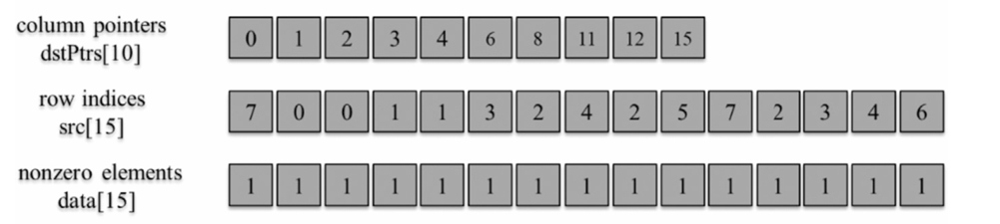

## Summary of Day 47:

> * Chapter 15- Graph Traversal Starts

> ***Quick Revision*** on Graph and Adcancy matrix through image:
> <div align="center">
>   
> </div>
>
> - **Beads**: Vertices
> - **Arrows**: Edges
> 
> The right side table is an ***adjacency matrix***.
> - $1$ if there exists arrow betweem source vertex and destination vertex.
> - $0$ otherwise.

So, in the earlier chapter; we studied about sparse matrix and if we look closely in the adjacancy matrix, its looks like one.

Adjacency matrix is mostly zeros, with just a few non-zero spots for actual edges. Storing all these zeros is massive waste of space and slows things down when we're running algos. So sparse matrix representations fix that by only storing the non zero stuffs. 

If we allocated the space for all the ($9\times9 = 81$) boxes in the above adjacency table shown, that would greately slow things down compared to how sparse matrix representations store:

<div align="center">
    
    <p><b> Fig 47_02: </b><i> COO representation of the above table</i>
    </p>
</div>

<div align="center">
    
    <p><b> Fig 47_03: </b><i> CSR representation of the above table</i>
    </p>
</div>

<div align="center">
    
    <p><b> Fig 47_04: </b><i> CSC representation of the above table</i>
    </p>
</div>

And actually, since we are considering all the $1's$, we don't even need the data array. which is a huge win, especially for giant graphs where savings could be in GBs.

> **ⓘ Note:** 
> - **CSR** rock when it comes to finding outgoing edges.
> - **CSC** rock when it comes to finding incoming edges, per text. With `dstPtrs`, we can jump to a column and see who's pointing to that vertex. (kinda like reverse lookup) 
> - **COO** is great for accessing both ends of an edge.

### Breadth First Search (BFS)

- Used to discover shortest number of edges that one needs to traverse going from one vertex to another vertex of the graph.

<div align="center">
    
    <p><b>Fig 47_01 (left): </b><i>Example graph</i></p>
</div>

- Okay it depends on which vertex we consider as root vertex. Let's assume $(0)$ for now:


Also, let's take one of the vertices as destination vertex let's assume it to be $(5)$: 

Since,we know **BFS** is level order search i.e, to find $(5)$, I'd go like 


Simple as that. 

>*[Click Here](./bfs_simple.cu) to redirect towards a simple BFS kernel implementation*. 
>
> It's output looks like this:
>```shell
> 0 1 2 3 4 5 6 7 8 
> Distance to 0: 0
> Distance to 1: 1
> Distance to 2: 1
> Distance to 3: 2
> Distance to 4: 2
> Distance to 5: 2
> Distance to 6: 2
> Distance to 7: 2
> Distance to 8: 3
> ```

---
**UpNext**: ***[Vertex-Centric Parallelization of BFS](../Day_48/)***