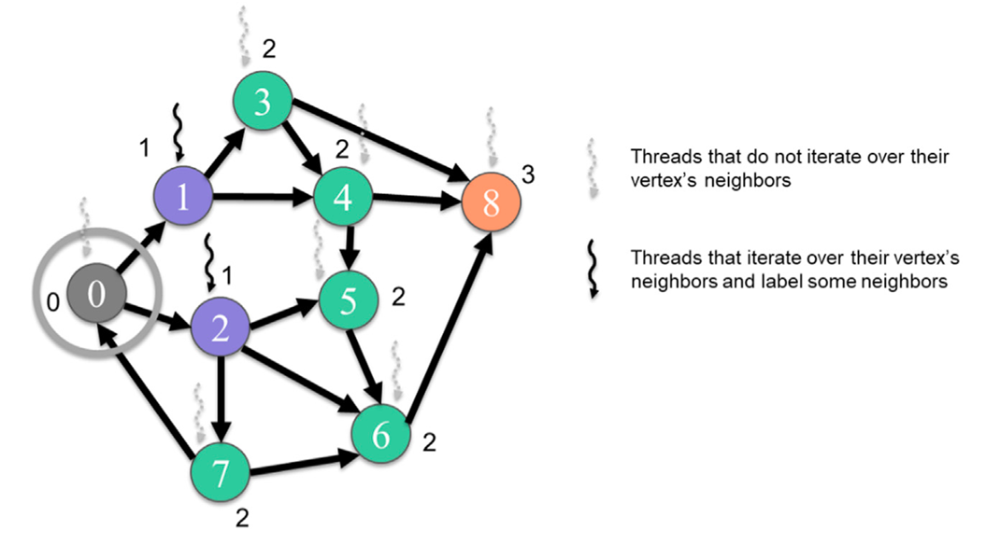
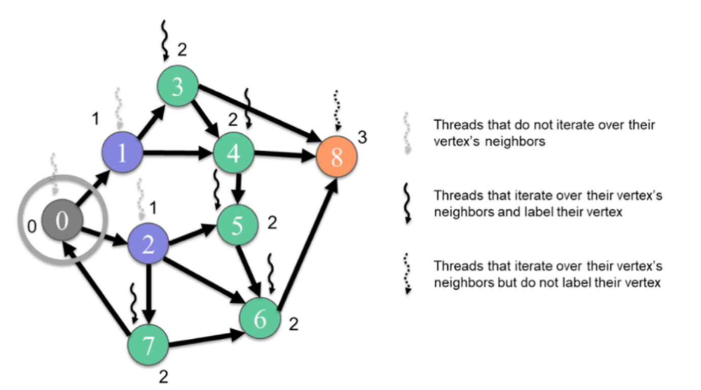

## Summary of Day 48:

Okay so yesterday, we studied and implemented a normal BFS code. Today let's buff it up with Parallelization. We'll dive into vertex-centric approaches that dramatically improve BFS performance on large graphs. These techniques are fundamental to graph processing frameworks and were key innovations in early Graph500 competition winners.

### Vertex-Centric Parallelization Concept
**Vertex-centric parallelization** is a natural approach to parallelize graph algorithms by assigning operations to different vertices or edges concurrently. In this paradigm, we can broadly classify implementations as *vertex-centric* or *edge-centric*.

In a **vertex-centric** implementation:
- Threads are assigned to vertices
- Each thread performs operations on its assigned vertex
- Operations typically involve iterating over the neighbors of that vertex
- Depending on the algorithm, the thread may process outgoing edges, incoming edges, or both

This contrasts with *edge-centric* (which we gon'a read next) implementations where threads are assigned to individual edges.

#### **Parallelizing BFS**: The Level-by-Level Approach

All parallel BFS implementations we'll examine follow the same high-level strategy:

- Label the root vertex as level $0$
- Call a kernel to label all neighbors of the root vertex as level $1$
- Call a kernel to label all unvisited neighbors of level $1$ vertices as level $2$
- Continue until no new vertices are visited

This level-by-level approach is necessary because we must ensure all vertices in a previous level are labeled before proceeding to the next level. Otherwise, we risk incorrect labeling.

#### The Push Approach (Top-Down BFS)
In this approach ([**Figure 48_01**](#example-execution)):

1. Each thread is assigned to a vertex

1. The thread checks if its vertex belongs to the previous level

1. If so, the thread iterates over all of its vertex's outgoing edges

1. For each outgoing edge, if the neighbor hasn't been visited:
    - The thread labels the neighbor as belonging to the current level
    - The thread sets a flag indicating a new vertex has been visited

> 👉 ***Key Features of Push Approach***:
> - **Data Structure**: Uses **CSR** (Compressed Sparse Row) format since it needs efficient access to outgoing edges
> - **Work Distribution**: Only threads assigned to vertices in the previous level perform significant work
> - **Memory Access Pattern**: Each thread writes to multiple locations in the output array
> - **Control Flow**: All threads check all neighbors without early termination

##### ***Example Execution:***

<b> Fig 48_01: </b><i> Example of a vertex-centric push BFS traversal from level 1 to level 2. BFS, breadth-first
 search</i>

> [Click Here](./vertex_centric_push.cu) to redirect to the code implementation of Vertex Centric Push BFS.

#### The Pull Approach (Bottom-Up BFS)
The second vertex-centric implementation is the pull approach, also called bottom-up BFS.

***How Pull Works***
In this approach ([**Figure 48_02**](#)):

1. Each thread is assigned to a vertex
1. The thread checks if its vertex has NOT been visited yet
1. If not visited, the thread iterates over its vertex's incoming edges
1. For each incoming edge, if the neighbor belongs to the previous level:
    - The thread labels its vertex as belonging to the current level
    - The thread sets a flag indicating a new vertex has been visited
    - The thread breaks out of the loop *(no need to check other neighbors)*

> ***Key Features of Pull Approach***
> - **Data Structure**: Uses **CSC** (Compressed Sparse Column) format since it needs efficient access to incoming edges
> - **Work Distribution**: Only threads assigned to unvisited vertices perform significant work
> - **Memory Access Pattern**: Each thread writes to only one location *(its own vertex's level)*
> - **Control Flow**: Threads can terminate early once they find one neighbor in the previous level

##### ***Example Execution:***

<b> Fig 48_01: </b><i>Example of a vertex-centric pull (bottom-up) traversal from level 1 to level 2.
</i>

In the provided example traversing from level $1$ to level $2$:
- Threads assigned to vertices $3-8$ *(unvisited vertices)* check their incoming edges
- When a thread finds a neighbor in level $1$, it labels its vertex as level $2$ and stops
- Vertex $8$ examines all its neighbors but doesn't find any in level $1$, so it remains unvisited

> [Click Here](./vertex_centric_pull.cu) to redirect to the code implementation of Vertex Centric Pull BFS.

> #### Key Differences Between Push and Pull Approaches
> | Aspect | Push Approach | Pull Approach |
>|--------|--------------|--------------|
>| **Loop Termination** | Threads must check all neighbors (no early termination) | Threads can break out early once they find one qualifying neighbor |
>| **Thread Activation** | Only threads assigned to vertices in the previous level are active | All threads assigned to unvisited vertices are active |

---

***Edge-Centric Implementation for Tomorrow ***🫡