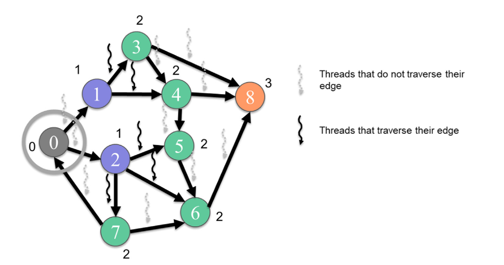
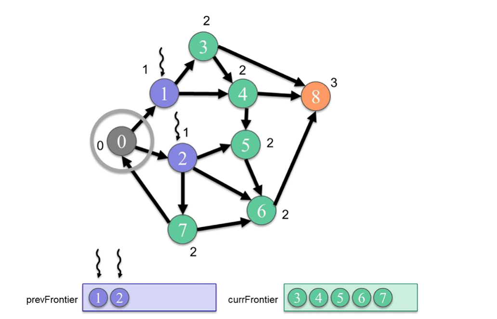

## Summary of Day 49:

> *Edge Centric Parallelization

Well well, so yesterday we dived into **Vertex-Centric Parallelization** and explored how threads were assigned to vertices to process outgoing or incoming edges. Today, let's go through **Edge-Centric Parallelization**, which flips the paradigm by assigning threads directly to edges, exposing *more parallelism and reducing control divergence*. We'll analyze its advantages, disadvantages, and implementation details.

Before diving further into **Edge-Centric Parallelization**, let's first differentiate between vertex-centric and edge-centric parallelization.

>| **Feature** | **Vertex-Centric** | **Edge-Centric** |
>|------------|---------------------|------------------|
>| **Thread Assignment** | Threads are assigned to vertices | Threads are assigned to edges |
>| **Parallelism** | Limited by the number of vertices | Exposes more parallelism (graphs typically have many more edges) |
>| **Control Divergence** | Threads process different numbers of edges depending on vertex degree | Each thread processes exactly one edge, reducing control divergence |
>| **Memory Format** | CSR/CSC formats for efficient vertex traversal | COO format for direct edge traversal |
>| **Efficiency for High-Degree Graphs** | May suffer from load imbalance due to varying vertex degrees | Better suited for high-degree graphs |
>| **Redundant Work** | Skips entire edge lists if vertex is irrelevant | Checks every edge individually |

### How Edge-Centric Parallelization Works:

> ***Key Idea***:
>
>Instead of assigning threads to vertices, edge-centric BFS assigns threads directly to edges. Each thread:
> - Retrieves the source vertex of its assigned edge.
> - Checks if the source vertex belongs to the previous BFS level.
> - If yes, retrieves the destination vertex of the edge.
> - Checks if the destination vertex has been visited.
> - If not visited, labels it as belonging to the current BFS level and sets a flag indicating a new vertex was visited.

***Example Execution***:

    
    
<b>Fig 49_01: </b><i>Example of an edge-centric traversal from level 1 to level 2</i>

In the above **Figure 49_01**;
- Threads are assigned to edges rather than vertices.
- Only threads assigned to outgoing edges of vertices in level $1$ (vertices $1$ and $2$) perform meaningful work.
- These threads traverse their edges, locate neighbors (e.g., vertices $3, 4, 5,$ etc.), and label them as belonging to level $2$.

#### Advantages of Edge-Centric Parallelization:
1. **Exposes More Parallelism**
    - Graphs typically have many more edges than vertices.
    - Assigning threads to edges ensures enough threads are launched to fully occupy the GPU.

2. **Reduces Control Divergence**
    - In vertex-centric BFS, threads process different numbers of edges depending on vertex degree.
    - In edge-centric BFS, each thread processes exactly one edge, reducing control divergence.

3. **Better for High-Degree Graphs**
    - High-degree graphs often have large variations in vertex degrees.
    - Edge-centric BFS avoids load imbalance by assigning threads uniformly to edges.

#### Disadvantages of Edge-Centric Parallelization:

1. **Checks Every Edge**
    - Edge-centric BFS checks every edge individually.
    - For irrelevant vertices (e.g., those not in the current frontier), all their edges are checked redundantly.

2. **Uses COO Format**
    - COO format requires more storage space than CSR or CSC formats used in vertex-centric parallelization.
    - Storing both row and column indices for each edge increases memory overhead.

> [Click Here](./edge_centric.cu) to view the compete code implementation for edge-centric BFS Kernel.

### Improving Effeciency with Frontiers

Okay so, in edge centric parallelization, though it exposed more parallelism, it also introduced ineffeciencies due to redundant checks on irrelevent edges. So, to reduce the redundant work by focusing only on relevant vertices or edges during each BFS level, we have **Frontier-Based Optimizations**.

#### Motivation for Frontier-Based Optimizations
In the previous vertex- and edge-centric approaches:
- **Vertex-Centric**: Threads were launched for every vertex in the graph, even if most vertices were irrelevant for the current BFS level.
- **Edge-Centric**: Threads were launched for every edge in the graph, even if most edges were irrelevant for the current BFS level.

So, this resulted in:

1. **Redundant Work:**
    - Many threads simply checked their assigned vertex or edge and found it irrelevant.

2. **Wasted Resources:**
    - GPU resources were wasted on threads that performed no useful work.

***Solution:*** **Use Frontiers**
The **frontier-based approach** eliminates these inefficiencies by:

- Maintaining a list of vertices *(or edges)* that are relevant for the current BFS level (called the "frontier").
- Launching threads only for elements in the frontier.
- Dynamically updating the frontier for the next BFS level as threads process their assigned vertices or edges.

### How this works:
> ***Key Idea:***
> 
> Instead of launching threads for all vertices or edges, launch threads only for elements in the current frontier.

***Steps:***
1. **Initialize Frontier**:
    - Start with the root vertex as the initial frontier (level $0$).

2. **Process Current Frontier**:
    - Launch threads only for vertices in the current frontier.
    - Each thread processes its assigned vertex and adds its unvisited neighbors to the next frontier.

3. **Update Frontier**:
    - Dynamically update the frontier for the next BFS level using atomic operations.

4. **Repeat Until Frontier is Empty**:
    - Continue processing frontiers until no new vertices are added.

So, here is the example diagram that well explains this visually: 

    
    
<b>Fig 49_02: </b><i> Example of a vertex-centric push (top-down) BFS traversal from level 1 to level 2 with frontiers.</i>

> Explaining **Figure 49_02**:
> 
> In the figure:
> The initial frontier (`prevFrontier`) contains vertices $1$ and $2$ from level $1$.
>- Threads are launched only for these two vertices.
>- Threads process outgoing edges of $1$ and $2$, adding their unvisited neighbors ($3, 4, 5, 6,$ and $7$) to `currFrontier`.
>- The next iteration will process vertices in `currFrontier`.

> [Click Here](./frontier.cu) to redirect to full code implementation using Frontiers in BFS_CSR kernel.

---
