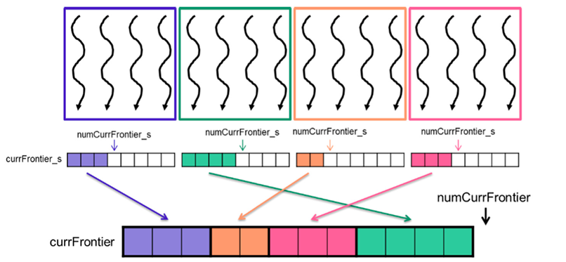

## Summary of Day 50:

> *Reducing contention with Privatization

### Introduction to Privatization:

Privatization is a technique used **to reduce contention** in atomic operations by allowing threads to **operate on private copies of shared data**. Instead of directly updating shared data *(which can lead to contention and poor performance)*, threads perform updates on private copies stored in shared memory. These **private copies are then merged back** into the global shared data after computation.

This technique is commonly used in parallel programming patterns like histograms(Used as well in Chapter 6: Histogram $\rightarrow$ **Day 25**), where threads in the same block update a local histogram stored in shared memory, then merge their results into the global histogram. Similarly, privatization can be applied to BFS computations to optimize frontier updates.

Today, we explore privatized frontiers for BFS and other optimizations like reducing launch overhead and improving load balance.

#### Reducing Contention with Privatization

***How Privatization Works in BFS***

In BFS, threads need to update the frontier. **Without privatization**:

- All threads directly update the global frontier using atomic operations.
- This leads to contention when multiple threads try to update the same data simultaneously.

**With privatization**:

- Each thread block maintains its own local frontier stored in shared memory.
- Threads within the block perform updates on this local frontier using low-latency atomic operations.
- After processing, the local frontier is merged into the global frontier stored in global memory.

    
    
<b>Fig 50_01: </b><i>Privatization of frontiers example</i>

So, above **Figure 50_01**, works like this:
1. **Initialization**:

    - Each thread block initializes its private frontier (`currFrontier_s`) and counter (`numCurrFrontier_s`) at the start of the kernel execution.

1. **Processing Local Frontier**:

    - Threads within a block process vertices from the previous level's frontier (`prevFrontier`).
    - For each vertex, threads iterate over its outgoing edges and check if neighbors are unvisited.
    - If a neighbor is unvisited, it is added to the local frontier (`currFrontier_s`).

1. **Overflow Handling**:

    - If the local frontier exceeds its capacity, threads add neighbors directly to the global frontier using atomic operations.

1. **Merging Local Frontiers**:

    - After all threads have finished processing, one thread allocates space in the global frontier for all elements in the local frontier.
    - Threads then copy elements from `currFrontier_s` to `currFrontier` using coalesced memory accesses.

> [Click Here](./privatization.cu) to redirect towards code implementation.

---
***Exercise***:

Implement the host code for the direction-optimized BFS implementation described in **Vertex Centric Parallelization**.

*Solution*:

[Click Here](../Day_48/vertex_centric_push.cu) to redirect to the solution.

---

> *Start of New **Chapter 16: Deep Learning**

> *Will Start Tom. Onwards!!* 🙂‍↕️

