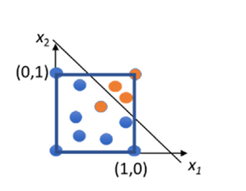
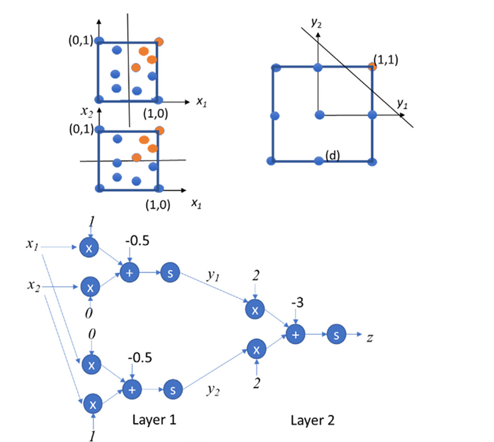
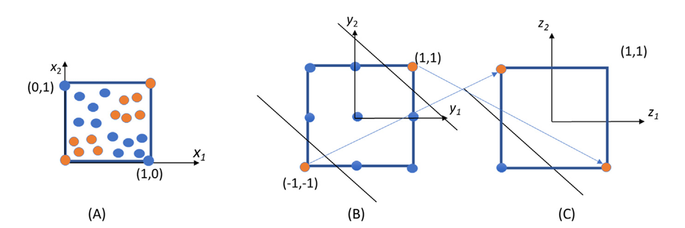
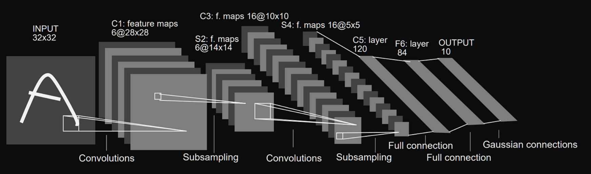

## Summary of Day 51:

> *Starting of Chapter 16- Deep Learning

> ***Intro basics:***
>
> **Core Equation**:  
> Most machine learning tasks use:  
> $$y = Wx + b$$  
> - $W$: Weight matrix  
> - $x$: Input  
> - $b$: Bias  
> 
> **Classifier Function**:  
> A model $$ f(x; \theta) $$ maps inputs to labels:  
> - $\theta = (W, b)$: Parameters learned from data  
> 
> **Perceptron (Linear Classifier)**:  
> $$y = \text{sign}(Wx + b)$$  
> - **Sign activation**: Outputs $\{-1, 0, 1\}$ based on input sign  
> - Introduces nonlinearity for classification  
> 
> **Decision Boundary**:  
> - Linear equation $Wx + b = 0$ splits input space into regions  
> - Example (2D): $w_1x_1 + w_2x_2 + b = 0$ defines a line  
> 
> **Inference**:  
> Compute class labels by evaluating $\text{sign}(Wx + b)$.  
> 

> **ⓘ Note**: This is just revision note. **Assuming readers have prior knowledge in all these topics*

### Multilayer Classifiers:

Okay, so Linear Classifiers use hyperplanes *(lines in 2D, planes in 3D)* to partition the input space into regions, each representing a class. 

However, the major limitation of this is that no all datasets can be separated by a single hyperplane. For example:

Let's take this image graph:

    
    
<b>Fig 51_01: </b><i>Single Layer Perceptron</i>

Here, in the above image, the classifier failed to properly classify that single "orange" point.

So that's where **Multilayer Perceptrons (MLPs)** come in.
- MLPs overcome this limitation by using multiple layers of perceptrons
- Each layer transforms the input space into a new feature space, enabling more complex classification patterns.

***Example:*** 
Two Layer Perceptron:

    
    
<b>Fig 51_02: </b><i>Two Layers Perceptron</i>

So here:

**Layer $1$: Transforming Input Space**
- Layer $1$ consists of two perceptrons.
    - $y_1 = \text{sign}(x_1 - 0.5)$ : Classifies points based on $x_1 > 0.5$.
    - $y_2 = \text{sign}(x_2 - 0.5)$ : Classifies points based on $x_2 > 0.5$.
- Outputs of Layer $1$ $(y_1 , y_2)$ are restricted to nine possible combinations:
$(−1,−1),(−1,0),(−1,1),(0,−1),(0,0),(0,1),(1,−1),(1,0),(1,1)$

**Layer $2$: Final Classification**
- Layer $2$ uses a single perceptron to classify points in the transformed $y_1 - y_2$ space:
    - A line like $z= \text{sign}(2y_1 + 2y_2 -3)$ seperates the orange points $((y_1, y_2)= (1,1))$ from others.

#### Need for More Layers:

    
    
<b>Fig 51_03: </b><i> Need for perceptrons with more than two layers</i>

**Problem with Two Layers**:

A two-layer perceptron cannot classify datasets like the one in **Figure 51_03(A)**, where orange points form two disjoint regions.

**Solution:** Adding Another Layer
- Adding a third layer enables proper classification:
    - Layer 2 introduces additional transformations $(z_1, z_2)$ in the second feature space.
    - A line like $z_1 + z_2 + 1 = 0$ seperates the classes in final feature space $(z_1 - z_2)$.

> **ⓘ Disclaimer:**
> In book there are different terminologies which assuming every one knows, not including here. Topics excluded: 
> - Error Function
> - SGD
> - Epoch
> - BackProp
> - Chain Rule
> - Learning Rate
> - Minibatch: *Splitting the training data into smaller subsets or batches during the training process*
> - Feed Forward Network

---
Now let's dive towards the real deep learning stuffs...

### CNNs (Convolutional Neural Networks):

Well, we did study about convolutiuons in [Chapter 7](../Day_16/README.md#convolution-what-is-it) earlier. Now let's let’s bridge this to deep learning. 

---
#### **Core Components of CNNs**  
1. **Convolutional Layers**:  
   - **Purpose**: Extract hierarchical features (edges → textures → complex patterns).  
   - **Mechanism**: Apply filters (kernels) to local input regions.  
     - Example: A $3×3$ filter scans the input, computing dot products.  
   - ***Key Concepts***:  
     - *Weight Sharing*: Same filter used across all input patches → reduces parameters.  
     - *Feature Maps*: Outputs highlight detected features.  

2. **Subsampling (Pooling) Layers**:  
   - **Purpose**: Reduce spatial size, retain critical features.  
   - **Types**:  
     - *Max-Pooling*: Takes maximum value in a patch (e.g., $2×2$).  
     - *Average-Pooling*: Takes average value in a patch.  

3. **Fully Connected Layers**:  
   - **Role**: Combine high-level features for classification.  
   - **Math**:  
     $$Y = W \cdot X + b$$  
     - $W$: Weight matrix, $X$: Input, $b$: Bias.  

---
#### **LeNet-5 Architecture**  
- **Structure**:  
    

        
        
<b>Fig 51_04: </b><i>LeNet-5 Architecture</i>

    

  1. **Input**: $32×32$ grayscale image *(handwritten digit)*.  
  2. **Conv Layers**: Extract spatial features (edges, curves).  
  3. **Subsampling**: Reduce dimensionality (focus on essential patterns).  
  4. **Fully Connected Layers**: Output probabilities for $10$ digit classes.  

---
#### **Training CNNs**  
1. **Supervised Learning**:  
   - **Input**: Labeled data (e.g., images tagged with digits).  
   - **Error Function**:  
     $$E = \frac{(y - t)^2}{2}$$  
     - $y$: Predicted output, $t$: True label.  

2. **Stochastic Gradient Descent (SGD)**:  
   - **Update Rule**:  
     $$w_i = w_i - \epsilon \frac{\partial E}{\partial w_i}$$  
     - $\epsilon$: Learning rate.  

3. **Backpropagation**:  
   - Computes gradients via chain rule:  
     $$\frac{\partial E}{\partial w_i} = \frac{\partial E}{\partial y} \cdot \frac{\partial y}{\partial w_i}$$  
   - Propagates errors backward to adjust weights.  

___
#### **Why CNNs Work**  
- **Hierarchy**: Automatically learns low → high-level features.  
- **Efficiency**:  
  - *Parameter Sharing*: Fewer parameters than fully connected networks.  
  - *Spatial Invariance*: Detects patterns regardless of position.  

---
Okay, enough of theory, let's code as well. This time first write some code based on C *(not going into kernels and parallization yet!)* 

[Click Here](./CNN_implementation.cu) to redirect to the code implementation. 