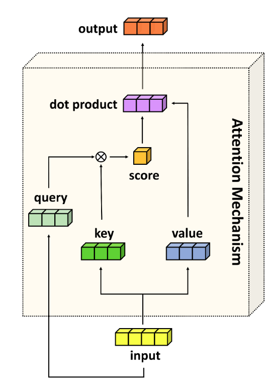

## Summary of Day 61:

> _So, today I fixed my yesterday's [MHA triton implementation](../Day_60/MHA.py). Took a lot of time so not going into CUDA today. However, will explain the code mechanism in very minute detail. So that well, evry one could understand. Also, this would be a revision for me._

### Understanding the $Q, K, V$ kernel:

Firsty, let's understand the parameters defined in this kernel. 

```python
def qkv_kernel(
    input_ptr, 
    wq_ptr, wk_ptr, wv_ptr, 
    bq_ptr, bk_ptr, bv_ptr, 
    q_ptr, k_ptr, v_ptr,
    batch_size: tl.constexpr, seq_len: tl.constexpr, embed_dim: tl.constexpr,
    head_dim: tl.constexpr, num_heads: tl.constexpr, stride_batch: tl.constexpr,
    stride_seq: tl.constexpr, stride_head: tl.constexpr
):
```
*So, here:*

- `input_ptr`: Pointer to the input tensor; shape of `[batch_size, seq_len, embed_dim]`.
- `wq_ptr`, `wk_ptr`, `wv_ptr` : Pointer to  the weights matrics for query, weight and vector. Shape of `[num_heads * head_dim, embed_dim]`.
- `bq_ptr`, `bk_ptr`, `bv_ptr` : Pointer to  the bias matrics for query, weight and vector. Shape of `[num_heads * head_dim]`.
- `q_ptr`, `k_ptr`, `v_ptr`: Pointers to the output tensors. Shape of `[batch_size, num_heads, seq_len, head_dim]`.
- `batch_size`: Number of samples in a batch. Defines how many independent inputs are processed in parallel. Used to ensure the `batch_idx` does not exceed valid range.
- `seq_len`: Length of the sequence *(number of tokens)*. Specifies how many positions in the sequence need $Q, K, V$ projections.
- `embed_dim`: Dimension of input embeddings 
- `head_dim`: Dimensionality of each attention heads (`embed_dim // num_heads`)
- `num_heads`: Number of attention heads in MHA
- `stride_batch`: The memory stride between consequtive batches. Multiplied with `batch_idx` to compute the base offset of a batch
- `stride_seq`: The memory stride between consequtive sequences. Multiplied with `seq_idx` to compute offset for a specific position.
- `stride_head`: The memory stride between consequtive heads. Multiplied with `head_idx` to access the data for a specific head.

Now explaining the inner mechanism:
- First comes **thread indexing and bounds checking**. The kernel is launched with a 3D grid size of (`batch_size, seq_len, num_heads`).

- Next, **memory offset calculation**: 
    - The `input_offset` is quite simple. It points to the start of the input vector for the current batch and sequence position.
    - In `qkv_offset`, we even account the heads, hence adding the heads offeset. (as $Q, K, V$ are split accross heads)

- Now comes **projection loop**:
    - **The outer loop:** ***(d loop)***
        - Iterates over the output dimension (`head_dim`), computing one element of $Q, K \text{ and } V$. Since each element needs a full dot product.
    - **The inner loop:** ***(e loop)***
        - Iterates over the input dimension (`embed_dim`), performing the dot product. 

        > [!Note]
        > Does the dot product by **multiplying and summing** accross the input vector and one row of the weight matrix. 

>[!important]
> **How this whole thing works**: 
> - The Outer loop's setup:
>   - `acc_q, acc_k, acc_v` are accumulators *(like temporary variables)* initialized with bias values.
>   - Bias is fetched from memory: `bq_ptr + head_idx * head_dim + d` picks the bias for this head and this output element.
>   - *Think of `d` as the "index" of the output vector we’re filling.*
> - The Inner Loop:
>   - Loads one input element: `x_val = tl.load(input_ptr + input_offset + e)`.
>   - Loads one weight from each matrix:
>      - `wq_val` from $WQ$ at row (`head_idx * head_dim + d`), column `e`.
>      - `wk_val` from $WK$, same row and column.
>      - `wv_val` from $WV$, same row and column.
>   - Multiplies and adds to accumulators:
>      - `acc_q += x_val * wq_val` *(Query dot product)*.
>      - `acc_k += x_val * wk_val` *(Key dot product)*.
>      - `acc_v += x_val * wv_val` *(Value dot product)*.

> [!note]
> For one output element `(d)`, we multiply the entire input vector by one row of the weight matrix and sum the results.

### The `attention_kernel`:

<div align="center">
    
    <p><b>Fig 61_01: </b><i>Attention Mechanism</i></p>
</div>

***Params recap:***
- **Pointers**: `q_ptr, k_ptr, v_ptr` (inputs), `scores_ptr` (intermediate scores), `output_ptr` (final output).
- **Dimensions**: `batch_size, seq_len, head_dim, num_heads` define the tensor shapes.
- **Strides**: `stride_batch, stride_seq, stride_head` navigate memory.
- **Scale**: `scale = 1/sqrt(head_dim)` normalizes the dot product.

***Thread initalization and boundary check:*** 
- similar to above.

***Memory Offsets:***
- `q_offset = batch_idx * stride_batch + seq_idx * stride_seq + head_idx * stride_head`
    - Points to the start of the Query $(Q)$ vector for this thread’s (`batch_idx, seq_idx, head_idx`) in the $Q$ tensor.
    - Shape of $Q$: `[batch_size, seq_len, num_heads, head_dim]`- $4D \text{ tensor.}$

- `scores_offset = batch_idx * seq_len * num_heads * seq_len + seq_idx * num_heads * seq_len + head_idx * seq_len`
    - Shape of `scores`: `[batch_size, seq_len, num_heads, seq_len]`

 > [!important]
 > - The `batch_idx * seq_len * num_heads * seq_len` shifts the offset for the batch. Here we account for all the attention socres in previous batches, each of which has `seq_len * num_heads * seq_len` scores.
 > - `seq_idx * num_heads * seq_len` moves to the correct query position in the sequence. Each query position has `num_heads * seq_len` scores *(because each head generates a score for each key position)*.
 > - `head_idx * seq_len` moves to the correct attention head for a given query.

> [!Caution]
> ***The order of multiplication matters!!*** 
>
> **Explaining this with an example:** 
> - `seq_len * num_heads * seq_len`:
> This keeps the memory layout in a format that:
>   -  ***first:*** traverses all sequence lengths (for queries), 
>   - then iterates over all heads, 
>   - and finally over the keys. 
>
> This is how it's structured to take advantage of memory access patterns when we're iterating over the tensor.
> - If we change this to `num_heads * seq_len * seq_len`:
>   - This would change the memory access pattern. With this order, you’d:
>     - First iterate over heads, 
>     - then over query positions, 
>     - and lastly over key positions. 
>
>This could work too, but it would lead to a different way of accessing memory, which might not be as efficient in certain cases, especially in terms of how the data is loaded into cache.

> [!tip]
> - Use `seq_len * num_heads * seq_len` for storing attention scores!
>
> ***✅ Why?***
> - Keeps all values for a single query together → faster softmax & attention
> - Better GPU memory coalescing → fewer trips, less latency
> - Avoids cache misses → speeds up computation
>
> - ❌ Avoid `num_heads * seq_len * seq_len` → Scatters data, slows down memory access!
> 
> - **Rule of Thumb**: Always structure memory for contiguous access!

***Computing Attention Scores:***

$$\text{Attention}(Q, K, V) = \text{softmax}\left(\frac{QK^T}{\sqrt{d}}\right)V$$

- So, next we calulate the `Q * K^T`:
    - Here we have not explicitly used any transpose operation. Instead, we are defining the offset values of $Q$ and $K$ such that there is no need to physically transpose $K$.

> [!important]
> The `q_offset` is calculated as: 
> 
> `q_offset = batch_idx * stride_batch + seq_idx * stride_seq + head_idx * stride_head`
> 
> This means for each query, we're accessing the query vector for a specific batch, sequence position and batch index.
> 
> The `k_offset` changes slightly:
> 
> `k_offset = atch_idx * stride_batch + k_seq * stride_seq + head_idx * stride_head`
>
> The crucial change here is that instead of using `seq_idx` *(the query sequence index)* as in `q_offset`, we're  using `k_seq` *(the loop variable)* to access the key vector at each position in the sequence. This allows us to access all of the keys for a given query sequence position.
>
> ***Why this works:***
> - By modifying the offset for $K$, we allow the query vector at a given position to "align" with each key vector from the sequence *(looping through k_seq)*.
> - This results in a dot product that’s essentially the same as multiplying $Q$ with $K^T$.

***Softmax Calculation:***

Next, we have softmax calculation:

$$\text{Softmax}(X_i) = \frac{e^{x_i}}{\sum_{j=1}^{n} e^{x_j}}$$

- First we **find the max score** for numerical stability.
    - We initialize the `max_score` to negative infinity.
    - Then we iterate oer all sequence positions (`k_seq`),loading the score values.
- Numerical instability could be caused by large exponentiated values.

- Then, the sum calculation part: 
    - We subtract `max_score` from each score before exponentiating *(to prevent the overflow)*.
    - Then we store the exponentiated values in `scores_base`.
    - And then we accumulate.

- Next we divide; hence getting the activation function. 

---
And that's how the kernel works.

> [!Note]
> ***Explaining the wrapper function***
> - We start with `scale = 1.0 / math.sqrt(head_dim)` to normalize attention scores later. Since `head_dim` is `embed_dim // num_heads`, we take the square root to scale down dot products in `Q * K^T`, preventing them from growing too large and destabilizing the softmax in the `attention_kernel`. For example, if `head_dim=4`, `scale=0.5`.
> - Next, we grab weights and biases from `attention_layer` (a PyTorch `MultiheadAttention` object). Its `in_proj_weight` is a big tensor `[3*embed_dim, embed_dim]`—three stacked weight matrices for Query (Q), Key (K), and Value (V).
> - We slice `wq = attention_layer.in_proj_weight[:embed_dim].T` to get the Query weights, the first `embed_dim` rows. We transpose it (`.T`) from `[embed_dim, embed_dim]` to `[embed_dim, embed_dim]` because Triton kernels expect weights in `[out_dim, in_dim]` format, unlike PyTorch’s default. This projects input to Q.
> - We do the same for `wk = attention_layer.in_proj_weight[embed_dim:2*embed_dim].T` (Key weights) and `wv = attention_layer.in_proj_weight[2*embed_dim:].T` (Value weights), slicing the next chunks and transposing them. Each is `[embed_dim, embed_dim]`, tailored for K and V projections.
> - For biases, we check `in_proj_bias` (size `3*embed_dim` or None). If it exists, we slice `bq = attention_layer.in_proj_bias[:embed_dim]` for Query, `bk = attention_layer.in_proj_bias[embed_dim:2*embed_dim]` for Key, and `bv = attention_layer.in_proj_bias[2*embed_dim:]` for Value—each `embed_dim`-sized. If None, we use `torch.zeros(embed_dim, device=DEVICE)` to create zero tensors on the GPU (CUDA), ensuring no bias offset when the layer skips it.
> - We grab `wo = attention_layer.out_proj.weight` (`[embed_dim, embed_dim]`) and `bo = attention_layer.out_proj.bias` (`[embed_dim]` or None, defaulting to `torch.zeros`) for the final output projection. No transpose here—PyTorch’s `linear` expects `[out_dim, in_dim]`, which matches `wo`.
> - We allocate output tensors on the GPU with `torch.empty`: `q`, `k`, `v` as `[batch_size, seq_len, num_heads, head_dim]` for Q, K, V projections. These are initially uninitialized (faster than zeros) since `qkv_kernel` fills them.
> - We set `scores = torch.zeros(batch_size, seq_len, num_heads, seq_len, device=DEVICE, dtype=torch.float32)` as a 4D tensor for attention scores. We use zeros to initialize it cleanly—`attention_kernel` overwrites it with raw scores, then softmax weights.
> - We also allocate `output = torch.empty(batch_size, seq_len, num_heads, head_dim, device=DEVICE)` for the attention result, uninitialized since `attention_kernel` populates it.
> - We define a 3D grid `grid_qkv = (batch_size, seq_len, num_heads)` and launch `qkv_kernel` with it. This grid means one thread per `(batch, seq, head)` combo—e.g., for `[2, 8, 4]`, that’s 64 threads. We pass `input_tensor`, weights (`wq`, `wk`, `wv`), biases (`bq`, `bk`, `bv`), output tensors (`q`, `k`, `v`), and shape/strides. It computes Q, K, V in parallel.
> - We reuse the same grid `grid_attn = (batch_size, seq_len, num_heads)` for `attention_kernel`. We pass `q`, `k`, `v`, `scores`, `output`, shape/strides, and `scale`. This computes attention: `softmax(Q * K^T * scale) * V`, filling `output`.
> - We reshape `output` from `[batch_size, seq_len, num_heads, head_dim]` to `[batch_size * seq_len, embed_dim]` (e.g., `[2, 8, 4, 4]` → `[16, 16]`) by flattening the head dimension. This concatenates head outputs, mimicking transformer behavior.
> - We apply `torch.nn.functional.linear(output, wo, bo)`—a matrix multiplication with `wo` and bias addition with `bo`—to project the concatenated result back to `embed_dim`. This gives us `[batch_size * seq_len, embed_dim]`.
> - We reshape again to `[batch_size, seq_len, embed_dim]` (e.g., `[2, 8, 16]`) to match the input shape, making it usable in a PyTorch pipeline.
> - Finally, we return this tensor—the multi-head attention output, ready for downstream layers.
