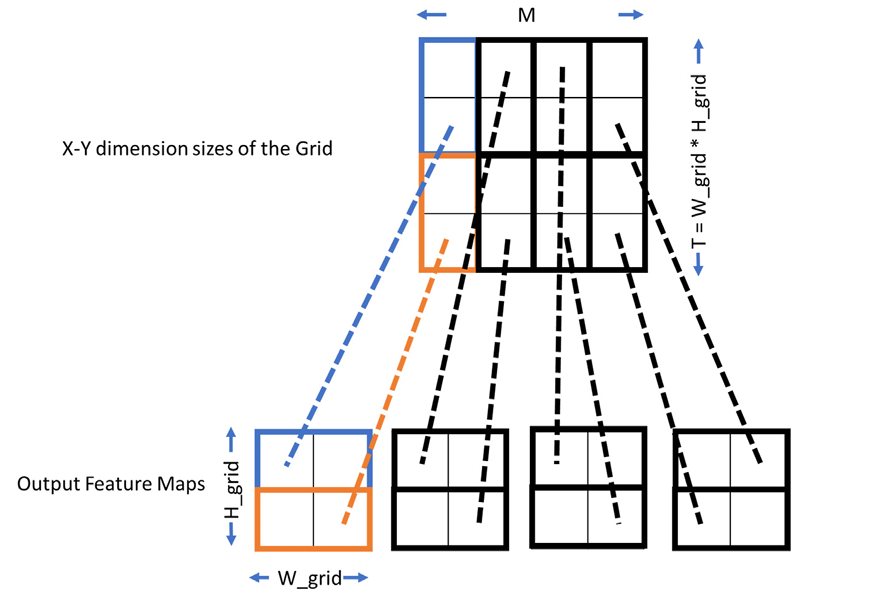
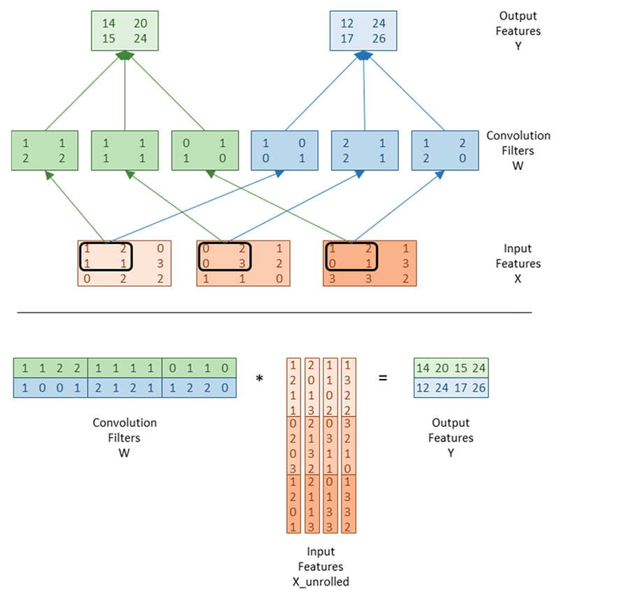

## Summary of Day 62:

> *Continuing from Chapter 16— where I left off

Well, we explored the basics of CNNs earlier. Now, let’s dive into how convolutional layers are implemented in CUDA for inference. This involves designing efficient kernels to compute the forward path of a convolutional layer.

### CUDA CNN Inference Kernel:

***Computation Pattern***:
- The computation in a convolutional layer is similar to **matrix multiplication**:
  - Highly parallel and compute-intensive.
  - Parallelism can be exploited at multiple levels:
    - Across samples in a minibatch (`n-loop`).
    - Across output feature maps (`m-loop`).
    - Across pixels in each output feature map (`h-w loops`).

***Thread Organization***:
- Each thread computes one element of an output feature map.
- Threads are organized into **2D thread blocks**, where each block computes a tile of size `TILE_WIDTH × TILE_WIDTH` pixels in one output feature map.
- Blocks are organized into a **3D grid**:
  1. X-dimension: Output feature maps (`M`).
  2. Y-dimension: Tiles within each output feature map (linearized `h-w` indices).
  3. Z-dimension: Samples in the minibatch (`N`).

> [!Note]
> ***How Host Code Looks Like:***
> ```cpp
> #define TILE_WIDTH 16
> W_grid = W_out / TILE_WIDTH; // Number of horizontal tiles per output map
> H_grid = H_out / TILE_WIDTH; // Number of vertical tiles per output map
> T = H_grid * W_grid; // Total number of tiles
> 
> dim3 blockDim(TILE_WIDTH, TILE_WIDTH, 1);
> dim3 gridDim(M, T, N);
> 
> ConvLayerForwardKernel<<<gridDim, blockDim>>>(...);
> ```

<div align="center">
    
    <p><b>Fig 62_01: </b><i>Mapping output feature map tiles to blocks in the X-Y dimension of the grid</i></p>
</div>
 
In **Fig 62_01**:
- Each sample has $M= 4$ output feature maps.
- Each output fature map consists of $H_\text{grid} \times W_\text{grid} = 2 \times 2 = 4$ tiles.
- *Grid Dimensions:*
    - X-dim : $M= 4$
    - Y-dim : $T= H_\text{grid} \times W_\text{grid} = 4$
    - Z-dim : $N$ *(samples in minibatch)*

> Tiles are assigned to the blocks using linearized indices for `h-w`, ensuring coalesced memory access.

***The Forward Kernel***:

```cpp
__global__ void ConvLayerForwardKernel(int C, int W_grid, int K,float* X, float* W, float* Y) {
    int m = blockIdx.x; // Output feature map index
    int h = (blockIdx.y / W_grid) * TILE_WIDTH + threadIdx.y; // Vertical index
    int w = (blockIdx.y % W_grid) * TILE_WIDTH + threadIdx.x; // Horizontal index
    int n = blockIdx.z; // Sample index in minibatch

    float acc = 0.0f;

    for (int c = 0; c < C; c++) {        // Sum over all input channels
        for (int p = 0; p < K; p++) {    // Loop over K×K filter
            for (int q = 0; q < K; q++) {
                acc += X[n, c, h + p, w + q] * W[m, c, p, q];
            }
        }
    }

    Y[n, m, h, w] = acc;
}
```

> [!Note]
> The formulas were just derived before. In code implementation, we simply substituted the values. 

Also in the loop we are calulatingthe summation value:

$$ Y[n,h,m,w] = \sum_{c=0}^{C-1} \sum_{p=0}^{K-1} \sum_{q=0}^{K-1} X[n,c,h+p,w+q] \cdot W[m,c,p,q] $$

Where:
- $n$: Sample index
- $m$: Output feature map index
- $h, w$: Pixel indices in the output feature map
- $c$: Input channel index
- $p, q$: Indices within the filter kernel
- $X[n,c,h+p,w+q]$: Input pixel value
- $W[m,c,p,q]$: Filter weight

### Formulation of Convolutional Layer as GEMM:

> [!Note]
> **GEMM**: General Matrix Multiplication

The convolutional layer in CNNs can be reformulated as a GEMM operation to leverage highly optimized matrix multiplication libraries like **cuBLAS**. This approach involves **unrolling the input feature maps into a matrix and representing filter weights as another matrix**, enabling the convolution operation to be expressed as a single matrix multiplication.

> [!important]
> ***The Central Idea***:
> The key idea is to rearrange input feature map pixels such that all elements required to compute one output pixel are stored as a sequential column in a new matrix (`X_unrolled`). The convolution filters are represented as rows in another matrix (`W`). The convolution operation then becomes: $Y = W \cdot X_\text{unrolled}$.
> Where:
> - $W$: Filter Matrix *(rows represent individual filters)*
> - $X_\text{unrolled}$: Expanded input feature matrix *(columns represent individual pathes needed for output pixels)*
> - $Y$: Output feature map matrix.

**Example:**
<div align="center">
    
    <p><b>Fig 62_02: </b><i>Formulation of convolutional layer as GEMM</i></p>
</div>

- So, during GEMM, the conv filters are layered one over other.
- Then multiplied with the unrolled input feature.

> [!important]
> ***How Unrolling Occurs***:
> - Assuming we have N input features and the kernel size is of $2 \times 2$ (as in above **Fig 62_02**)
> - The first column of unrolled input feature matrix is the conacatenated value of initial kernel scan values
> - For every scan the values get updated in another column
> - Since the kernel size and flter size are always same, the *row formatted* $W$ and *column formatted* $X_\text{unrolled}$ can be multiplied together hence providing the output feature.

> [!Note]
> **Why input features are expanded**
> The unrolling process duplicates input pixels to ensure all patches required for convolution are available sequentially in `X_unrolled`. This duplication leads to an expansion ratio.\
> $\text{Expansion Ratio} = \frac{CK^2H_\text{out}W_\text{out}}{CH_\text{in}W_\text{in}}$\
> Where:
> - $C$: Number of input channels
> - $K$: Kernel size
> - $H_\text{out}, W_\text{out}$: Output feature map dimensions
> - $H_\text{in}, W_\text{in}$: Input feature map dimensions

> [Click Here](./Conv_GEMM.cu) to redirect to the code for GEMM with X_unrolled implemented. 