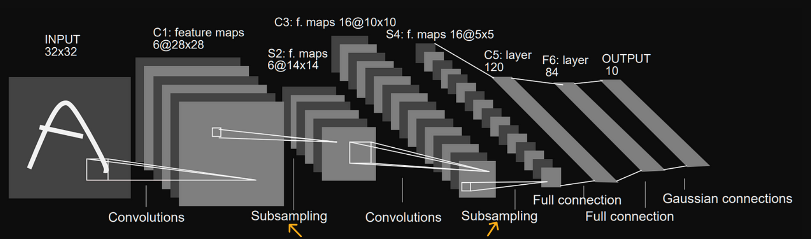

## Summary of Day 65:

> *Exercises from Chapter 16

#### Qn 1.   Implement the forward pass for the pooling layer described in *Section 16.2 of PMPP book*.

***Solution:***

In book the pooling is referred to as *"subsampling"* and mainly focuses on **LeNet-5 architecture**.  

<div align="center">

<p><b>Fig 65_01: </b><i>LeNet-5 architecture with pooling layers marked.</i></p>
</div>

So well pooling/subsampling involves downsampling the input feature maps by applying a pooling function. 

In case of LeNet-5, we use average pooling over a $2 \times 2$ neighborhood with stride of $2$. 

> [!important]
> For each output pixel, the layer averages four corresponding input pixels, adds a per-feature-map bias and then applies a sigmoid activation function.

**Our Problem Context:**

- **Input:** A $3D$ array $X[C,H,W]$ representing $C$ input feature maps, each of size $H$ rows and $W$ columns. For example, if we look at **Fig 65_01**, in layer $S2$; it's input feature map: $C = 6; H = 28; W = 28$.

- **Output:** Now after applying the pooling filter — A $3D$ array $Y[C, H/2, W/2]$ with the same number of feature maps $(C)$, but well it reduced the spatial dimension. For $S2$, its $Y[6, 14,14]$. 

> [Click Here](./pooling_fwd.cu) to redirect towards the code implementation for this.

#### Qn 2. We used an $[N \times C \times H \times W]$ layout for input and output features. Can we reduce the memory bandwidth by changing it to an $[N \times H \times W \times C]$ layout? What are potential benefits of using a $[C \times H \times W \times N]$ layout?

***Solution:***

Our Current Layout is:
$$[N \times C \times H \times W]$$
*which means:*

The data is stored with $N$ as the outermost dimension, followed by $C$, then $H$ and $W$ as the innermost dimension. 

>[!note]
> In memory, its a contiguous $1D$ array where the index for an element at `(n, c, h, w)` is:
>
> $n \times  (C\times H\times W) + c \times (H \times W) + h \times W + w$

In code during average calculation *(during pooling)* we had: 
```cpp
    for (int p = 0; p < K; p++) {
    for (int q = 0; q < K; q++) {
        int in_h = h * K + p;
        int in_w = w * K + q;
        sum += X[m * H * W + in_h * W + in_w];
    }
}
```
- Here, `m` is the channel index *(equivalent to c)*, and the stride-2 pooling maps `(h, w)` in the output to `(h*2+p, w*2+q)` in the input.
- **Access Pattern**: 
    - For a fixed `m` *(channel)*, threads access consecutive `in_h` and `in_w` values, but these values are strided by `W` (e.g. `in_h * W + in_w` jumps by `W` between rows). 
    - This is **not fully coalesced** because adjacent threads (example: incrementing `w`) access memory locations separated by `W` leading to suboptimal memory bandwidth usage.

***Proposed Layout 1:***
$$[N \times H \times W \times C]$$

>[!note]
>*which means:*
>
>$N$ is still outermost, but now $C$ is the innermost dimension. The index for `(n, h, w, c)` becomes: `n * (H * W * C) + h * (W * C) + w * C + c`

so our kernel  would adjust to:
```cpp
sum += X[n * (H * W * C) + in_h * (W * C) + in_w * C + m];
```
- **Thread Access:**
    - Each thread still works on one channel (`c`) and grabs a $2\times2$ area.
    - **Within a Row**: For `w=0` to `w=1` in the same channel, the thread jumps by `C` *(e.g which is $6$ in our case)* because all channels for `w=0` come before `w=1`. So, `X[h=0, w=0, c=0]` and `X[h=0, w=1, c=0]` are $6$ floats apart.
    - **Across Rows**: To get `h=1`, `w=0`, the jump is `W * C` *(e.g., 28 * 6 = 168 spots)*, because all channels for all W values of `h=0` come before `h=1`.

- **Coalescing:**
    - **Problem:** The $2\times2$ area’s data is spread out. Within a row, the stride is `C=6` *(not 1)*, and between rows, it’s `W * C = 168` *(way bigger than 28)*. The GPU can’t grab all four values (e.g., $(0,0), (0,1), (1,0), (1,1)$ ) in one fetch—they’re juss too far apart.
    - **Result:** More separate memory fetches are needed, like one for each corner of the $2\times2$ area, instead of maybe two in the original layout.

>[!warning]
> This approach uses more bandwidth because the GPU has to work harder to fetch scattered data. A single fetch ($128$ bytes = $32$ floats) can’t cover the $168$ -spot row jump or even the $6$ - spot `w` jump efficiently.

***Proposed Layout 2:***  
$$[C \times H \times W \times N]$$

>[!note]  
>*Which means:*  
>  
>`C` is now the outermost dimension, followed by `H`, then `W`, and `N` as the innermost dimension. The index for `(c, h, w, n)` becomes: `c * (H * W * N) + h * (W * N) + w * N + n`.

So our kernel would adjust to:  
```cpp
sum += X[m * (H * W * N) + in_h * (W * N) + in_w * N + n];
```
- **Thread Access:**  
    - Each thread still works on one channel (`m`, which is `c`) and grabs a $2\times2$ area from the input `X`.  
    - **Within a Row**: For `w=0` to `w=1` in the same channel and sample (`n`), the thread jumps by `N` (e.g., 1 if `N=1`, like in our single-image example). So, `X[c=0, h=0, w=0, n=0]` and `X[c=0, h=0, w=1, n=0]` are just 1 float apart if `N=1`.  
    - **Across Rows**: To get `h=1, w=0`, the jump is `W * N` (e.g., 28 * 1 = 28 spots if `N=1`), because all `W` values for `h=0` and all samples come before `h=1`.

- **Coalescing:**  
    - **Good News**: If `N=1`, the $2\times2$ area’s data is pretty close together. Within a row, the stride is `N=1`, so `w=0` and `w=1` are right next to each other—perfect for the GPU to grab in one go. Between rows, the stride is `W=28`, which isn’t tiny but still fits decently in a GPU memory fetch (128 bytes = 32 floats can hold a row).  
    - **Result**: The GPU can often grab the whole $2\times2$ area with fewer fetches—like maybe two (one per row)—compared to the original layout where it’s also about two but less tight within a channel.

>[!tip]  
> **Why This Could Be Awesome:**  
> - **Tighter Data**: If `N=1`, the $2\times2$ area’s data is super close (stride 1 in a row), so the GPU grabs it fast, saving bandwidth.  
> - **Channel Power**: All data for one channel is grouped together, which is great if we tweak the kernel to process whole channels at once—fewer memory jumps!  
> - **Batch Bonus**: If `N` gets bigger (like a batch of images), threads can work on different samples (`n`) side-by-side, and their data is still next to each other (stride 1), making it super efficient.  
> - **Less Work**: With smart tweaks (like using shared memory), this layout could cut down how much the GPU has to fetch from main memory, speeding things up.

So, second proposed layout is better while first one was trash 😄.

#### Qn. 3 Implement the backward pass for the convolutional layer described in *Section 16.2 of PMPP*.

> [Click Here](../Day_55/complete_backprop.cu) to redirect to the code