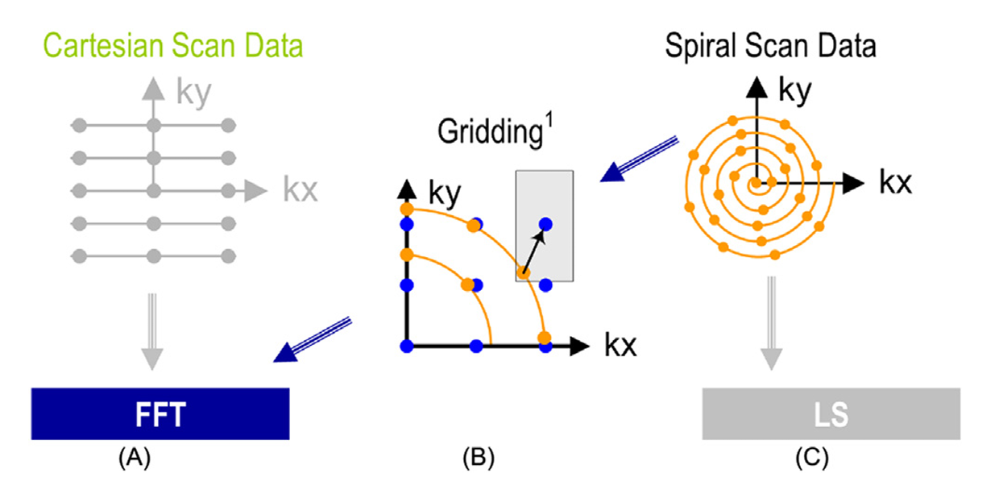
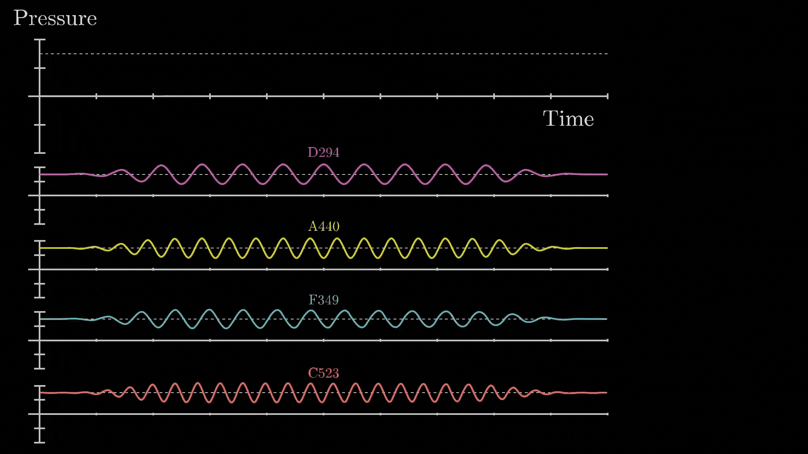

## Summary of Day 66:

> *Starting new chapter- Chapter 17

Okay so this chapter is all about image reconsturction and authors have taken MRI as the main reference, which is basically how we turn various wave forms into pictures.

So image reconstruction using MRI takes $2$ big steps:
1. **Collecting Data** ***(Scanning)*** 
    - The MRI machine grabs data in a place called *k-space domain*, which is the spatial frequency domain *(or **Fourier Transform Domain**)*. The data is sampled along a predefined trajectory, representing the Fourier transform of the final image.

2. **Reconstruction**
    - The *k-space* data is processed to generate a spatial domain image ***(this is the MRI Image)*** that reveals tissues shape and structure.

>[!note]
> More about ***FFT*** later on... [Click Here](#explaining-fast-fourier-transform-fft) to jump

#### **Challenges in MRI:**
Major limitations during MRI scans are:
- **High Noise Levels**
- **Imaging Artifacts** $\longrightarrow$ Distortions caused by motion or scanner imperfections.
- **Long Acquisition Times** $\longrightarrow$ Patients comfort and scanner throughput.

>[!warning]
> - Short scan times improve throughput and reduce motion artifacts but may increase noise or lower resolution.
>- High resolution and signal-to-noise ratio **(SNR)** enhance diagnostic accuracy but often require longer scans.

#### K- Space Trajectories and Reconstruction Strategies: ***How we collect data***:

The *k-space sampling trajectory* determines how data is collected in the frequency domain, influencing reconstruction methods, computational complexity, and image quality.

The book presents $3$ strategies:

    
    
<b>Fig 66_01: </b><i>Scanner k-space trajectories and their associated reconstruction strategies: (A) Cartesian trajectory with FFT reconstruction, (B) spiral (or non-Cartesian trajectory in general) followed by gridding to enable FFT reconstruction, (C) spiral (non-Cartesian) trajectory with a linear solver based reconstruction.</i>

1. **Cartesian Trajectory**: ***(A)***
    - Data is sampled on a uniform grid in *k-space*, with parallel lines along the $k_x$ axis stacked along the $k_y$ axis.

    - **Advantages**:
        - Easy to implement
        - Widely used in clinical settings

    - **Reconstruction:** 
        - Uses the **inverse FFT** inder ideal conditions. The reconstruction equation simplifies because the weighing function $(W(k))$ becomes constant and the exponential terms $e^{i 2 \pi k_j r}$ are uniformly spaced:
        
    $$m(r) = \sum_j s(k_j) e^{i 2 \pi k_j r}$$

    Here, $m(r)$ is the reconstructed image and $s(k)$ is the *k-space* data.

>[!important]
> The **Fourier Synthesis Equation** is: 
>
> $m(r) = \sum_j W(k_j)s(k_j) e^{i 2 \pi k_j r}$
>
> - In the cartesian trajectory, k-space samples are acquired on a uniform grid, with evenly spaced points along $k_x$ and $k_y$.
> - Under ideal conditions for this trajectory, the weighing function $W(k)$ is constant across all k-space points. 
> - Let's denote this as $W(k) = C$, where $C$ is a scalar.
> 
> Hence we get: $m(r) =  C \sum_j s(k_j) e^{i 2 \pi k_j r} \longrightarrow \sum_j s(k_j) e^{i 2 \pi k_j r}$

2. **Non_Cartesian with Griding:** ***(B)***

    - Data is sampled along non-uniform paths *(spiral trajectory)*
    - **Advantages:**
        - Reduced sensitivity to patients motion
        - Batter correction
        - Lower hardware requirements
    - **Reconstruction:**
        - **Gridding**: The non-uniform k-space data is interpolated onto a Cartesian grid using convolution with a mask. *(It's computationally intensive)*
        - **FFT**: Once gridded, the data is *reconstructed using inverse FFT*

>[!note]
> **Gridding**'s convolution operations benefit from parallel computing.

3. **Non_Cartesian Trajectory with Linear Solver:** ***(C)***
- Similar spiral trajectory as in ***(B)*** but reconstructed differently.
- **Reconstruction:**
    - Uses **Linear Solver**— an iterative method that directly solves the system of linear equations arising from non-Cartesian k-space data reconstruction without gridding.
    - **Equation:**  $\hat{m(r)} = \sum_j W(k_j)s(k_j) e^{i 2 \pi k_j r}$
    - Here, $W(k)$ adjusts for non-uniform sampling density and acts as an noise reducing filter.

- **Advantages**:
    - **Statistically optimal**, 
    - Bounds noise errors; improving the image quality.

>[!caution]
> High computational demand; historically impractical for large $3D$ datasets.

#### Explaining Fast Fourier Transform (FFT)

>[!important]
> Before diving into **FFT**, let's first understand Fourier Transform:
>
> **The Core Idea**: 
> - The core idea behind Fourier Transform is that: "any signal, no matter how complex, can be broken down into combination of simple sine waves of different frequencies, amplitudes and phases.
> 

>   
>   
<b>Fig 66_02: </b><i>Fourier Transform (breakdown of a complex waveform)</i>

> 
<i><b>*src: 3B1B</i></b>

> 

> 
> The mathematical Formulation for the continuous Fourier Transform is:
> 
> $F(\omega) = \int_{-\infty}^{\infty} f(t) e^{-i2 \pi \omega t} dt$
>
> Where: 
> - $f(t)$ is the original signal in the time domain
> - $F(ω)$ is the representation in the frequency domain
> - $e^{-i2πωt}$ is the complex exponential that represents the oscillation
>
> The inverse Fourier transform reconstructs the original signal from its frequency components *(the one shown in **Fig 66_02**)*:
>
> $f(t) = \int_{-\infty}^{\infty} F(\omega) e^{i2 \pi \omega t} d\omega$
>
> And if we change this to discrete form:
>
> $X[k]= \sum_{n=0}^{N-1} x[n]e^{-i2 \pi \frac{kn}{N}}$
> Where:
> - $x[n]$ is the discrete time-domain signal
> - $X[k]$ is the frequency-domain representation of the discrete signal
> - $N$ is the total number of samples
> - $k$ is the discrete frequency index
> 
> The original discrete signal can be reconstructed using the **discrete DFT**:
>
> $x[n] = \frac{1}{N} \sum_{k=0}^{N-1} X[k]e^{i2 \pi \frac{kn}{N}}$
>
> *Which looks similar to our equation*

> [!tip]
> For understanding the Fourier Transform formula derivation visit [3Blue1Brown's Video](https://www.youtube.com/watch?v=spUNpyF58BY) 👈

> [!note]
> The **DFT** has computational complexity of $O(N^2)$, which can be slow for large datasets. The **Fast Fourier Transform** (FFT) reduces the complexity to $O(N \log N)$.

#### Relevance to MRI:
- **Cartesian Data (Figure 66_01: A)**: FFT directly reconstructs the image from uniform k-space samples.

- **Non-Cartesian with Gridding (Figure 66_01: B)**: Gridding aligns non-uniform data into a Cartesian grid, enabling FFT use.