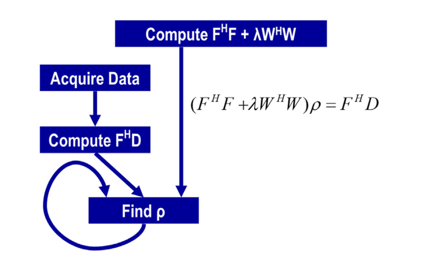

## Summary of Day 67:

Okay so yesterday, we studied about Fourier Transform and FFT. Also, we were discussing that FFT is widely used in signal processing and image reconstruction. Today let's discuss on this.

#### Iterative Reconstruction

***Objective***: Reconstruct a voxel-based image $\rho$ from non-Cartesian k-space data $(D)$, using a quasi-Bayesian estimation framework.

>[!Note]
> Voxel-based image are $3D$ pixels that form a grid. They are particularly used in MRI and CT scans to create detailed $3D$ visualizations of scanned area. 
>
> quasi-Bayesian estimation is a flexible approach of Bayesian estimation that uses the prior knowledge to estimate the new one.

<details>
  <summary><b>About Quasi-Bayesian Estimation</b></summary>
  <div align="center">
  <a href="https://www.youtube.com/watch?v=hncA61eBWDI" target="_blank">
    
  </a>
  </div>
</details>

***Problem Formulation***: 

$$(F^H F + \lambda W^H W)\rho = F^H D$$

where:
- $\rho$: Vector of voxel values for the reconstructed image
- $(F)$: Matrix modeling the physics of the imaging process *(eg, Fourier encoding)*
- $(D)$: Vector of k-space data samples from the scanner.
- $(W)$: Matrix incorporating prior information
- $\lambda$: Regularization parameter
- $F^H$: Conjugate transpose of $(F)$
- $W^H$: Conjugate transpose of $(W)$

> [!note]
> $F^H$ and $W^H$ are  also termed as Hermitian transposes on the book. 

***Challenges***:

While reconstructing an image from *k-space* data in medical imaging, such as **MRI** which rely on Fourier Transform we face major challenge of matrix sizes.

Here's the breakdown:
- For a modest $128 \times 128 \times 128$ voxel image, $(F)$ has $128^3$ ie $\approx 2 \text{ million columns}$, each column having $(N)$ elements. This leads to significant memory and computational challenges due to:
    - The high-dimensional nature of the Fourier transform, requiring efficient storage and computation.
    - The computational cost of applying FFT to large matrices, which scales as $O(N \log N)$, making real-time processing difficult.
    - Hardware constraints, as handling large FFT computations efficiently requires GPUs or specialized accelerators like TPUs.
>[!warning]
> Direct methods like Gaussian Elimination are impractical due to the massive dimensions of matrices

***Solution Approach***:
- We use an iterative method— Authors suggest to use **Conjugate Gradient (CG)** algorithm, to solve for $\rho$.

> [!note]
> When reconstructing an MRI image, we often solve system of equations of the form:
>
> $Ax= b$
>
> Where:
> - $A$ is the large symmetric positive definite matrix *(often derived from FT and system modeling)*
> - $x$ is the image we want to reconstruct
> - $b$ is the k-space data
>
> Since direct inversion of $A$ is infeasible due to its size, the **CG** provides an effecient way to iteratively *approximate* $x$ **without explicitly computing** $A^{-1}$.

> [!important]
> ***The Core Idea Behind CG***
>
> CG solves $Ax=b$ by searching for the solution in a sequence of conjugate directions, which helps converge in fewer iterations than a general iterative method *(like gradient descent)*
>
> Instead of solving for $x$ directly, **CG minimizes the quadratic function**:
>
> $f(x) = \frac{1}{2} x^T A x - b^T x$
>

> [!note]
>
> ---
> **Algorithm: Conjugate Gradient Method (CG)**
> 
> ---
> **Input:**
> - Symmetric Positive Definite (SPD) matrix $A \in \mathbb{R}^{n \times n}$
> - Right-hand side vector $b \in \mathbb{R}^{n}$
> - Initial guess $x_0$
> - Tolerance $\epsilon$
> ---
> 
> **Output:**
> - Approximate solution $x_k$ such that $||A x_k - b|| < \epsilon$
> ---
> 
> 1. **Initialize:**
>    $x_0, \quad r_0 = b - A x_0, \quad p_0 = r_0, \quad k = 0$
> 
> 2. **While** $||r_k|| > \epsilon$ **do:**
>    - Compute step size:
>      $\alpha_k = \frac{r_k^T r_k}{p_k^T A p_k}$
>    - Update solution:
>      $x_{k+1} = x_k + \alpha_k p_k$
>    - Update residual:
>      $r_{k+1} = r_k - \alpha_k A p_k$
>    - Compute new search direction:
>      $\beta_k = \frac{r_{k+1}^T r_{k+1}}{r_k^T r_k}$
>    - Update search direction:
>      $p_{k+1} = r_{k+1} + \beta_k p_k$
>    - Update index:
>      $k \gets k + 1$
> 
> 3. **End while**
> 
> 4. **Return** $x_k$
> ---

> [!important]
> - Unlike gradient descent, which moves along the steepest descent direction, CG constructs an optimal search direction by ensuring conjugacy, which accelerates convergence.
> <div align="center">
>   
>   <p><b>Fig 67_01: </b><i> An iterative linear solver based approach to reconstructing non-Cartesian k-space sample data. </i></p>
> </div>
>
> - For an $n$-dimensional problem, CG converges in at most $n$ iterations, much faster than gradient descent.

#### Computing $F^H D$

***Sequential Implementation***:

```cpp
for (int m = 0; m < M; m++) {
    rMu[m] = rPhi[m]*rD[m] + iPhi[m]*iD[m];
    iMu[m] = rPhi[m]*iD[m] - iPhi[m]*rD[m];
    for (int n = 0; n < N; n++) {
        float expFHD = 2*PI*(kx[m]*x[n] + ky[m]*y[n] + kz[m]*z[n]);
        float cArg = cos(expFHD);
        float sArg = sin(expFHD);
        rFHD[n] += rMu[m]*cArg - iMu[m]*sArg;
        iFHD[n] += iMu[m]*cArg + rMu[m]*sArg;
    }
}
```

Okay so here, we are trying to compute $F^H D$, where $F$, $D$ and $F^H$ were previously discussed. Now let's explain what $F^H D$ is:

$F^H D$ is a complex vector with real $(\text{rFHD})$ and imaginary $(\text{iFHD})$ components

Likewise in the code above:

- $M$: Number of k-space samples (size of $D$).
- $N$: Number of voxels in the reconstructed image *(size of $\text{rFHD}$ and $\text{iFHD}$)*.
- $\text{rD}[m], \text{iD}[m]$: Real and imaginary parts of the $m$-th k-space sample in $D$.
- $\text{rPhi}[m], \text{iPhi}[m]$: Real and imaginary parts of a phase term for the $m$-th k-space sample, often related to field inhomogeneities or coil sensitivities.
- $\text{kx}[m], \text{ky}[m], \text{kz}[m]$: Coordinates of the $m$-th k-space sample in 3D k-space.
- $\text{x}[n], \text{y}[n], \text{z}[n]$: Coordinates of the $n$-th voxel in the 3D image space.
- $\text{rMu}[m], \text{iMu}[m]$: Intermediate real and imaginary components of a vector $\text{Mu}$, computed as $\text{Mu} = \text{Phi} \times D$.
- $\text{rFHD}[n], \text{iFHD}[n]$: Real and imaginary components of $F^H D$ for the $n$-th voxel.

> [!important]
> ***Breaking down the code***:
>
> 1. The outer loop: 
>       ```cpp
>       for (int m = 0; m < M; m++) {
>        }
>       ```
>       - This loops over all k-space samples. 
>       - **Why?**: Each k-space sample contributes to every voxel in image, so we need to process all $M$ samples
>
> 2. Computing `rMu` and `iMu`:
>       ```cpp
>       rMu[m] = rPhi[m]*rD[m] + iPhi[m]*iD[m];
>       iMu[m] = rPhi[m]*iD[m] - iPhi[m]*rD[m];
>       ```
>       - This computes the imtermediate complex vector $\text{Mu} = \text{Phi} \times D$ for the `m`th k-space sample.
>           - $\text{Phi} = \text{rPhi} + i \cdot \text{iPhi}$ — A complex phase term
>           - $D = \text{rD} + i \cdot \text{iD}$ — A complex k-space sample
>           - $\text{Mu} = \text{Phi} \times D = (\text{rPhi} + i \cdot \text{iPhi}) \times (\text{rD} + i \cdot \text{iD})$
>           - Expanding the multiplication we get: 
>
>             $\text{Mu} = (\text{rPhi} \cdot \text{rD } + i \cdot \text{rPhi} \cdot \text{iD}) + i(\text{iPhi} \cdot \text{rD} - \text{rPhi} \cdot \text{iD})$
>           
>                - **Real Part**: $\boxed{\text{rMu} = \text{rPhi} \cdot \text{rD } + i \cdot \text{rPhi} \cdot \text{iD}}$
>               - **Imaginary Part**: $\boxed{\text{iMu} = \text{rPhi} \cdot \text{iD} - \text{iPhi} \cdot \text{rD}}$
>
> 3. The Inner Loop:
>       ```cpp
>       for (int n = 0; n < N; n++) {
>        }
>       ```
>       For the current *k-space* sample (`m`), it loops over all `N` voxels in the image.
> 
> 4. Then, computing the phase term:
>       ```cpp
>       float expFHD = 2*PI*(kx[m]*x[n] + ky[m]*y[n] + kz[m]*z[n]);
>       ```
>       This computes the phase term for the Fourier Transform between `m` -th k-space sample and the `n`-th voxel.
> 
>       The phase term in Fourier Transform is  the exponential term and for $3D$ we could say its like: $e^{i 2 \pi (k_x x + k_y y + k_z z)}$
>
>       Where: $(k_x, k_y, k_z)$ are k-space coordinates and $(x, y, z)$ are voxel coordinates. 
> 
> 5. Next, we have the sine and cosine parts. These compute the sine and cosine of phase term:
>       ```cpp
>       float cArg = cos(expFHD);
>       float sArg = sin(expFHD);
>       ```
>       The Complex exponential $e^{i \theta}$ can be written using **Euler's formula** as:
>
>       $e^{i \theta} = \cos(\theta) + i \cdot \sin(\theta)$
>
>       Here, $\theta = \text{expFHD}$ 
>
> 6. Then, we update the $\text{rFHD}$ and $\text{iFHD}$ components:
>
>    ```cpp
>     rFHD[n] += rMu[m]*cArg - iMu[m]*sArg;
>     iFHD[n] += iMu[m]*cArg + rMu[m]*sArg;
>     ```
>     - This step accumulates the contribution of the $m$-th k-space sample to the $n$-th voxel’s $F^H D$ value.
>     - **Mathematics**:
>       - The goal is to compute $F^H D$, where each element is:
>         $(F^H D)[n] = \sum_{m=0}^{M-1} F^H[n, m] \cdot D[m]$
>       - Here, $F^H[n, m] = e^{-i 2\pi (k_x[m] x[n] + k_y[m] y[n] + k_z[m] z[n])}$, because $F^H$ is the Hermitian transpose of $F$, which involves conjugation.
>       - The code includes a phase correction, so we actually compute:
>         $(F^H D)[n] += \text{Mu}[m] \cdot e^{-i 2\pi (k_x[m] x[n] + k_y[m] y[n] + k_z[m] z[n])}$
>       - $\text{Mu}[m] = \text{rMu}[m] + i \cdot \text{iMu}[m]$, where $\text{Mu} = \text{Phi} \times D$.
>       - $e^{-i \theta} = \cos(\theta) - i \cdot \sin(\theta)$, with $\theta = \text{expFHD}$.
>       - Multiply $\text{Mu} \cdot e^{-i \theta}$:
>         $(\text{rMu} + i \cdot \text{iMu}) \cdot (\cos(\theta) - i \cdot \sin(\theta))$
>         - Real part: $\text{rMu} \cdot \cos(\theta) - \text{iMu} \cdot (-\sin(\theta)) = \text{rMu} \cdot \cos(\theta) + \text{iMu} \cdot \sin(\theta)$
>         - Imaginary part: $\text{rMu} \cdot (-\sin(\theta)) + \text{iMu} \cdot \cos(\theta) = -\text{rMu} \cdot \sin(\theta) + \text{iMu} \cdot \cos(\theta)$
>       - Substituting $\text{cArg} = \cos(\theta)$, $\text{sArg} = \sin(\theta)$:
>         - Real part: $\text{rFHD}[n] += \text{rMu}[m] \cdot \text{cArg} - \text{iMu}[m] \cdot \text{sArg}$
>         - Imaginary part: $\text{iFHD}[n] += \text{iMu}[m] \cdot \text{cArg} + \text{rMu}[m] \cdot \text{sArg}$
>     - **Why?**: This step performs the summation over all k-space samples for each voxel, building the final $F^H D$ vector.

#### Implementing in Kernel:

> [Click Here](./FHD.cu) to redirect towards the code.