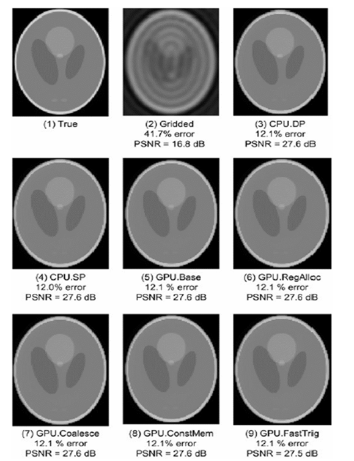

## Summary of Day 68:

> Optimizing the $F^H D$ kernel step by step approach:

Yesterday, we discussed the sequential code and also delved into the kernel code, but the explanation wasn't clear. So, let's begin by understanding the optimization steps first.

> [!note]
> Each step is going to tackle a specific bottleneck and by the last step we will have the most optimized kernel.

#### Step 1: $F^H D$ kernel with parallel structure

- As the title says: we parallelize the sequential code since our goal is to run on GPU.
- We need to decide how to split the work across threads.

***First Attempt***:
- Our First attempt will be **scattering**. 
    - What we do here is we map the outer loop `M` to threads. Each thread processes one k-space sample and updates **all** voxels.
    
    ```cpp
    #define FHD_THREADS_PER_BLOCK 1024
    __global__ void cmpFhD(float *rPhi, iPhi, rD, iD, kx, ky, kz, x, y, z, rMu, iMu, rFhD, iFhD, int N)
    {
        int m = blockIdx.x * FHD_THREADS_PER_BLOCK + threadIdx.x; //Each thread processes one "sample" or voxel
        rMu[m] = rPhi[m] * rD[m] + iPhi[m] * iD[m];
        iMu[m] = rPhi[m] * iD[m] - iPhi[m] * rD[m];
        for (int n = 0; n < N; n++)
        {
            float expFhD = 2 * PI * (kx[m] * x[n] + ky[m] * y[n] + kz[m] * z[n]);
            float cArg = cos(expFhD);
            float sArg = sin(expFhD);
            atomicAdd(&rFhD[n], rMu[m] * cArg - iMu[m] * sArg);
            atomicAdd(&iFhD [n], iMu[m] * cArg + rMu[m] * sArg);
        }
    }
    ```

> [!warning]
> So this way; threads clash when writing  the same voxel, needing slow atomic operations

>[!important]
> Also in the above code we are using `atomicAdd` and major reason of using that:
> - When performing parallel operations like in above; the threads within a block *(or even across)* might need to update the same shared data. If two threads attempt to modify the same memory location at once, it could lead to **race condition**.
> - The `atomicAdd` ensures that only one thread modifies the mem location data once at a time.

***Better Approach***:

The better approach would be **gathering** approach. 
- We simply interchange the loops. i.e, outerloop would be `N` and inner loop would be `M`. 
- That is:  The outer loop runs over the voxels and inner loop over the k-space samples.

```cpp
for (int n = 0; n < N; n++)
{
    for (int m = 0; m < M; m++)
    {
        float expFhD = 2 * PI * (kx[m] * x[n] + ky[m] * y[n] + kz[m] * z[n]);
        float cArg = cos(expFhD);
        float sArg = sin(expFhD);
        rFhD[n] += rMu[m] * cArg - iMu[m] * sArg;
        iFhD[n] += iMu [m] * cArg + rMu[m] * sArg;
    }
}
```

> [!important]
> **Why Loop Interchange Helps**:
> - When we do a loop interchange, we’re optimizing how threads access memory. By iterating over the voxels in the outer loop and gathering contributions from all the frequency samples in the inner loop, we can maximize memory access patterns.
> - This pattern **tends to improve cache locality** and **data coalescing** because the memory accesses are more likely to be consecutive, especially in global memory. This can significantly reduce memory latency compared to scattering, where threads may be accessing widely spaced memory locations.
>
> Hence, no clashes ;no atomics !

>[!tip]
> ***Bonus Move***:
> - Use loop fission to split the work into two kernels:
>   - `cmpMu()`: **Precomputes** `rMU` and `iMU` *(intermediate values)* for all `M` samples.
>   - `cmpFhD()`: Computes `rFhD` and `iFhD` for all `N` voxels.


#### Step 2: Memory Optimization

The kernel we got after all interchangings:

```cpp
#define FHD_THREADS_PER_BLOCK 1024
__global__ void cmpFhD(float *rPhi, iPhi, phiMag, kx, ky, kz, x, y, z, rMu, iMu, int M)
{
    int n = blockIdx.x * FHD_THREADS_PER_BLOCK + threadIdx.x;
    for (int m = 0; m < M; m++)
    {
        float expFhD = 2 * PI * (kx[m] * x[n] + ky[m] * y[n] + kz[m] * z[n]);
        float cArg = cos(expFhD);
        float sArg = sin(expFhD);
        rFhD[n] += rMu[m] * cArg - iMu[m] * sArg;
        iFhD[n] += iMu[m] * cArg + rMu[m] * sArg;
    }
}
```

This kernel is wayy better than any previous kernels we discussed ***but***:
- This uses global memory (ie. slow DRAM) too much — 14 accesses per iteration.

So we need to reduce the memory traffic.

>[!important]
> Here are the fixes:
>
> ***Fix 1:*** (Registers)
>- Moving per-voxel constants (`x[n], y[n], z[n]`) and accumulators (`rFhD[n], iFhD[n]`) to registers. 
>- This would cut the access to $7$ per iteration.
>
> ***Fix 2:*** (Constant Memory)
>- Moving k-space data (`kx, ky, kz`) to constant memory, ***processed in chunks***. 
>- All threads in a warp read the same `m` index, so the cache slashes the DRAM hits.
>
> ```cpp
>   // Host code using chunking (Example)
>   __constant__ float kx_c[CHUNK SIZE], ky_c[CHUNK SIZE], kz_c[CHUNK SIZE];
>
>   ...
>   
>   void main()
>   {
>       for (int i = 0; 1 < M / CHUNK_SIZE; i++){
>       cudaMemcpyToSymbol(kx_c, &kx[i * CHUNK_SIZE], 4 * CHUNK_SIZE, cudaMemCpyHostToDevice);
>       cudaMemcpyToSymbol(ky_c, &ky[i * CHUNK_SIZE], 4 * CHUNK_SIZE, cudaMemCpyHostToDevice);
>       cudaMemcpyToSymbol(kz_c, &kz[i * CHUNK_SIZE], 4 * CHUNK_SIZE, cudaMemCpyHostToDevice);
>   
>       ...
>   
>           cmpFhD<<<FHD THREADS PER BLOCK, N / FHD THREADS PER BLOCK>>>(rPhi, iPhi, phiMag, x, y, z, rMu, iMu, CHUNK_SIZE);
>       }
>       /* Need to call kernel one more time if M is not perfect multiple of CHUNK SIZE */
>   }
>
>
> ``` cpp
> #define FHD_THREADS_PER_BLOCK 1024
> __global__ void cmpFhD(float *rPhi, iPhi, phiMag, x, y, z, rMu, iMu, int M)
> {
>     int n = blockIdx.x * FHD_THREADS_PER_BLOCK + threadIdx.x;
>      /*Note: All the variables with _r are the ones assigned to register 😁*/
>     float xn_r = x[n];
>     float yn_r = y[n];
>     float zn_r = z[n];
>     float rFhDn_r = rFhD[n];
>     float iFhDn_r = iFhD[n];
>     for (int m = 0; m < M; m++)
>     {
>         float expFhD = 2 * PI * (kx_c[m] * xn_r + ky_c[m] * yn_r + kz_c[m] * zn_r);
>         float cArg = cos(expFhD);
>         float sArg = sin(expFhD);
>         rFhDn_r += rMu[m] * cArg - iMu[m] * sArg;
>         iFhDn_r += iMu[m] * cArg + rMu[m] * sArg;
>     }
>     rFhD[n] = rFhD_r;
>     iFhD[n] = iFhD_r;
> }
>```
> 
>
> ***Fix 3:*** (Structs ✅; Pointers ❌ )
> - Originally, `kx, ky, kz` are separate arrays, needing multiple cache lines per iteration
> - So, we switch to **an array** of structs (`k[m].x, k[m].y, k[m].z`)
> - Now, **one line** holds all three values, hence boosting frequency
> 
> ```cpp
> float expFhD = 2 * PI * (k[m].x * xn_r + k[m].y * yn_r + k[m].z * zn_r); // Jsut this line changes
> ```

> [!tip]
> ***Result***: After all the upper fixes; we go down to $2$ global memory accesses per iteration (for `rMu, iMu`), compute-to-memory ratio up to $1.63 \text{ OP/B}$.


#### Step 3: Hardware-Specific Functions

- ***What we do:*** The sine and cosine inside of the kernel loop; *the one from Euler's formula*. They are slow in software. So we switch to hardware function versions. They are executed by GPU Special Functional Units (SFUs).
- Denoted by `__sinf()` and `__cosf()`.

> [!warning]
> Durinf code implementation I tried `__cos()` and `__sin()` as mentioned in book but didn't work. So I assume its already depreciated.  

> [!caution]
> These hardware fuctions are fast but less precise. But well it's not that bad either. For the problem sets that would require very precise values would not recommend using them.

> [!note]
> **Metrics for Accuracy Validation**
>
> To validate the accuracy of hardware functions, two key metrics are used:
>
> - **Mean Squared Error (MSE):**
>
>   $MSE = \frac{1}{mn} \sum_{i,j} (I(i,j) - I_0(i,j))^2$
>   Where:
>   - $I_0$ is the perfect/reference result.
>   - $I$ is the result produced by the hardware function.
>   - $m$ and $n$ are dimensions of the data.
>
> - **Peak Signal-to-Noise Ratio (PSNR):**
>
>   $PSNR = 20 \log_{10} \left( \frac{\max(I_0(i,j))}{\sqrt{MSE}} \right)$
>
>   Higher PSNR values indicate better quality results.
>
> **Accuracy Observations:**
>
> - Switching from software trigonometric functions (`sin`, `cos`) to hardware-accelerated versions (`__sin`, `__cos`) resulted in:
>   - A negligible degradation in PSNR from 27.6 dB to 27.5 dB.
>   - No perceptible difference in visual quality.
>
> - Visual inspection and PSNR calculations confirmed that hardware functions provide sufficient accuracy for image reconstruction tasks while offering significant performance improvements.
>
> **Fig 68_01** illustrates these findings:
>
> 1. True Image: Perfect reference image.
> 2. Gridded/iFFT: Significant artifacts ($41.7\%$ error, $PSNR = 16.8 \space dB$).
> 3. CPU DP/SP and GPU implementations: $~12\%$ error, $PSNR = 27.6 \space dB$.


<div align="center">
    
    <p><b>Fig 68_01: </b><i> Validation of floating-point precision and accuracy of the different FHD implementations.</i></p>
</div>

#### Step 4: Performance Tuning aka. Experimental Tuning

***What Do we Tweak?***
- **Threads per Block**: 
    - E.g., $1024 \space \text{threads/block}$. 
    - Too few underuses the GPU; too many might not fit due to resource limits.
- **Loop Unrolling**: 
    - Unroll the inner loop (e.g., $4 \space \text{times}$) to cut overhead, but it uses more registers, potentially reducing occupancy *(blocks per SM)*.

> [!tip]
> ***TL;DR***
> - **Parallelize**: *Gather > scatter*, split into `cmpMu` and `cmpFhD`.
>- **Memory**: Registers, constant memory chunks, structs for cache efficiency *(not coalescing, but cache line usage)*.
>- **Hardware**: `__sin()`, `__cos()` for Euler’s-driven `rFhD`/`iFhD`—fast with minor accuracy trade-off.
>- **Tuning**: Threads and unrolling for max performance.

Now let's create the most optimized $F^H D$ kernel:
> [Click Here](./optimized_FHD.cu) to redirect towards the code.