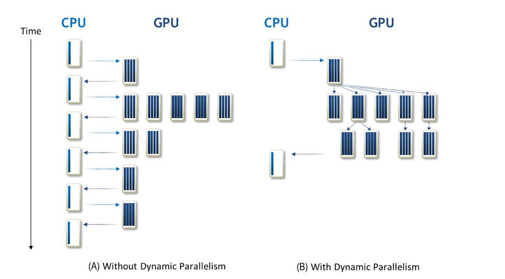

## Summary of Day 69:

> **Skipping 3 chaps and starting from Chap 21— Dynamic Parallelism 

#### What is Dynamic Parallelism?

The term **dynamic parallelism** is adctually specific to GPUs and its the property in which device kernels can call other device kernels without communicating with the host *(CPU)*.

#### Why is it required??

As until now; grids could only be launched using the host code. Algos that involved recursion, irregular loops, time-space variation or any other algos that could not be fit into single level of parallelism needed to make multiple calls from kernels to  the host. 

> [!note]
> This would significantly increase the burden on the host and total execution time. 

> [!tip]
> After introducing the dynamic parallelism; the burden on host as well execution time would be high.

The support for dynamic parallelism allows algorithms that dynamically discover new work to prepare and launch new grids without burdening the host or impacting the software maintainability.

#### ***Diagramatic Representation***

    

#### Explaining via Code approach: 

As I mentioned recursion earlier; first I'll write a kernel code for recursion without any dynamic paralleism and measure its runtime.

> [Click here](./recursion_no_dynamic_parallelism.cu) to redirect towards kernel with no dynamic parallelism

> [Click Here](./recursion_dynamic_parallelism.cu) to redirect towards kernel with dynamic parallelism

