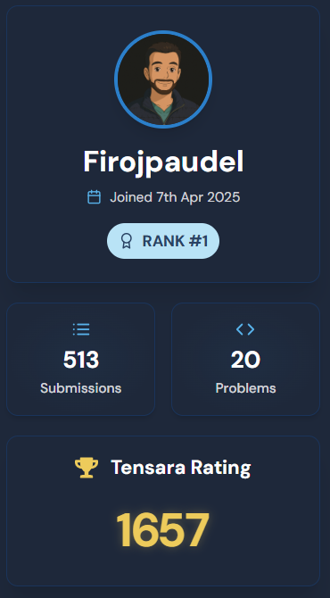

## Summary of Day 78:

> Back to Tensara Grind:

So today's kernels:

1. **Hinge Loss**:

> [Click Here](https://github.com/Firojpaudel/100_days_of_CUDA/blob/main/Day_78/hinge_loss.cu) to redirect to the code

> [!note]
> - Performance: $697.83 \text{ GFLOPs}$ 
> - Runtime: $0.17 \text{ ms}$
> - GPU: **NVIDIA H100**

2. **Hard Sigmoid**:

> [Click Here](https://github.com/Firojpaudel/100_days_of_CUDA/blob/main/Day_78/hard_sigmoid.cu) to redirect to the code

> [!note]
> - Performance: $447.57 \text{ GFLOPs}$ 
> - Runtime: $0.35 \text{ ms}$
> - GPU: **NVIDIA H100**

3. **Huber Loss**:

> [Click Here](https://github.com/Firojpaudel/100_days_of_CUDA/blob/main/Day_78/huber_loss.cu) to redirect to the code 

> [!note]
> - Performance: $900.57 \text{ GFLOPs}$ 
> - Runtime: $0.13 \text{ ms}$
> - GPU: **NVIDIA H100**

4. **SELU**:

> [Click Here](https://github.com/Firojpaudel/100_days_of_CUDA/blob/main/Day_78/selu.cu) to redirect to the code   

> [!note]
> - Performance: $1.01 \text{ TFLOPs}$
> - Runtime: $0.13 \text{ ms}$
> - GPU: **NVIDIA H100**

> ***And today I am at tensara: Global Rankings no 1***
> - Just putting this here to get myself hyped up for coming days
>
>  
> 

>   
> 

